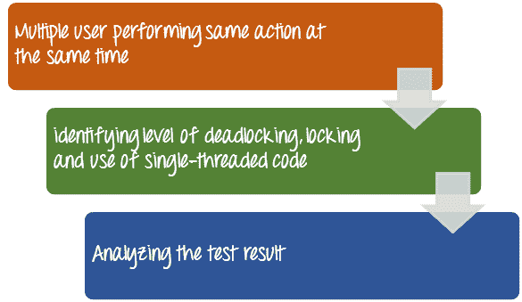

# 什么是软件测试中的并发测试？

> 原文： [https://www.guru99.com/concurrency-testing.html](https://www.guru99.com/concurrency-testing.html)

### 什么是并发测试？

并发测试被定义​​为一种测试技术，用于在多个用户登录时检测应用程序中的缺陷。换句话说，当多个用户同时执行同一操作时，监视效果。 下图显示了并发测试

并发测试也称为**多用户**测试。 由于不确定性和同步性问题，测试并发程序比测试顺序程序更具挑战性。

<figure>

 

<figcaption>如何测试并发</figcaption>

</figure>

## 为什么要进行并发测试

*   标识同时访问相同的数据库记录，模块或应用程序代码的影响。
*   识别并衡量死锁，锁定和使用单线程代码的级别，并限制对共享资源的访问

## 并行测试的优点

*   通过将并发交互的范围限制在少数几个经过广泛测试的组件上，相对减少了测试应用程序所需的工作量。
*   封装值允许分析程序一部分的行为，而无需查看整个代码或程序
*   它有助于提高并发程序的可靠性和健壮性。

## 并行测试的缺点

执行并行测试时测试可能遇到的缺点

*   需要在多个平台上进行测试
*   需要更严格的测试
*   函数不会立即将结果返回给调用方，而是可以稍后通过通知，块，回调函数或类似机制来传递结果，这会使测试更加困难。
*   该信息或程序流未反映在调用堆栈中。
*   系统中执行路径的数量可能非常多，因为并发系统中的进程可以在执行过程中相互交互
*   并发程序比顺序程序的失败率更高
*   并发程序的调试

**摘要：**

进行并发或并发测试技术是为了在多个用户登录时检测应用程序中的缺陷。