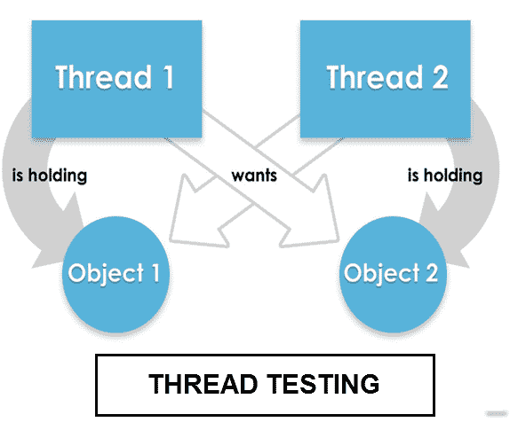

# 什么是软件测试中的线程测试？

> 原文： [https://www.guru99.com/thread-testing.html](https://www.guru99.com/thread-testing.html)

### 什么是线程测试？

线程测试被定义​​为一种软件测试类型，用于验证特定任务（线程）的关键功能。 它通常在集成测试阶段的早期进行。

基于线程的测试是系统[集成测试](/integration-testing.html)期间采用的增量策略之一。 因此，线程测试应该更恰当地称为“ **线程交互测试”。**

## 线程测试的类型

基于线程的测试分为两类

*   **单线程测试**：单线程测试一次涉及一个应用程序事务
*   **多线程测试**：多线程测试一次涉及多个并发活动事务

## 如何进行线程测试

线程过程专注于集成活动，而不是整个开发生命周期。 例如，

*   基于线程的测试是基于会话的测试的通用形式，因为会话是线程的一种形式，但是线程不一定是会话。
*   对于线程测试，将线程或程序（小的功能）作为子系统进行集成和增量测试，然后针对整个系统执行。
*   在最低层次上，它为集成商提供了关于测试内容范围的更好的知识
*   与其直接测试软件组件，不如让集成商专注于在整个系统的上下文中测试逻辑执行路径。

## 多线程测试提示

*   通过在运行中的不同应用程序组合中重复执行来测试多线程程序
*   通过同时激活程序的多个实例来测试您的多线程程序
*   在压力水平和工作负荷不同的不同硬件模型上执行多线程程序
*   代码检查
*   仅收集主线程以外的线程中发生的错误和失败

## 线程测试的缺点

*   对于多线程测试，最大的挑战是您应该能够对单元测试进行可重现的测试编程
*   为多线程代码编写单元测试是一项艰巨的任务
*   多线程测试的测试标准不同于单线程测试。 对于多线程测试，在不同的硬件上调用时，诸如内存大小，存储容量，时序问题等各种因素会有所不同。

**摘要：**

*   在软件工程中，线程测试是一种用于验证特定任务的关键功能的技术。
*   基于线程的测试分为两类
    *   单线程测试
    *   多线程测试