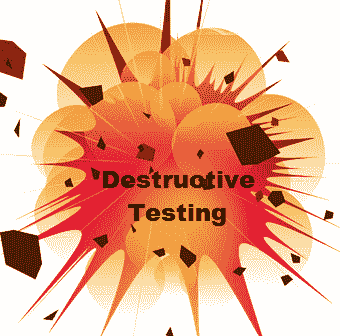

# 什么是破坏性测试？ 技术，方法，实例

> 原文： [https://www.guru99.com/destructive-testing.html](https://www.guru99.com/destructive-testing.html)

### 什么是破坏性测试？

破坏性测试定义为一种软件测试类型，用于查找软件程序中的故障点。 这是一种测试方法，在此方法中，有意使应用程序无法检查应用程序的健壮性并确定故障点。

与检查应用程序功能的其他测试方法不同，此技术将检查应用程序内不可预测的用户行为。

对于破坏性测试，无需了解软件产品的原始要求。 但是，一些知识可能有助于制定好的测试策略。

## 为什么要进行破坏性测试

*   当软件使用不当时，它有助于了解可预测的软件行为。
*   它有助于检查软件产品的健壮性。

## 您在破坏性测试中检查的内容

在破坏性测试中，您将检查以下内容

*   正确的软件行为
*   软件行为不当
*   使用不当
*   输入数据不正确
*   正确的输出数据

## 如何进行破坏性测试

破坏性测试涉及许多活动，例如设计一组测试脚本，执行测试脚本，引发错误，关闭错误以及在迭代结束时向参与者提供通过或失败度量。

对于破坏性测试，可以使用多种方法进行测试。 让我们看一些例子-

*   **故障点分析方法：**这是系统的演练，它评估各个点可能出了什么问题。 对于此策略，可以从 BA（业务分析师）那里获得帮助。
*   **测试人员同行评审**：让您的测试用例由对系统/功能不太熟悉的其他测试人员进行分析或审查
*   **测试用例的业务回顾**：最终用户或专家可能会想到许多有效的场景，有时测试人员可能没有考虑或错过这些场景，因为他们的全部重点将放在测试需求上
*   **使用运行表进行探索性测试：**使用运行表的探索性测试将有助于确定所测试的内容，重复测试并允许您控制测试范围。
*   **使用其他来源：**您可以要求某人破坏软件产品并针对各种情况进行分析。

## 破坏性测试方法&技术

在软件工程中，破坏性测试方法可以使用许多测试技术，例如

*   Alpha / Beta 测试
*   [回归测试](/regression-testing.html)
*   接口测试
*   等效分区
*   循环测试
*   验收测试，等等。

虽然很少有可用于修改的技术，但是有[白盒测试](/white-box-testing.html)，[安全测试](/what-is-security-testing.html)，[缺陷](/defect-management-process.html)测试，冒烟测试等。

在执行破坏性测试时，存在某些测试条件

*   该软件不得处理或接受无效的输入数据
*   无论输入数据的有效性或正确性如何，软件均应始终产生正确的输出数据

**摘要：**

*   在这种技术中，故意使应用程序无法通过程序来检查应用程序的健壮性
*   对于破坏性测试，不需要**就可以了解软件产品的原始要求。**