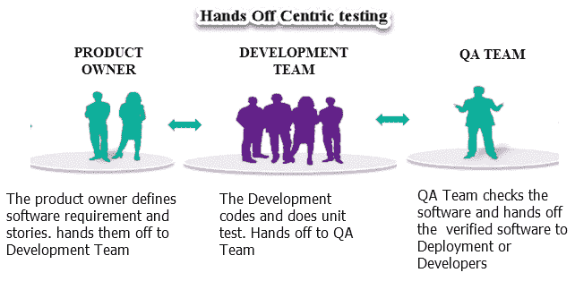
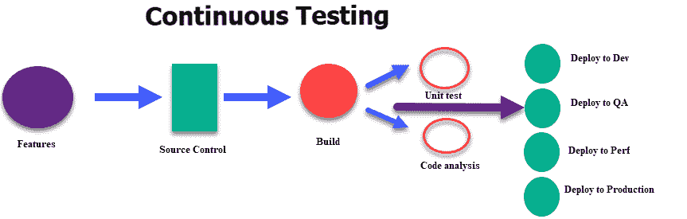
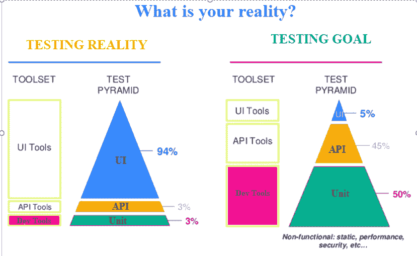

# 什么是 DevOps 中的连续测试？ 定义，好处，工具

> 原文： [https://www.guru99.com/continuous-testing.html](https://www.guru99.com/continuous-testing.html)

## 什么是连续测试？

连续测试被定义​​为一种软件测试类型，它涉及早期测试，经常测试，到处测试以及自动化的过程。 这是一种在持续交付过程的每个步骤中评估质量的策略。 连续测试的目标是尽早测试并且经常测试。 该过程涉及开发人员，DevOps，质量保证和运营系统等利益相关者。

在本教程中，您将学习

*   [什么是连续测试？](#1)
*   [连续测试有何不同？](#2)
*   [连续测试与测试自动化有何不同？](#3)
*   [如何进行连续测试](#4)
*   [连续测试工具](#5)
*   [连续测试的好处](#6)
*   [连续测试的挑战](#7)

## 连续测试有何不同？

旧的测试方法是以中心为中心。 该软件已从一个团队移交给另一个团队。 一个项目将具有明确的开发和质量保证阶段。 质量检查团队一直希望有更多时间来确保质量。 目的是质量应优先于项目进度。

但是，企业希望更快地向最终用户交付软件。 该软件较新，可以更好地进行市场营销并增加公司的收入潜力。 因此，一种新的测试方法得以发展。

连续意味着连续进行不间断的测试。 在持续的 DevOps 流程中，软件变更（候选发布）不断地从开发过渡到测试再到部署。

该代码是不断开发，交付，测试和部署的。

例如，每当开发人员检查源代码服务器中的代码时，就像 Jenkins 的自动化单元测试集在连续过程中执行一样。 如果测试失败，则拒绝构建，并通知开发人员。 如果构建通过测试，则将其部署到性能 QA 服务器以进行详尽的功能和负载测试。 测试是并行运行的。 如果测试通过，则该软件将部署到生产环境中。

持续测试是持续开发，集成和部署周期中的一小部分。

软件开发与以往不同，我们将开发工作从一个月缩短到了几周。 当前的测试堆栈（请参见上图）标题为 UI 测试。 但是目标是拥有越来越多的自动化单元测试。

## 连续测试与测试自动化有何不同？

**测试自动化与连续测试**

| **参数** | **测试自动化** | **连续测试** |
| --- | --- | --- |
| **定义** | 测试自动化是一个使用工具或软件来自动化任务的过程。 | 它是一种软件测试方法，致力于实现持续质量&的提高。 |
| **目的** | 一组类似或重复的任务，一台机器可以更快地执行并减少错误。 | 持续的测试过程有助于发现风险，解决风险并提高产品质量。 |
| **前提条件** | 无需集成连续测试即可实现测试自动化。 | 没有测试自动化就无法实现连续测试。 |
| **时间** | 软件发布可能需要一个月到几年的时间。 | 软件版本可能每周至每小时发布。 |
| **反馈** | 测试每个版本后的定期反馈。 | 每个阶段的反馈都需要即时。 |
| **历史记录** | 自动化测试已经进行了数十年，以加快测试过程。 | 连续测试是一个相对较新的概念。 |

## 如何进行连续测试

*   用于工具来根据用户案例/需求生成测试自动化套件
*   创建测试环境。
*   复制和匿名化生产数据以创建测试数据床
*   使用服务虚拟化测试 API
*   并行性能测试

## 连续测试工具

**1）QuerySurge**

[QuerySurge](https://bit.ly/2Ni99Gd) 是智能数据测试解决方案，它是用于连续数据测试的同类首个完整 DevOps 解决方案。 主要功能包括可进行 60 多次调用的 Robust API，详细的数据智能&数据分析，无缝集成到 DevOps 管道中以进行连续测试，以及快速验证大量数据。

[免费开始测试](https://bit.ly/2Ni99Gd)

**2）詹金斯**

Jenkins 是使用 Java 语言编写的持续集成工具。 可以通过 GUI 界面或控制台命令配置此工具。

**下载链接：** [https://jenkins.io/](https://jenkins.io/)

**3）特拉维斯**

Travis 是托管在 GitHub 上的连续测试工具。 它提供了托管和本地的变体。 它提供了多种不同的语言和良好的文档。

**下载链接：** [https://travis-ci.org/](https://travis-ci.org/)

**4）硒**

Selenium 是开源软件测试工具。 它支持所有主流浏览器，例如 Firefox，Chrome，IE 和 Safari。 Selenium WebDriver 用于自动执行 Web 应用程序测试。

**下载链接：** [https://www.seleniumhq.org/](https://www.selenium.dev/)

## 连续测试的好处

*   加快软件交付
*   连续测试可提高代码质量
*   它有助于评估确切的业务风险范围。
*   它无缝集成到 DevOps 流程中
*   在数小时而不是数月内帮助创建敏捷而可靠的流程。
*   通过持续的反馈机制加快产品上市时间。
*   合并传统上孤立的团队，以满足现代企业的需求。 解决开发，测试和运营团队之间的脱节。
*   测试自动化通过为所有相关测试维持相同的配置来帮助实现一致性。
*   强调业务期望以减轻业务风险
*   通过 Service Virtualization 提供无处不在的测试环境访问

## 持续测试的挑战

*   传统过程限制了开发& QA 专业人员之间的文化转移。
*   缺乏在敏捷& DevOps 环境中进行测试的 DevOps 技能和正确的工具。
*   永远不会反映生产环境的异构测试环境。
*   常规测试过程和宽松定义的测试数据管理。
*   较长的代码集成周期会导致集成问题和较晚的缺陷修复
*   资源和测试环境不足和无效
*   复杂的应用程序体系结构和业务逻辑限制了 DevOps 的采用。

## 结论：

*   在软件工程中，连续测试是指尽早测试，经常测试，到处测试以及自动化的过程。
*   旧的测试方法是以切换为中心的。 该软件已从一个团队移交给另一个团队
*   Jenkins，Travis 和 Selenium 是流行的持续测试和集成工具。
*   持续测试根据交付流程的每个阶段提供可行的反馈。
*   持续测试有助于提高代码质量
*   传统过程限制了开发& QA 专业人员之间的文化转移。
*   较长的代码集成周期会导致集成问题和较晚的缺陷修复