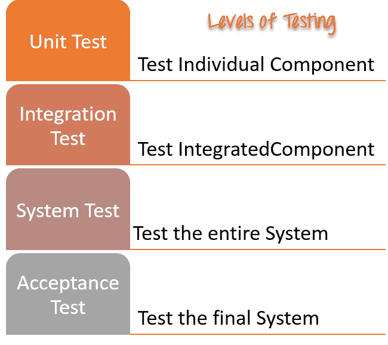

# 软件测试中的测试级别

> 原文： [https://www.guru99.com/levels-of-testing.html](https://www.guru99.com/levels-of-testing.html)

## 测试的水平是多少？

根据测试在 SDLC 中的添加位置或包含的详细程度，将测试分组在一起。 通常，测试分为四个级别：单元测试，集成测试，系统测试和验收测试。 测试级别的目的是使软件测试系统化，并轻松识别特定级别上的所有可能测试案例。

有许多不同的测试级别，可帮助检查软件测试的行为和性能。 这些测试级别旨在识别缺失的区域以及开发生命周期状态之间的协调。 在 SDLC 模型中，具有特征化的阶段，例如需求收集，分析，设计，编码或执行，测试和部署。

所有这些阶段都经过软件测试级别的过程。 主要有四个测试级别是：

1.  单元测试
2.  整合测试
3.  系统测试
4.  验收测试

这些测试级别中的每一个都有特定的目的。 这些测试级别为软件开发生命周期提供了价值。

1） [**单元测试：**](/unit-testing-guide.html)

单元是可以被编译，喜欢，加载和执行的系统或应用程序的最小可测试部分。 这种测试有助于分别测试每个模块。

目的是通过分离来测试软件的每个部分。 它检查组件是否满足功能。 这种测试由开发人员执行。

2） [**集成测试：**](/integration-testing.html)

整合意味着结合。 例如，在此测试阶段，将不同的软件模块组合在一起并进行一组测试，以确保已为系统测试准备好集成系统。

集成测试检查从一个模块到另一模块的数据流。 这种测试是由测试人员执行的。

3） [**系统测试：**](/system-testing.html)

系统测试是在完整的集成系统上执行的。 它允许根据要求检查系统的符合性。 它测试组件的整体交互。 它涉及负载，性能，可靠性和安全性测试。

系统测试通常是最终测试，用于验证系统是否符合规格。 它评估测试的功能和非功能需求。

4） [**验收测试：**](/user-acceptance-testing.html)

验收测试是为了确定规格或合同的要求是否符合交付要求而进行的测试。 验收测试基本上由用户或客户完成。 但是，其他股东也可以参与此过程。

## 其他类型的测试：

*   回归测试
*   好友测试
*   阿尔法测试
*   Beta 测试

## 结论：

*   软件测试级别是对软件/系统的每个单元或组件进行测试的过程。
*   系统测试的主要目标是评估系统是否符合指定需求。
*   在软件工程中，测试的四个主要级别是单元测试，集成测试，系统测试和验收测试。