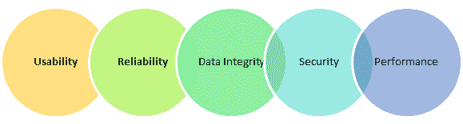

# IoT 测试教程：什么是流程，挑战&工具

> 原文： [https://www.guru99.com/iot-testing-challenges-tools.html](https://www.guru99.com/iot-testing-challenges-tools.html)

## 什么是物联网？

物联网通常被称为 IoT，是由设备，车辆，建筑物或任何其他连接的电子设备组成的网络。 这种互连有助于收集和交换数据。 物联网系统的 4 个常见组件是

1.  传感器
2.  应用
3.  网络
4.  后端（数据中心）

IOT 是可识别的嵌入式设备与现有 Internet 基础结构的连接。 简而言之，我们可以说物联网是一个“智能”时代，互联产品可以进行通信并传输大量数据并将其上传到云。

在这个初学者教程中，您将学习

*   [什么是物联网？](#1)
*   [什么是 IOT 测试？](#2)
*   [物联网](#3)中的测试类型
*   [物联网测试过程：示例测试条件](#4)
*   [物联网测试的挑战](#5)
*   [有效进行物联网软件测试的最佳做法](#6)
*   [物联网测试工具](#7)

## 什么是 IOT 测试？

物联网测试是一种检查物联网设备的测试。 如今，越来越需要提供更好，更快的服务。 从任何设备访问，创建，使用和共享数据都有巨大的需求。 重点是对各种互连的 IOT 设备提供更深入的了解和控制。 因此，物联网测试框架很重要。

## 物联网中的测试类型

物联网设备的测试主要围绕安全性，分析，设备，网络，处理器，操作系统，平台和标准进行。

让我们研究一下广泛的测试类型

**可用性测试：**

用户使用了许多不同形状和形状因数的设备。 此外，每个用户的感知也各不相同。 因此，在物联网测试中，检查系统的可用性非常重要。

**兼容性测试：**

通过物联网系统可以连接许多设备。 这些设备具有各种软件和硬件配置。 因此，可能的组合是巨大的。 因此，检查物联网系统的兼容性非常重要。

**可靠性和可伸缩性测试：**

可靠性和可扩展性对于构建物联网测试环境至关重要，该环境涉及通过利用虚拟化工具和技术来模拟传感器。

**数据完整性测试：**

在物联网测试中检查数据完整性非常重要，因为它涉及大量数据及其应用程序。

**安全测试：**

在物联网环境中，有许多用户正在访问大量数据。 因此，通过身份验证来验证用户，将数据隐私控制作为安全测试的一部分非常重要。

**性能测试：**

性能测试对于创建用于制定和实施物联网测试计划的战略方法很重要。

下图给出了不同测试类型对物联网各个组件的适用性。

| **物联网元素
测试类型** | **传感器** | **应用** | **网络** | **后端（数据中心）** |
| --- | --- | --- | --- | --- |
| 功能测试 | 真正 | True | 假 | False |
| 可用性测试 | True | True | False | False |
| 安全测试 | True | True | True | True |
| 性能测试 | False | True | True | True |
| 兼容性测试 | True | True | False | False |
| 服务测试 | False | True | True | True |
| 操作测试 | True | True | False | False |

## 物联网测试过程：示例测试条件

| 

**测试类别**

 | 

**样品测试条件**

 |
| --- | --- |
| **组件验证** | 

*   设备硬件
*   嵌入式软件
*   云基础架构
*   网络连接
*   第三方软件
*   传感器测试
*   命令测试
*   数据格式测试
*   鲁棒性测试
*   安全测试

 |
| **功能验证** | 

*   基本设备测试
*   在 IOT 设备之间进行测试
*   错误处理
*   有效计算

 |
| **条件验证** | 

*   手动调节
*   自动调节
*   调节配置文件

 |
| **性能验证** | 

*   数据传输频率
*   多请求处理
*   同步
*   中断测试
*   设备性能
*   一致性验证[

 |
| **安全性和数据验证** | 

*   验证数据包
*   验证数据丢失或损坏的包
*   数据加密/解密
*   数据值
*   用户角色和职责[ & 及其使用模式

 |
| **网关验证** | 

*   云接口测试
*   设备到云协议测试
*   延迟测试

 |
| **分析验证** | 

*   传感器数据分析检查
*   IOT 系统运行分析
*   系统过滤器分析
*   规则验证

 |
| **通信验证** | 

*   互操作性
*   M2M 或设备到设备
*   广播测试
*   中断测试
*   协议

 |

## 物联网测试的挑战

*   您需要检查网络和内部通讯
*   在 IOT 平台中，安全性是一个大问题，因为所有任务都是通过 Internet 使用的。
*   软件和系统的复杂性可能掩盖了物联网技术中存在的错误
*   资源考虑因素，例如内存限制，处理能力，带宽，电池寿命等。

## 有效进行物联网软件测试的最佳做法

*   灰盒测试应与物联网测试一起使用，因为它可以设计有效的测试用例。 这使您可以了解操作系统，体系结构，第三方硬件，新的连接性和硬件设备限制。
*   实时操作系统对于提供可扩展性，模块化，连接性和安全性至关重要，这对物联网至关重要
*   物联网测试应该是自动化的。

## 物联网测试工具：

**两个最有效的 IOT 测试工具是：**

**1.Shodan**

Shodan 是一个物联网测试工具，可用于发现哪些设备已连接到 Internet。 它使您可以跟踪可直接从 Internet 访问的所有计算机。

**下载链接：** [https://www.shodan.io/](https://www.shodan.io/)

**2.小事**

Thingful 是物联网的搜索引擎。 它允许通过 Internet 在数百万个对象之间实现安全的互操作性。 该物联网测试工具还可以控制数据的使用方式，并能够做出更具决定性和更有价值的决策。

**下载链接：** [https://www.thingful.net](https://www.thingful.net)

## 结论：

*   IOT 是可识别的嵌入式设备与现有 Internet 基础结构的连接。
*   软件和系统的复杂性可能掩盖了物联网技术中存在的错误
*   灰盒测试应与物联网测试一起使用，因为它可以设计有效的测试用例。
*   物联网测试可确保用户在所有连接的物联网设备上获得更好的用户体验。
*   由于没有测试计划，因此无法测量部分要测试的属性。 因此，可能不容易检测到错误/错误。