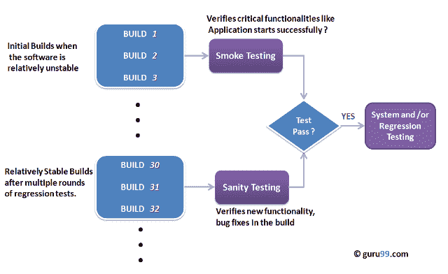

# 健康测试与烟雾测试：简介&差异

> 原文： [https://www.guru99.com/smoke-sanity-testing.html](https://www.guru99.com/smoke-sanity-testing.html)

冒烟和健全性测试是软件测试中最容易被误解的主题。 关于该主题的文献很多，但其中大多数令人困惑。 下面的文章试图解决这种混乱。

可以通过下图了解烟雾测试与健全性测试之间的主要区别：

要欣赏上面的图表，首先要了解-

## 
什么是软件版本？

如果要开发一个仅包含一个源代码文件的简单计算机程序，则只需编译并链接一个文件即可生成一个可执行文件。 这个过程非常简单。
通常不是这种情况。 一个典型的软件项目包含数百甚至数千个源代码文件。 从这些源文件创建可执行程序是一项复杂且耗时的任务。
您需要使用“构建”软件来创建可执行程序，并且该过程称为“ *Software Build* ”

## 什么是烟雾测试？

[冒烟测试](/smoke-testing.html)是一种在软件构建后执行的软件测试，以确定程序的关键功能是否正常运行。 它在软件构建上执行任何详细的功能或回归测试之前“执行”。 目的是拒绝严重损坏的应用程序，以使 QA 团队不会浪费时间安装和测试软件应用程序。

在冒烟测试中，测试用例选择覆盖系统中最重要的功能或组件。 目的不是执行详尽的测试，而是要验证系统的关键功能是否正常运行。
例如，典型的冒烟测试将是-验证应用程序是否成功启动，检查 GUI 是否响应...等。

## 关键区别

*   冒烟测试的目标是验证“稳定性”，而理智测试的目标是验证“合理性”。
*   烟雾测试由开发人员或测试人员完成，而健全性测试由测试人员完成。
*   冒烟测试可验证系统的关键功能，而完整性测试可验证新功能（如错误修复）。
*   烟雾测试是验收测试的子集，而健全性测试是回归测试的子集。
*   烟雾测试记录或编写了脚本，而健全性测试则没有。
*   冒烟测试从头到尾验证整个系统，而健全性测试仅验证特定组件。

## 什么是理智测试？

健全性测试是一种在收到软件版本后执行的软件测试，其中对代码或功能进行了微小的更改，以确定这些错误已得到修复，并且由于这些更改而没有引起其他问题。 目的是确定所提议的功能大致按预期工作。 如果完整性测试失败，则将拒绝该构建，以节省更严格的测试所需的时间和成本。

目的是“不是”彻底验证新功能，而是确定开发人员在生产软件时已应用了某些合理性（合理性）。 例如，如果您的科学计算器给出 2 + 2 = 5 的结果！ 然后，毫无意义地测试诸如 sin 30 + cos 50 之类的高级功能。

## 烟雾测试与健康测试-主要区别

| 烟雾测试 | 健全性测试 |
| 执行冒烟测试以确保程序的关键功能正常运行 | 完成完整性测试以检查新功能/错误是否已修复 |
| 此测试的目的是验证系统的“稳定性”，以便进行更严格的测试 | 测试的目的是验证系统的“合理性”，以便进行更严格的测试 |
| 该测试由开发人员或测试人员执行 | 健全性测试通常由测试人员执行 |
| 烟雾测试通常记录或编写脚本 | 健全性测试通常没有文件记录且没有脚本 |
| 烟雾测试是验收测试的一部分 | 健全性测试是[回归测试](/regression-testing.html)的子集 |
| 烟雾测试从始至终都对整个系统进行了测试 | 健全性测试仅行使整个系统的特定组成部分 |
| 烟雾测试就像一般健康检查 | 健全性测试就像专门的健康检查 |

## 注意事项。

*   健全性测试和冒烟测试都是通过快速确定应用程序是否存在缺陷而不值得进行任何严格测试来避免浪费时间和精力的方法。
*   健全性测试也称为测试人员验收测试。
*   在特定建筑物上执行的烟雾测试也称为 建筑物验证测试 。
*   最佳行业实践之一是在软件项目中进行每日构建和冒烟测试。
*   烟雾测试和健康测试都可以手动执行或使用自动化工具 执行。 当使用自动化工具时，测试通常由生成构建本身的同一过程启动。
*   根据测试的需求，您可能必须在软件版本中执行完整性测试和冒烟测试。 在这种情况下，您将首先执行冒烟测试，然后继续进行健全性测试。 在工业中，用于健全性测试的测试用例通常与烟雾测试的用例结合在一起，以加快测试的执行速度。 因此，术语经常混淆并互换使用是很常见的

阅读有关软件工程中的[冒烟测试](/smoke-testing.html)的更多信息