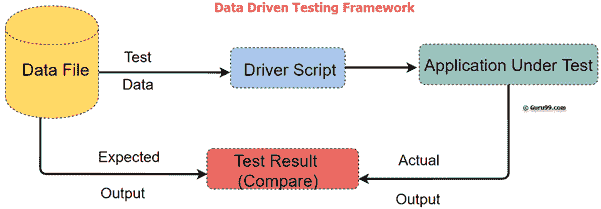
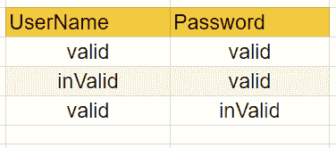

# 什么是数据驱动测试？ 学习创建框架

> 原文： [https://www.guru99.com/data-driven-testing.html](https://www.guru99.com/data-driven-testing.html)

## 什么是数据驱动测试？

**数据驱动测试**是一种测试自动化框架，以表格或电子表格格式存储测试数据。 这使自动化工程师可以拥有一个测试脚本，该脚本可以对表中的所有测试数据执行测试。

在此框架中，从数据文件中读取输入值，并将其存储到测试脚本中的变量中。 Ddt（数据驱动测试）可将肯定和否定测试用例都构建到单个测试中。

在数据驱动的测试自动化框架中，输入数据可以存储在单个或多个数据源中，例如 xls，XML，csv 和数据库。



在本教程中，您将学习

*   [什么是数据驱动测试？](#1)
*   [为什么要进行数据驱动测试？](#3)
*   [如何创建数据驱动的自动化框架](#4)
*   [数据驱动测试的最佳做法：](#5)
*   [数据驱动测试的优势](#6)
*   [数据驱动测试的缺点：](#7)

## 为什么进行数据驱动测试？

通常，我们有多个数据集需要运行相同的测试。 为每个数据集创建单独的测试是一个漫长且耗时的过程。

数据驱动测试框架通过将数据与功能测试分开来解决了此问题。 可以对输入的测试数据的不同组合执行相同的测试脚本，并生成测试结果。

**示例：**

例如，我们要使用包含 1000 个不同数据集的多个输入字段来测试登录系统。

要对此进行测试，可以采用以下不同方法：

**方法 1）**为每个数据集分别创建 1000 个脚本，并分别运行每个测试。

**方法 2）**手动更改测试脚本中的值，然后运行几次。

**方法 3）**从 excel 工作表导入数据。 从 excel 行中逐行提取测试数据并执行脚本。

在给定的三种情况下，前两种情况既费力又费时。 因此，遵循第三种方法是理想的。

因此，第三种方法就是数据驱动框架。

## 如何创建数据驱动的自动化框架


考虑您要测试应用程序的登录功能。

**步骤 1）**识别测试用例

*   输入正确的用户名和密码-登录成功
*   输入错误的用户名和正确的密码–登录失败
*   输入正确的用户名和错误的密码-登录失败

**步骤 2）**为上述 3 个测试用例创建详细的 est 步骤

| 测试用例＃ | 描述 | 测试步骤 | 测试数据 | 预期成绩 |
| --- | --- | --- | --- | --- |
| 1 | 检查登录以获取有效凭证 | 

1.  启动应用程序
2.  输入用户名密码
3.  单击确定
4.  检查结果

 | 用户名：有效密码：有效 | 登录成功

 |
| 2 | 检查登录以获取无效的凭证 | 

1.  启动应用程序
2.  输入用户名密码
3.  单击确定
4.  检查结果

 | 用户名：无效密码：有效 | 登录失败

 |
| 3 | Check Login for invalid credentials | 

1.  启动应用程序
2.  输入用户名密码
3.  单击确定
4.  检查结果

 | 用户名：有效密码：无效 | Login Fail

 |

**步骤 3）**创建测试脚本

如果您遵守 3 个测试步骤，则“测试步骤”仍然很常见。 您需要创建一个测试脚本来执行这些步骤

```
// This is Pseudo Code 

// Test Step 1: Launch Application 
driver.get("URL of the Application");  

// Test Step 2: Enter Username 
txtbox_username.sendKeys("valid"); 

// Test Step 3: Enter Password 
txtbox_password.sendKeys("invalid"); 

// Test Step 4: Check Results 
If (Next Screen) print success else Fail

```

**步骤 4）**使用输入测试数据创建 excel / csv



**步骤 5）**步骤修改脚本以循环输入测试数据。 输入命令也应参数化

```
// This is Pseudo Code
// Loop 3 Times
for (i = 0; i & lt; = 3; i++) {
    // Read data from Excel and store into variables
    int input_1 = ReadExcel(i, 0);
    int input_2 = ReadExcel(i, 1);

    // Test Step 1: Launch Application
    driver.get("URL of the Application");

    // Test Step 2: Enter Username
    txtbox_username.sendKeys(input_1);
    // Test Step 3: Enter Password

    txtbox_password.sendKeys(input_2);
    // Test Step 4: Check Results
    If(Next Screen) print success
    else Fail
}

```

以上只是 3 个测试用例。 仅通过将测试数据值附加到 Excel，即可使用测试脚本来循环以下测试用例

*   输入错误的用户名和错误密码–登录失败
*   输入正确的用户名和密码为空白–登录失败
*   输入空白的用户名和密码–登录失败

等等

## 数据驱动测试的最佳做法：

下面给出的是数据驱动测试的最佳测试实践：

*   理想的是在数据驱动的测试过程中使用真实的信息
*   测试流程导航应在测试脚本中编码
*   利用有意义的数据来驱动虚拟 API
*   使用数据来驱动动态断言
*   测试正面和负面结果
*   重新利用数据驱动功能测试的安全性和性能

## 数据驱动测试的优势

数据驱动提供了许多优势，其中包括：

1.  允许在回归测试期间使用多组数据值测试应用程序
2.  测试数据和验证数据只能组织在一个文件中，并且与测试用例逻辑分开。
3.  基于该工具，可以将测试脚本存储在单个存储库中。 这使文本易于理解，维护和管理。
4.  动作和功能可以在不同的测试中重复使用。
5.  一些工具会自动生成测试数据。 当需要大量随机测试数据时，这很有用，这有助于节省时间。
6.  数据驱动的测试可以执行开发的任何阶段。 数据驱动的测试服务通常在单个过程中合并。 但是，它可以在多个测试用例中使用。
7.  允许开发人员和测试人员清楚地将测试用例/脚本的逻辑与测试数据区分开。
8.  相同的测试用例可以执行多次，这有助于减少测试用例和脚本。
9.  测试脚本中的任何更改都不会影响测试数据

## 数据驱动测试的缺点：

数据驱动自动化测试方法的一些缺点是：

1.  测试的质量取决于实施团队的自动化技能
2.  测试大量数据时，数据验证是一项耗时的任务。
3.  维护是一个大问题，因为数据驱动测试需要大量编码。
4.  需要高级技术技能。 测试人员可能必须学习全新的脚本语言。
5.  将有更多文档。 主要与脚本管理测试基础结构和测试结果有关。
6.  需要使用诸如记事本之类的文本编辑器来创建和维护数据文件。

## 结论：

*   数据驱动的是一个自动化的测试框架，以表格或电子表格格式存储测试数据。
*   在数据驱动的测试自动化框架中，输入数据可以存储在单个或多个数据源中，例如 xls，XML，csv 和数据库。
*   为每个数据集创建单独的测试是一个漫长且耗时的过程。 数据驱动测试框架通过将数据与功能测试分开来解决了此问题。
*   在数据驱动测试中，使用实际信息是理想的选择
*   它允许在回归测试期间使用多组数据值测试应用程序
*   该方法的缺点在于它取决于实施团队的自动化技能