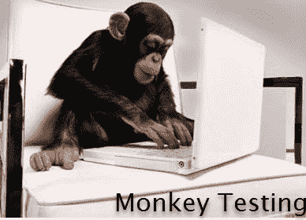
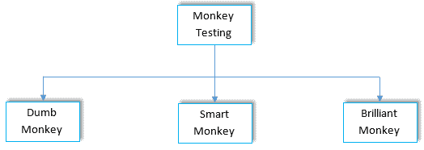

# 什么是猴子&大猩猩测试？ 例子，差异

> 原文： [https://www.guru99.com/monkey-testing.html](https://www.guru99.com/monkey-testing.html)

## 什么是猴子测试？

**MONKEY TESTING** 是软件测试类型，其中，测试人员在没有预定义测试用例的情况下将随机输入输入应用程序并检查系统行为。 猴子测试的目的是使用探索性技术来发现错误/错误。

1.  在 Monkey Testing 中，测试人员（有时也是开发人员）被视为“猴子”
2.  如果猴子使用计算机，他会出于自己的理解而在系统上随机执行任何任务
3.  就像测试人员将随机测试用例应用于被测系统以查找错误/错误而无需预先定义任何测试用例一样
4.  在某些情况下，Monkey Testing 也专用于[单元测试](/unit-testing-guide.html)或 [GUI 测试](/gui-testing.html)

### 什么是大猩猩测试？

大猩猩测试是一种软件测试技术，其中对该程序的模块进行反复测试以确保其正常运行，并且该模块中没有错误。

一个模块可以用相同的方式测试一百多次。 因此，大猩猩测试也被称为“挫折测试”。

### 猴子测试的优点：

1.  新型错误：测试人员可以根据他的理解完全暴露于实施测试的能力，除了先前陈述的场景（可能没有）。 系统中存在的新错误/错误。
2.  易于执行：针对随机数据安排随机测试是测试系统的简便方法
3.  技术水平较低的人：无需技术熟练的测试人员即可进行猴子测试（但并非总是如此）
4.  成本更低：建立和执行测试案例所需的支出大大减少

### 猴子测试的缺点：

1.  无法复制任何错误：由于测试人员会使用随机数据进行随机测试，因此可能无法复制任何错误或错误。
2.  准确性较低：测试人员无法定义准确的测试方案，甚至不能保证测试用例的准确性
3.  需要非常好的技术专长：总是不值得牺牲准确性，因此要使测试用例更准确，测试人员必须具有该领域的良好技术知识。
4.  更少的错误和耗时的时间：由于没有预定义的测试，因此此测试可以花费更长的时间，并且发现的错误数量可能会导致系统漏洞

可以认为猴子测试，大猩猩测试和临时测试是相同的，因为它们中都存在一些相似的事实，但真正的事实是它们彼此之间是不同的……如何？

我们将首先看到 Monkey 和 Gorilla Testing 之间的区别。 首先要清楚避免混淆。

### 猴子测试 V / s 大猩猩测试：

| 

猴子测试

 | 

大猩猩测试

 |
| 猴子测试是随机执行的，没有特别预定义的测试用例 | 它既不是预定义的也不是随机的 |
| 猴子测试是在整个系统上执行的，可以有多个测试用例 | 大猩猩测试是在很少有测试用例的特定少数选择性模块上执行的 |
| 猴子测试的目的是检查系统崩溃 | 大猩猩测试的目的是检查模块是否正常工作 |

一旦消除了这种差异，就可以看看下一步。

### 猴子测试与临时测试：

| 

Monkey Testing

 | 

临时测试

 |
| Monkey Testing is performed randomly with no specifically predefined test cases | 临时测试无需计划和文档即可进行（测试用例和 SRS） |
| 在 Monkey Testing 中，测试人员可能不知道系统的意义和目的。 | 在临时测试中，测试人员必须在执行测试之前充分了解系统 |
| The objective of Monkey Testing is to check for system crash | 临时测试的目的是将系统随机分为多个子部分并检查其功能 |

### 猴子测试的类型：

猴子测试根据其实现方式进一步分为几类。

1.  **Dumb Monkey：**测试人员不了解系统及其功能，也不保证测试用例的有效性。
2.  **Smart Monkey：**测试仪对系统的用途和功能有精确的了解。 测试员在系统中导航并提供有效的输入以执行测试。
3.  **Brilliant Monkey** ：测试人员根据用户的行为进行测试，并可以指定发生错误的几率。

猴子测试甚至也可以在 Android 上执行。 使用工具可以使猴子测试变得高效。 甚至可以用来查找更多像其他测试类型一样的错误。 如果我们使用工具进行猴子测试，那么遵循的一般流程是什么？ 快速浏览一下；

1.  像其他测试工具一样，第一步是在专用服务器上注册软件
2.  确保您已准备好所有必要的参考资料以构建测试套件
3.  运行内置的测试服
4.  “ Monkey Test”是将创建以记录测试结果的测试日志文件
5.  请记住，测试将一直进行到系统达到崩溃点为止，该崩溃点将操作记录到日志文件中
6.  最后，测试报告与相关人员共享，测试数据可以存储并用作将来参考

即使使用工具，猴子测试的过程也可以实现自动化，但是由于这是一种新的测试方法，并且尚未在行业层面建立，因此与其他工具相比，这些工具的身份较少。 随着测试过程时代的来临，这种情况可能会改变，然后我们将展望猴子测试的即将来临的影响及其对行业标准的重大影响。 这是 Monkey Testing 的入门教程，涵盖了有关它的基本概念。

**摘要：**

*   猴子测试是执行测试的相对较新的测试类型。
*   它与大猩猩测试和临时测试有很大的不同。
*   猴子测试在某些测试领域可能会有所帮助。
*   在软件工程中，猴子测试具有 3 种主要类型：哑猴子，智能猴子和辉煌猴子
*   可以使用工具使 Monkey Testing 自动化，有效和高效。

***本文由 Dhanshri Salvi 发表***