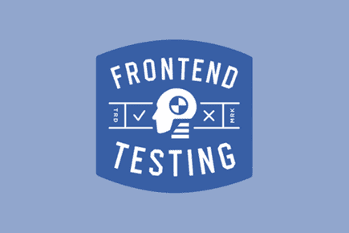

# 什么是前端测试？ 工具&框架

> 原文： [https://www.guru99.com/frontend-testing.html](https://www.guru99.com/frontend-testing.html)

## 什么是前端测试？

前端测试用于测试图形用户界面（GUI），网站或应用程序的功能和可用性。

**例如**：如果在应用程序的前端输入名称，则不应接受数字。 另一个示例是检查 GUI 元素的对齐方式。

前端测试的主要目的是通过连续更新来确保前端无缺陷。 除此前端测试外，还针对：

*   CSS 回归测试：会破坏前端布局的少量 CSS 更改
*   更改 JS 文件以使前端无法正常工作
*   性能检查

在本教程中，我们将学习，

*   [什么是前端测试？](#1)
*   [如何创建前端网站测试计划？](#2)
*   [为什么要创建前端测试计划？](#3)
*   [更好的前端测试技巧](#4)
*   [前端测试工具](#5)
*   [前端性能优化](#6)
*   [前端性能测试工具](#7)

## 如何创建前端网站测试计划？

创建前端测试计划是一个简单的 4 个步骤。

**步骤 1）**找出用于管理测试计划的工具

**步骤 2）**决定前端测试的预算

**步骤 3）**设置整个过程的时间表

**步骤 4）**确定项目的整个范围。 范围包括以下项目

*   用户使用的操作系统和浏览器 ISP 的受众计划
*   观众使用的流行设备
*   听众的熟练程度
*   观众上网校正速度

### 为什么要创建前端测试计划？

前端测试计划可帮助您确定

1.  浏览器
2.  操作系统

您的项目需要涵盖。 您可以在无数种浏览器和操作系统的组合上测试前端。 制定计划将帮助您减少测试工作量和金钱。

通过创建前端测试，计划您将获得以下优势：

1.  它可以帮助您完全了解项目范围
2.  执行前端测试还使您对部署项目充满信心

### 更好的前端测试技巧

您需要遵循以下一些重要技巧来创建更好的前端测试计划：

*   明智地准备预算，资源和时间。
*   使用无头浏览器，因此可以更快地执行测试。
*   减少测试中的 DOM 渲染量，以加快执行速度。
*   隔离测试用例，以便快速确定错误的根本原因，从而加快缺陷修复周期
*   使您的测试脚本可重复使用，以加快回归周期。
*   您应该对测试脚本使用一致的命名约定

## 前端测试工具

进行各种功能时，使用了一堆有用的前端测试工具。 这里是其中的一些：

前端测试工具：

### JS 测试工具：

**1\. [茉莉花](https://jasmine.github.io/)**

它是一个行为驱动的开发框架，用于测试 JavaScript 代码。 该工具更侧重于业务价值，而不是技术细节。 它具有干净的语法，可帮助您轻松编写测试。 它不依赖于任何其他 JavaScript 框架。 它受到诸如 JSSpec，ScrewUnit，JSpec 和 RSpec 之类的单元测试框架的严重影响。

### 功能测试工具：

**2\. [硒](https://www.selenium.dev/)**

硒是一种前端测试工具。 它跨 Windows，Mac 和 Linux 等各种浏览器&平台执行端到端测试。 它允许您使用 Java，PHP，C＃等不同的编程语言编写测试。该工具提供了记录和回放功能，无需学习 Selenium IDE 即可编写测试。

### CSS 工具：

**3\. [针](https://needle.readthedocs.io/en/latest/)**

该针是用于测试 CSS 的 Front 测试工具。 它通过截取网站某些部分的屏幕截图来检查视觉元素（如字体/ CSS /图像）是否正确呈现。 之后，该工具将与一些已知的良好屏幕截图进行比较。 它还允许测试人员计算 CSS 值和 HTML 元素的位置。

对于任何前端测试工具，您需要了解以下两个主要挑战：

1.  在最初阶段，测试自动化需要大量的努力。 因此，它需要更多的时间和精力。
2.  测试工具可能与操作系统和浏览器存在一些兼容性问题。

## 前端性能优化

前端性能测试检查“页面加载速度如何”。

在测试具有高用户负载的应用程序之前，为单个用户优化前端性能是一个好习惯。

### 为什么前端性能优化很重要？

早期的性能优化意味着优化服务器端。 这是因为大多数网站都是静态的，并且大多数处理是在服务器端完成的。

但是，随着 Web 2.0 技术的出现，Web 应用程序变得更加动态。 结果，客户端代码已成为性能问题。

### 前端性能优化的好处是什么？

*   在网站测试中，除了发现服务器瓶颈之外，发现客户端性能问题同样重要，因为它们很容易影响用户的体验。
*   将后端性能提高 50％将使应用程序的整体性能提高 10％。
*   但是，将前端性能提高 50％将使应用程序的整体性能提高 40％。
*   此外，与后端相比，前端性能优化既简单又经济高效。

## 前端性能测试工具

[**页面速度**](https://developers.google.com/speed/pagespeed/)

Page speed 是 Google 推出的开源性能测试插件。 该工具会评估网页并提供建议以最大程度地减少加载时间。 当用户使用 Google 搜索引擎访问网页时，它可以使网页检索更快。

[**YSlow**](http://yslow.org/)

YSlow 是一个前端 Web 性能测试工具。 它通过检查页面上的所有组件（包括使用 JavaScript 创建的组件）来分析网页的性能。 它还可以测量页面的性能并向用户提供建议。

## 结论

*   前端测试是测试或验证前端功能，GUI 和可用性。
*   前端测试的主要目的是确保每个用户都可以免受错误的良好保护。
*   创建前端测试计划可帮助您了解项目需要涵盖的设备，浏览器和系统。
*   它还可以帮助您完全了解项目范围
*   茉莉，硒，浏览器，TestComplete，Needle 是一些前端测试工具的示例。