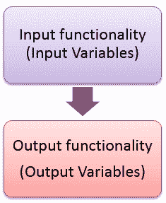
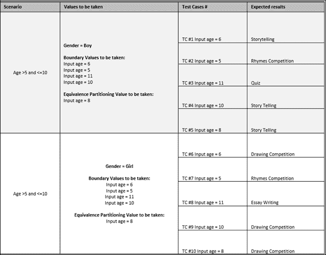

# 什么是软件测试中的域测试？ （带有示例）

> 原文： [https://www.guru99.com/domain-testing.html](https://www.guru99.com/domain-testing.html)

## 什么是域测试？

域[测试](/software-testing.html)是[功能测试](/functional-testing.html)的一种，它通过提供输入并评估其适当的输出来测试应用程序。 它是一种软件测试技术，在这种情况下，必须使用最少数量的输入来测试系统的输出，以确保系统不会接受无效且超出范围的输入值。

域测试是最重要的[白盒测试](/white-box-testing.html)方法之一。 域测试的主要目标是检查系统是否接受可接受范围内的输入并提供所需的输出。 同样，它可以验证系统是否不接受超出指定范围或有效范围的输入，条件和索引。

域测试不同于您测试软件系统所需的特定领域知识。

在本教程中，您将学习-

*   [域测试的更简单实践](#1)
*   [域测试策略](#2)
*   [域测试示例](#3)
*   [域测试结构](#4)

## 域测试的简单实践

在域测试中，我们将一个域划分为多个子域（等效类），然后使用每个子域中的值进行测试。 例如，如果已经提供了一个网站（域）进行测试，为了便于测试，我们会将网站划分为小部分（子域）。

域可能涉及测试任何一个输入变量或输入变量的组合。

从业人员经常研究领域测试的最简单案例，而不是另外两个名称，即“边界测试”和“对等类分析”。

**[边界测试](https://www.guru99.com/equivalence-partitioning-boundary-value-analysis.html)** -边界值分析（BVA）基于对分区之间边界的测试。 我们将测试分区/类中的有效和无效输入值。

**等效类测试**-这种技术的思想是将一组测试条件划分（即划分）为可以视为相同的组或集合（即系统应等效地处理它们），因此，“ 等价分区。”

该简化形式适用于域测试-

1.  仅测试输入变量
2.  仅在系统级别进行测试时
3.  仅一次测试一次
4.  仅当以非常肤浅的方式进行测试时

可以简化如下：

| **变量** | **有效类等效类** | **无效的类别对等类别** | **边界&特殊情况** | **注释** |
| X | 0-100 |  | 0 |  |
|  |  |  | 100 |  |
|  |  | < 0 | -1 |  |
|  |  | > 100 | 101 |  |

**说明：**

1.  如果字段接受范围为 0-100 的字段，则该字段不应接受-1 和 101，因为它们是无效的条目并且超出了边界。
2.  该字段应接受值，例如 0,100 及其之间的任何数字。

**这样的构建表（实际上）**

1.  要随着时间建立等效类分析，请将信息放入电子表格中。 首先列出变量。 获取有关它们的信息。
2.  该表最终应包含所有变量。 这意味着您可以观察到的所有输入变量，所有输出变量和任何中间变量。
3.  实际上，我看到的大多数表都不完整。 最好的列出所有变量，并为关键变量添加详细信息。

## 域测试策略

在进行域测试时，您需要考虑以下事项，

1.  我们正在测试哪个域？
2.  如何将值分组为类？
3.  要测试的类的哪些值？
4.  如何确定结果？

**我们正在测试哪个域？**

我们测试的任何域都具有一些输入功能和输出功能。 将输入一些输入变量，并且必须验证适当的输出。

## 域测试示例

1.  考虑单个输入测试方案：

C = a + b，其中 a 和 b 是输入变量，C 是输出变量。

在上面的示例中，这里不需要分类或组合变量。

2.  考虑以下多个输入和适当的输出方案：

考虑一个儿童游戏展览，安排了 6 个比赛，并且必须根据年龄和性别输入门票。 票务是游戏展览会整体功能的测试模块之一。

根据场景，我们根据年龄和比赛获得了六个场景：

1.  > 5 岁和< 10 岁，男孩应该参加讲故事。
2.  年龄> 5 和< 10 岁的女孩应参加绘画比赛。
3.  > 10 岁和< 15 岁，男孩应参加测验。
4.  年龄> 10 和< 15 岁的女孩应该参加散文写作。
5.  年龄< 5 岁，男孩和女孩都应参加押韵比赛。
6.  > 15 岁，男孩和女孩都应该参加诗歌比赛。

在此输入的是年龄和性别，因此将颁发比赛门票。 输入的这种情况分区或简单地将值分组都出现在图中。

**如何将值分组为类？**

对某些值进行分区意味着将其拆分为不重叠的子集。

正如我们前面讨论的，分区有两种类型：

1.  **等效分区**-等效分区是**软件测试**技术，该技术将软件单元的输入数据划分为等效数据的分区，从中可以得出测试用例。 原则上，测试用例设计为至少覆盖每个分区一次。
2.  **边界值分析-**边界值分析是一种**软件测试**技术，其设计旨在包括范围内边界值的代表。 这个想法来自**边界**。

对于上面的示例，我们将值划分为一个或多个子集。 我们将年龄分为以下几类：

1.  **第 1 类：** 5 至 10 岁的儿童
2.  **第 2 类：**年龄小于 5 岁的儿童
3.  **第 3 类：** 10 至 15 岁年龄段的儿童
4.  **第 4 类：**年龄大于 15 岁的儿童。

**要测试的类的哪些值？**

用于测试的值应为边界值：

1.  边界是我们从中采样的等价类的代表。 他们比其他班级成员更有可能暴露错误，因此他们是更好的代表。
2.  等效类的最佳代表是范围之间的值。

对于以上示例，我们要测试以下类：

例如对于方案 1：

1.  **第 1 类：** 5 至 10 岁的儿童（年龄> 5 和< = 10）

**边界值：**

1.  值应等于或小于 10。因此，年龄 10 岁应包括在该类中。
2.  值应大于 5。因此，年龄 5 岁不应包括在该类中。
3.  值应等于或小于 10。因此，年龄 11 岁不应包括在该类中。
4.  值应大于 5。因此，此类应包括 6 岁。

**等效分区值：**

当必须从每个分区测试一个条件时，将引用等效分区。 在这种情况下，我们假设如果分区中的一个条件起作用，那么所有条件都应该起作用。 同样，如果该分区中的一个条件不起作用，那么我们假定其他条件都不起作用。 例如，

（年龄> 5 和< = 10）

由于从 6 到 10 的值是有效值，因此必须选择 6,7,8,9 和 10 中的值之一。 因此，所选年龄“ 8”是介于（年龄> 5 和< = 10）之间的年龄组的有效输入年龄。 这种划分称为等效划分。

| **场景** | **要采用的边界值** | **等价分区值** |
| 男孩-年龄> 5 和< = 10 | 输入年龄= 6

输入年龄= 5

输入年龄= 11

输入年龄= 10 | 输入年龄= 8 |
| 女孩-> 5 岁，< = 10 岁 | Input age = 6

Input age = 5

Input age = 11

Input age = 10 | Input age = 8 |
| 男孩-年龄> 10 和< = 15 | 输入年龄= 11

输入年龄= 10

输入年龄= 15

输入年龄= 16 | 输入年龄= 13 |
| 女孩-年龄> 10 和< = 15 | Input age = 11

Input age = 10

Input age = 15

Input age = 16 | Input age = 13 |
| 年龄< = 5 | 输入年龄= 4

输入年龄= 5 | 输入年龄= 3 |
| 年龄> 15 | 输入年龄= 15

输入年龄= 16 | 输入年龄= 25 |

**我们如何确定程序是否通过了测试？**

传递功能不仅取决于上述情况的结果。 给定的输入和预期的输出将为我们提供结果，这需要领域知识。

确定示例的结果：

因此，如果上述所有测试案例都通过了，则竞赛中的票证发行域将通过。 如果不是，则域失败。

## 域测试结构

通常，测试人员在域测试中遵循以下步骤。 这些可以根据我们的测试需求进行定制/跳过。

*   确定潜在的有趣变量。
*   确定您现在可以分析的变量并对其进行排序（最小到最大，反之亦然）。
*   如上所述创建和标识边界值和等效类值。
*   确定次要维度并以经典方式进行分析。 （在上面的示例中，“性别”是次要维度）。
*   识别并测试保存结果的变量（输出变量）。
*   评估程序如何使用此变量的值。
*   确定其他可能相关的变量以进行组合测试。
*   想象一下不一定映射到明显维度的风险。
*   识别并列出未分析的变量。 收集信息以供以后分析。
*   用风险/对等表汇总您的分析。

**摘要：**

如上所述，域测试需要提供正确的输入以实现所需输出的知识。 因此，只能将其用于一小段代码。