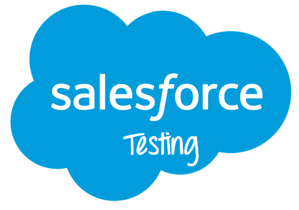
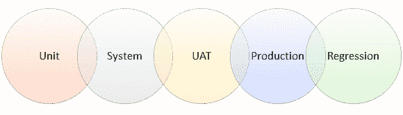

# Salesforce 测试教程：什么，流程，工具，最佳实践

> 原文： [https://www.guru99.com/salesforce-testing-tutorial.html](https://www.guru99.com/salesforce-testing-tutorial.html)

## 什么是 Salesforce？

Salesforce 是世界上第一个基于云的 CRM 系统。 它由马克·贝尼奥夫（Marc Benioff）和帕克·哈里斯（Parker Harris）于 1999 年 3 月成立。开发此 CRM 平台的目的是帮助用户以经济实惠的方式轻松地进行销售，服务，营销，分析并与客户建立联系。

SFDC（Sales Force Dot Com）具有许多标准功能，可帮助您管理与潜在客户和客户的关系。 它还允许您与员工和业务合作伙伴进行互动和协作，以将其数据安全地存储在云中。

在本教程中，您将学习：

*   [什么是 Salesforce？](#1)
*   [什么是 SalesForce 测试？](#2)
*   [为什么要进行 Salesforce 测试？](#3)
*   [Salesforce 测试的类型](#4)
*   [SalesForce](#5) 中的测试级别
*   [Salesforce 测试流程](#6)
*   [Salesforce 测试挑战](#7)
*   [Salesforce 测试的最佳做法](#8)
*   [Salesforce 测试人员的角色和职责](#9)
*   [SalesForce 测试自动化工具](#10)
*   [示例 Salesforce 测试方案](#11)
*   [Salesforce 测试：客户挑战](#12)

## 什么是 SalesForce 测试？

关于 Salesforce 的一个很棒的事情是，许多现成的功能都可以自定义以满足公司的需求。

Salesforce 测试是对在原始 SDFC 中执行的配置和自定义的验证。

**面临的挑战是确保测试人员正在检查已自定义的代码，以代替测试内置的 Salesforce 功能。**

SalesForce CRM 基于称为 **APEX** 的平台开发语言构建。 它还为开发人员提供了许多内置的单元测试用例，以验证其代码。

## 为什么要进行 Salesforce 测试？

以下是进行 Salesforce 测试的主要原因：

*   允许您检查配置和代码是否正常运行。
*   帮助您验证完成的系统可以支持客户的业务流程
*   帮助您确认系统的初始构建是否满足约定的要求
*   帮助您及早发现问题，同时轻松解决问题
*   功能流根据测试用例的状态进行报告。 这使团队可以创建功能流程来了解应用程序的功能
*   流程构建器功能可帮助您检查系统的工作状况和行为
*   工作流使您可以检查基于时间的事件的功能

## Salesforce 测试的类型

### 手动测试：

手动软件测试过程包括使用传统方法测试 Salesforce.com App。 QA 团队可以使用手动测试来执行功能测试，快乐路径测试，集成测试，回归测试和系统测试。

### 自动化测试：

自动化测试涉及一个计算机程序来测试 Salesforce.com 或 Force.com 应用程序。 使用了自动测试工具，如 Selenium，Assure Click，QTP 等。

## Salesforce 中的测试级别

通常遵循以下测试级别，适用于 Salesforce

**单元测试**

*   单元测试过程由 Apex 开发人员进行。 它涉及在其代码中编写子句，以自动测试其覆盖范围
*   它可以帮助您评估受影响的数据记录数，以便代码可以在该环境中成功运行。
*   要将 Apex 代码部署到生产环境中，您的代码覆盖率至少应为 78％

**系统测试：**

*   由 Salesforce 顾问的专家团队执行
*   从头到尾涉及测试系统的技术流程
*   包含基于特定输出的测试脚本
*   允许您使用系统中的自动规则（例如工作流程，验证，分配等）对问题进行故障排除。

**UAT 测试：**

*   由将使用该应用程序的用户进行
*   允许测试系统支持业务流程的能力
*   根据业务情况根据测试脚本进行 UAT 测试
*   期望的输出应该是客户确认系统适合于目的

**生产测试：**

*   这是在生产环境中进行系统测试的重复
*   通过 Salesforce 中的产品测试，您可以测试配置和代码是否已从沙箱正确部署到生产环境中
*   如果在最终项目启动之前还有时间，则客户端应在部署后再次通过 UAT 脚本运行

**回归测试：**

*   回归测试的主要目的是测试代码和配置版本是否正在影响系统的现有用户进程。
*   一旦将增强或修补程序部署到生产中，将进行此操作。
*   用户提供可能影响其当前流程的更改列表

## Salesforce 测试流程

Salesforce 的测试过程与任何常规的基于 Web 的应用程序相同。 测试人员应该对在测试过程中建立的可定制功能有清晰的认识。 它可以帮助他们将精力集中在经过定制的代码上，而不是内置的 Salesforce 功能。

开发人员和测试人员应将沙盒环境（测试环境）用于其每个目的。 沙盒环境中经过测试的代码已从沙盒环境部署到生产中。 假定质量检查测试人员具有 Salesforce 中使用的术语的基本知识和理解。

## Salesforce 测试挑战

Salesforce 测试并非易事。 测试人员在此过程中面临许多挑战。 他们之中有一些是：

*   要测试 Visualforce，Salesforce 或 Service Cloud Console 等高级功能并非易事。
*   您需要为 Lightning UI 重新创建所有经典测试
*   一些标准功能虽然没有使用，但无法删除
*   当我们切换到测试环境时，GUI 测试不起作用
*   自动化测试应该能够在您的所有测试环境中工作
*   为 Salesforce 屏幕创建字段定位器时会出现问题，因为组织之间某些字段 ID 有所不同

## Salesforce 测试的最佳做法

*   以真实的用户配置文件运行测试
*   应准备测试数据以验证报告功能
*   测试方法必须包括功能测试，UI 测试，回归测试和系统集成测试
*   应特别注意视觉力页面的动态性质，因为网页的所有元素可能不会同时加载
*   自动化测试应使用 Selenium 和 HP Unified Functional Testing 等工具执行
*   Salesforce 测试人员应考虑哪些因素包括正向和负向流量
*   必须使用工作流程来构造和测试用户角色

## Salesforce 测试人员的角色和职责

Salesforce 测试人员的重要角色和职责是：

*   应该能够进行烟雾测试，以确保所有主要功能均按要求运行
*   创建正面和负面的测试方案
*   能够进行等价分割和边界值分析
*   还需要测试人员在应用程序上工作并了解其功能，以创建功能图
*   测试人员应该与开发团队建立便捷的沟通渠道
*   他应该了解可以为 Salesforce 应用构建的可定制功能
*   测试人员需要执行基于角色的测试用例，以确保数据的一致性
*   如果 Salesforce 与第三方应用程序集成，他还应该执行兼容性测试
*   Salesforce 测试人员应该熟悉 JMeter 之类的负载测试工具，以验证可能在 Salesforce 中提供不一致结果的复杂流程
*   顶点知识

## SalesForce 测试自动化工具

由于大多数测试网页都是动态的，因此在 SalesForce 中执行自动化功能测试是一项艰巨的任务。 因此，测试人员需要构建健壮的自动化框架，该框架不仅在今天而且在将来都将有用。

下面给出了广泛使用的 Salesforce 测试工具：

*   Selenium Web 驱动程序
*   惠普统一功能测试（UFT）
*   黄瓜
*   Force.com IDE（基于 Eclipse）
*   变更集（云部署）
*   Ant / force.com 迁移工具
*   工作日

**使用测试 Salesforce 测试工具的原因：**

*   帮助您节省 75％的时间和 25％的测试自动化成本
*   提供更好的 Apex 测试执行，详细的测试覆盖率和课程覆盖率报告
*   您可以利用 Selenium 和 JMeter 等行业领先的自动化工具。
*   自动生成测试方案以在不同的环境和多个浏览器上运行
*   无缝记录和回放您记录的测试用例
*   帮助您自动化所有类型的部署前和部署后任务
*   Salesforce 测试过程将数据与测试脚本分开，并允许您使用多个数据集进行增强

## 示例 Salesforce 测试方案

*   您可以捕获潜在客户/客户的联系信息
*   可以将联系人标记为有效/无效
*   任何公司都可以标记为客户或潜在客户
*   可以借助网络表单来捕获潜在客户
*   报价价格不能为零
*   交易完成后应发送电子邮件。 被退回的电子邮件（如果有的话）
*   与第三方软件的集成应该正常工作
*   计费服务应能按预期工作
*   联系人，机会和潜在客户管理中的记录无重复。
*   移动工作流程按预期工作
*   未经授权的用户不能访问文件。

## Salesforce 测试：客户挑战

客户总是对 Salesforce 测试感到紧张，因为他们很多都不知道如何正确进行测试。 结果，他们有一个与现实截然不同的神话。

这里是其中的一些：

| **客户端问题** | **解决方案** |
| 不知道如何使用 Salesforce 系统。 | 客户需要测试他们的过程，而不是系统功能。 |
| 没有所有数据都无法在系统中进行测试。 | 他们只需要样本记录即可进行测试。 |
| 我没有空余时间进行测试和日常工作 | 他们需要在设计和建造阶段与您的 PM 保持联系，并定期进行检入电话。 |

### 摘要

*   Salesforce 是世界上第一个基于云的 CRM 系统
*   Salesforce 测试是验证在香草 SDFC 中执行的配置和自定义
*   Salesforce 测试可帮助您验证完成的系统是否可以支持客户的业务流程
*   SalesForce Testing 的最大挑战是确保您正在测试自定义项和内置的 SDFC 功能
*   Salesforce 测试的重要级别是单元测试，系统测试，UAT 测试，生产测试，回归测试
*   Salesforce 测试的最大挑战是您需要为 Lightning UI 重新创建所有经典测试
*   Salesforce 测试人员应将测试作为真实用户配置文件运行
*   Salesforce 测试应该能够进行冒烟测试，以确保所有主要功能均按要求运行
*   Selenium Web 驱动程序，HP 统一功能测试（UFT），Cucumber Force.com IDE 是少数重要的 Salesforce 测试工具