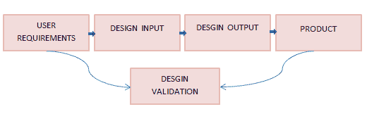
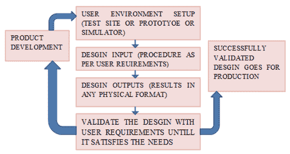

# 设计验证&验证过程

> 原文： [https://www.guru99.com/design-verification-process.html](https://www.guru99.com/design-verification-process.html)

在本教程中，您将学习-

*   [什么是设计验证？](#1)
*   [什么是设计验证？](#2)
*   [设计验证和验证之间的区别](#3)
*   [设计验证流程](#4)
*   [设计验证流程](#5)
*   [设计验证和验证的优势](#6)

## 什么是设计验证？

**设计验证**是在产品开发期间或结束时对软件进行评估的过程，以确保制造的系统满足最终用户应用程序或产品和环境中的规范。

验证涉及根据用户需求证明设计的一致性和完整性。 这是您实际构建产品版本并根据用户要求进行验证的阶段。

下图显示了设计验证过程。

目的是用客观证据证明产品满足用户需求。 客观证据不过是输出的任何物理证据，例如图像，文本或音频文件，表明该过程已完成。

通过客观证据，该过程将持续检查产品是否符合预定要求。 此过程涉及测试活动，检查和分析等。

## 什么是设计验证？

**设计验证**是一种通过检查并提供证据证明设计输出符合设计输入规格的确认方法。 任何产品开发过程中的必不可少的过程，可确保设计的产品与预期用途相同。

设计输入是用作设计目的基础的任何物理和性能要求。 设计输出是每个设计阶段以及整个设计工作结束时的结果。 最终的设计输出是设备主记录的基础。

## 设计验证和验证之间的区别

验证和确认之间总是存在误解。 这些是在开发过程的每个阶段执行的不同活动。

| 

设计验证

 | 

设计验证

 |
| 

*   设计验证用于实际设计输出应与满足产品规格的预期设计输出相同的情况。

 | 

*   设计验证用于定义最终设计是否符合用户需求。

 |
| 

*   设计验证问：您是否正确设计了产品？

 | 

*   设计验证问：您是否设计了正确的产品？

 |
| 

*   设计验证包括单元和主要集成级别测试。

 | 

*   设计验证包括次级或更高级别的集成和系统级测试。

 |
| 

*   在设计验证过程中可以完成设计验证的某些方面，但是设计验证不能替代设计验证。

 | 

*   设计验证是在成功进行设计验证之后进行的。

 |
| 

*   在任何条件下，都可以在单个模块或完整的系统上进行设计验证。

 | 

*   设计验证应根据用户要求在指定条件下进行。

 |
| 

*   设计验证可以使用静态技术。 它包括系统检查，分析和正式验证（测试）活动。

 | 

*   设计验证由经过审核，批准和签名的最终报告（测试执行结果）组成。 这些文档被存储以备将来参考。

 |

## 设计验证流程

**鉴定和制备：**

*   在规范的开发阶段，对验证活动的识别是并行进行的。 这使设计人员可以确保规范是可验证的。 因此，测试工程师可以启动详细的测试计划和程序。 规范中的任何更改均应告知。
*   确定进行验证的最佳方法，定义度量方法，所需的资源，工具和设施。
*   完成的验证计划将与设计团队一起审查，以在最终确定计划之前确定问题。

**规划：**

*   计划验证是与核心团队和开发团队同时进行的活动。 这在整个项目生命周期中都会发生。 在对设计输入进行任何更改时，将对此进行更新。
*   在此阶段，应将范围内的测试软件或系统记录在案。
*   在此阶段制定了初步的测试计划和测试计划的完善。 测试计划捕获了降低项目风险的关键里程碑。
*   工具，测试环境，开发策略以及通过检查或分析来识别需求。

**开发中：**

*   测试用例的开发将与项目团队实施的 SDLC 方法一致。 在此阶段可以确定多种测试方法。
*   必须开发设计输入，包括明确，可验证的最简单的验证活动。
*   按顺序执行类似概念时，应减少验证时间。 甚至一个测试的输出也可以用作后续测试的输入。
*   在测试用例和相应的设计输入之间创建了可链接性链接，以确保测试所有需求并且设计输出满足设计输入。

**执行：**

*   在开发阶段创建的测试程序将根据测试计划执行，并严格遵循验证活动。
*   如果发生任何无效的结果或需要修改任何程序，则记录更改并获得适当的批准很重要。
*   在此阶段，任何问题都会被识别并记录为缺陷。
*   创建可牵引性矩阵以验证在验证测试计划中确定的所有设计输入均已通过测试，并确定通过率。

**报告：**

*   该活动在验证执行的每个阶段结束时执行。
*   设计验证报告提供了验证结果的详细摘要，包括配置管理，每种测试类型的测试结果以及在验证活动中发现的问题。
*   在需求和相应的测试结果之间创建设计验证可追溯性报告，以验证所有需求均已通过测试并提供了适当的结果。
*   任何不符合项将被记录在案并予以适当解决。
*   设计验证活动完成后进行复查并分别获得批准。

## 设计验证过程

*   通过与执行类似目的的类似设备进行比较，可以验证某些设计。 此方法对于验证现有基础结构或将要合并到新系统或应用程序中的标准设计的配置更改特别有用。
*   演示和/或检查可用于验证产品的要求和其他功能。
*   分析设计可以完成，例如数学建模，可以重新创建所需功能的仿真。
*   在最终设计上执行测试，以验证系统是否可以按照指定的设计运行。
*   测试计划，执行和结果应形成文件并作为设计记录的一部分进行维护。 因此，验证是所有验证活动结果的集合。
*   当在最终设计验证中使用等效产品时，制造商必须记录相似性以及与初始生产的任何差异。

**范例**

*   让我们以简单的产品（防水手表）为例。
*   产品要求文件可能会指出“手表在游泳时必须是防水的”。
*   设计规范可能会指出“即使用户长时间游泳，手表也应能工作。”
*   测试结果应确认手表应满足这些要求，否则将进行重新设计迭代，直到满足要求为止。

## 设计验证和验证的优势

*   我们可以持续监控设计，使我们能够在每个阶段满足用户定义的要求。
*   验证设计将指出功能的工作方式与预期的工作方式之间的差异。
*   如果可能进行任何更改或增强，则记录验证过程将有助于在将来的任何阶段轻松了解功能。
*   开发时间将持续减少，从而提高了生产率，从而能够按预期交付产品。
*   该过程包括需要采用的每种验证方法的范围和范围。
*   可以使用代表最终用户需求的详细设计数据来执行验证。
*   结果和用户需求文档之间的任何差异都必须记录下来。
*   验证设计中的更改导致重新验证活动。
*   重要的是要记录验证期间发生的所有活动，以充分证明设计符合用户要求。