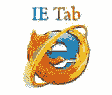

# 2020 年 10 种最佳跨浏览器兼容性测试工具

> 原文： [https://www.guru99.com/top-10-cross-browser-testing-tools.html](https://www.guru99.com/top-10-cross-browser-testing-tools.html)

有一些广告无限工具可以检查您的 Web 应用程序是否具有跨浏览器兼容性。 这是我们的专家筛选出的用于跨浏览器[测试](/software-testing.html)的顶级工具列表。

### 1） [LambdaTest](https://bit.ly/2RMDT3f)

[LambdaTest](https://bit.ly/2RMDT3f) 是一个基于云的平台，可帮助您对 Web 应用程序或网站执行跨浏览器兼容性测试。 您可以在 LambdaTest 的可伸缩云网格上运行自动化的硒脚本，甚至可以在真实的浏览器环境中执行实时交互式测试。

**Key Features:**

*   在具有 2000 多种浏览器环境的可扩展 Selenium 网格上运行 Selenium 自动化测试
*   对您的网站执行自动屏幕截图和响应式测试
*   使用 SSH 隧道测试本地或私人托管的网站
*   一键式错误记录到您喜欢的错误跟踪工具，如 Asana，BitBucket，GitHub，JIRA，Microsoft VSTS，Slack，Trello 等。

* * *

### 2）[硒盒](https://bit.ly/3cz0I1t)

[Selenium Box](https://bit.ly/3cz0I1t) 是在本地或企业云中运行的企业 Selenium 网格，受到完全管理并具有高度可扩展性。 它允许在公司防火墙内执行针对 Web 和移动设备的自动化测试。 该产品是为安全敏感领域（例如银行，保险和医疗领域）的大型组织设计的。 Selenium Box 将 SaaS 解决方案的功能与本地/内部部署的安全性和性能相结合。

**主要功能：**

*   本地/企业云部署
*   桌面浏览器，模拟器/模拟器和真实设备
*   安全，无需隧道或外部访问
*   全面管理，免维护
*   高度可扩展
*   企业集成例如 LDAP，人群

* * *

### 3）Ghostlab

Ghostlabs 为所有连接的设备上的单击，滚动，重新加载和形成输入提供同步测试。 它使用高级的内置检查器来快速查清任何问题。 它可以连接到任何设备上的 DOM 或 [JavaScript](/interactive-javascript-tutorials.html) 输出，并有效地修复代码。 它适用于 Mac OS X 和 Windows，而无需进行设置。 为了使用 Ghostlab 服务器跟踪文件更改，您可以集成本地目录，本地主机 [Apache](/apache.html) 或任何其他服务器中的页面。

[下载 Ghostlab](http://vanamco.com/ghostlab/)

* * *

#### 4）浏览器快照

Browsershots 是一个开源 Web 浏览器测试平台。 它使您可以在任何浏览器和操作系统中测试网站。 在浏览器快照中，您可以使用出色的自定义选项（例如操作系统，浏览器类型，颜色深度，JavaScript 状态和 Flash 启用/禁用设置）运行交叉兼容性测试。 浏览器快照使您可以在近 61 种浏览器和各种操作系统中进行网站截屏。

[下载 Browsershots](http://browsershots.org/)

* * *

#### 5）IE NetRender

这是用于跨浏览器测试的最简单的工具，您只需在 IE 上选择一个版本，然后输入要测试的 URL，即可获得正在使用的页面的屏幕截图。 它能够实时处理大量请求，并且没有等待时间。 所有渲染的图像和 URL 均保持私有和安全。 它也适用于快速测试，也可以在不同版本的 IE 中用于逐像素站点比较。

[下载 IE NETRender](http://netrenderer.com/)

* * *

#### 6）Turbo.net（以前是 Spoon.net）

Turbo.net（以前称为 Spoon.net）是一个开放源代码的浏览器沙箱，用于部署或测试当前版本，beta 版本或旧版 Web 浏览器的多个版本，而无需维护笨拙的虚拟机。 由于此类 Turbo.net（以前称为 Spoon.net）在隔离的“沙箱”中运行应用程序，因此您可以并排运行多个应用程序，而没有任何依赖性或冲突。 该工具的唯一缺点是它当前不支持 [Linux](/unix-linux-tutorial.html) ，但是 Linux 版本正在开发中。

[下载 TURBO](https://turbo.net/)

* * *

#### 7）IE 标签页

使用 Firefox 或 chrome 浏览器，您只需单击一下即可轻松查看网页。 在 IE 选项卡中，您可以在不同的浏览器中查看网页，而无需实际从一种浏览器切换到另一种浏览器。 IE 选项卡的缺点是它不适用于 Firefox 6.0 及更高版本。 IE 选项卡完全支持 Internet 配置，这意味着可以手动或自动设置各种设置，例如安全设置和 Internet 设置。

IE Tab 扩展名将自动检查是否应使用 IE 显示网页

[下载 IE 标签](http://www.ietab.net/)

* * *

#### 8）跨浏览器测试

跨浏览器测试工具具有多种不同的浏览器及其版本。 它可用于多个 OS。 它支持 1000 多种不同浏览器和操作系统（包括移动浏览器）的组合。 它具有本地主机支持，自动截图功能，在登录后进行测试等功能。 它是最受欢迎的商业跨浏览器测试工具。

[下载 CrossBrowserTesting](http://crossbrowsertesting.com/)

#### 9）超级预览

SuperPreview 是 Microsoft 产品，使您可以在一个统一的界面中比较不同的渲染引擎。 它与 Expression Web 很好地集成在一起，并提供了在构建页面时轻松预览和比较页面的功能。

[下载超级预览](http://www.softpedia.com/get/Internet/WEB-Design/Web-Design-related/Expression-Web-SuperPreview.shtml)

* * *

#### 10）浏览器堆栈

使用浏览器堆栈，可以在台式机和移动浏览器上进行基于 Web 的浏览器测试。 它基于云，因此不需要任何安装，并且预安装的开发人员工具对于快速跨浏览器测试和调试很有用。 使用浏览器堆栈，您可以设置一个全面的测试环境，并支持代理，防火墙和 Active Directory。 它支持歌剧移动，Android，Windows（XP，7 和 8），iOS，OSX 雪豹，狮子和山狮等。 浏览器堆栈使您可以远程测试页面。

[下载 BrowserStack](http://www.browserstack.com/)

* * *

#### 11）酱实验室

它是领先的基于云的 Web 和移动应用程序测试平台。 它使您可以在 260 多种不同的浏览器平台和设备上在云中运行测试。 无需设置或维护虚拟机。 通过访问实时断点，您可以轻松控制系统以手动调查问题。 使用 Sauce Lab，您可以按时间顺序列出最近运行的测试，以及有关运行时，测试平台，构建以及它们是否通过的信息。

[下载 SauceLab](https://saucelabs.com/home)

以下是工具汇总列表

*   幽灵实验室
*   酱实验室
*   浏览器堆栈
*   浏览器快照
*   IE 浏览器
*   浏览器
*   Turbo.net
*   IE 标签页
*   跨浏览器测试
*   超级预览