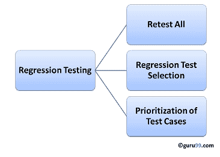
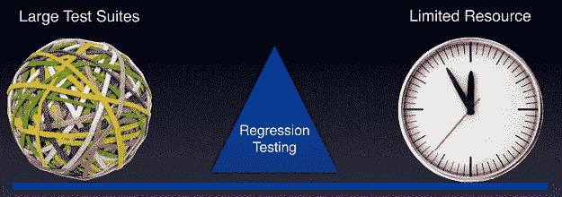

# 什么是回归测试？ 定义，测试用例（示例）

> 原文： [https://www.guru99.com/regression-testing.html](https://www.guru99.com/regression-testing.html)

## 什么是回归测试？

**回归测试**被定义为一种软件测试，用于确认最近的程序或代码更改未对现有功能产生不利影响。

回归测试只不过是全部或部分选择已执行的测试用例，然后重新执行以确保现有功能正常运行。

进行此测试是为了确保新代码更改不会对现有功能产生副作用。 这样可以确保在完成最新代码更改后，旧代码仍然可以使用。

在本教程中，我们将学习

*   [需要回归测试](#1)
*   [如何进行回归测试](#2)
*   [选择测试用例进行回归测试](#3)
*   [回归测试工具](#4)
*   [回归测试和配置管理](#5)
*   [重新测试和回归测试之间的差异](#6)
*   [回归测试中的挑战](#7)
*   [带有视频](#8)的回归测试示例的实际应用

## 需要回归测试

如果存在以下情况，则需要进行回归测试

*   需求变更和代码根据需求进行修改
*   新功能已添加到软件中
*   缺陷修复
*   性能问题修复

## 如何进行回归测试

软件维护是一项活动，其中包括增强，纠错，优化和删除现有功能。 这些修改可能会导致系统无法正常工作。 因此，回归测试变得必要。 可以使用以下技术执行回归测试：

### 重新测试全部

*   这是用于回归测试的方法之一，其中应重新执行现有测试桶或套件中的所有测试。 这是非常昂贵的，因为它需要大量的时间和资源。

### 回归测试选择

*   与其重新执行整个测试套件，不如选择一部分要运行的测试套件
*   所选的测试用例可以分类为 1）可重用的测试用例 2）过时的测试用例。
*   可重复使用的测试用例可用于后续的回归循环中。
*   过时的测试用例不能在后续的周期中使用。

### 测试用例的优先级

*   根据业务影响，关键的&常用功能对测试用例进行优先级排序。 根据优先级选择测试用例将大大减少回归测试套件。

## 选择用于回归测试的测试用例

从行业数据中发现，客户报告的大量缺陷归因于最新的错误修复，这些缺陷修复产生了副作用，因此选择[测试用例](/test-case.html)进行回归测试是一门艺术，而不是那么容易。 可以通过选择以下测试用例来完成有效的回归测试-

*   经常有缺陷的测试用例
*   对用户更可见的功能
*   验证产品核心功能的测试用例
*   经历了更多和最新变化的功能测试案例
*   所有集成测试用例
*   所有复杂的测试用例
*   边值测试用例
*   成功的测试案例样本
*   故障测试案例样本

## 回归测试工具

如果您的软件进行频繁更改，则回归测试成本将上升。

在这种情况下，手动执行测试用例会增加测试执行时间和成本。

在这种情况下，回归测试用例的自动化是明智的选择。

自动化程度取决于连续回归循环中仍可重复使用的测试用例的数量。

以下是在软件工程中用于功能测试和回归测试的最重要工具。

**[Selenium](/selenium-tutorial.html)** ：这是一个用于自动化 Web 应用程序的开源工具。 硒可用于基于浏览器的回归测试。

**[快速测试专业版（QTP）](/quick-test-professional-qtp-tutorial.html)** ：HP 快速测试专业版是旨在自动化功能测试和回归测试用例的自动化软件。 它使用 [VBScript](/vbscript-tutorials-for-beginners.html) 语言进行自动化。 它是一个数据驱动的基于关键字的工具。

**Rational Functional Tester（RFT）**：IBM 的 Rational Functional Tester 是用于自动化软件应用程序测试案例的 [Java](/java-tutorial.html) 工具。 这主要用于自动化回归测试用例，并且还与 Rational Test Manager 集成。

## 回归测试和配置管理

在不断修改代码的敏捷环境中，回归测试期间的配置管理变得势在必行。 为了确保有效的回归测试，请注意以下几点：

*   正在回归测试的代码应在配置管理工具下
*   在回归测试阶段，不得更改任何代码。 回归测试代码必须不受开发人员更改的影响。
*   用于回归测试的数据库必须是隔离的。 不允许更改数据库

## 重新测试和回归测试之间的区别：

重新测试意味着再次测试功能或错误以确保代码已修复。 如果不固定，则需要重新打开[缺陷](/defect-management-process.html)。 如果已修复，则关闭缺陷。

回归测试意味着对您的软件应用程序进行代码更改时对其进行测试，以确保新代码不会影响软件的其他部分。

另外，在处检查[的完整差异列表。](/re-testing-vs-regression-testing.html)

## 回归测试中的挑战：

以下是进行回归测试的主要测试问题：

*   随着连续的回归运行，测试套件变得相当大。 由于时间和预算的限制，无法执行整个回归测试套件
*   在达到最大[的同时最小化测试套件](/test-coverage-in-software-testing.html)仍然是一个挑战
*   确定回归测试的频率，即在每次修改或每个内部版本更新之后，或在修复了许多错误之后，都是一个挑战。

## 带视频的回归测试示例的实际应用

**结论：**

一种有效的回归策略，可以节省组织的时间和金钱。 根据银行领域的一项案例研究，回归可节省多达 60％的错误修复时间（回归测试可能会捕获这些错误）和 40％的金钱