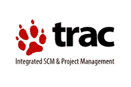
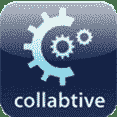
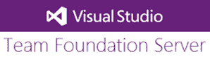

# 2020 年 20 种最佳 Bug /缺陷跟踪工具

> 原文： [https://www.guru99.com/top-20-bug-tracking-tools.html](https://www.guru99.com/top-20-bug-tracking-tools.html)

您可以用另一种方式表示“更好的 Bug 跟踪工具，更好的产品质量”。 以下是软件行业中的顶级错误跟踪工具：

### 1）[待办事项](https://bit.ly/2OVbzKx)

[待办事项](https://bit.ly/2OVbzKx)是一个平台上流行的错误和项目跟踪工具。 任何人都可以轻松地报告错误并跟踪问题更新和状态更改的完整历史记录。 开发团队使用 Backlog 与其他团队合作，以增强团队协作和高质量项目交付。

*   简易的错误追踪工具
*   搜索和高级搜索功能
*   问题更新和状态更改的完整历史记录
*   子任务的项目和问题
*   内置 Git 和 SVN
*   甘特图和燃尽图
*   Wiki 和监视列表
*   本机移动应用
*   看板式视觉工作流程板

* * *

### 2） [SpiraTeam](http://bit.ly/2uJthbG)

[SpiraTeam](http://bit.ly/2uJthbG) 提供了完整的应用程序生命周期管理（ALM）解决方案，该解决方案在一个环境中管理需求，测试，计划，任务，错误和问题，并具有完全可追溯性。 SpiraTeam 的完全集成的错误跟踪解决方案使您可以使用以下功能来管理整个测试过程：

*   在测试脚本执行期间自动创建新事件。
*   完全可定制的事件字段，包括状态，优先级，缺陷类型和严重性。
*   能够将事件（错误）链接到其他工件和事件。
*   强大的报告，搜索和排序功能，以及跟踪更改的审核日志。
*   自定义工作流程状态更改触发的电子邮件通知。
*   能够通过电子邮件报告问题和错误。

* * *

### 3）BugZilla

BugZilla 是一种流行的错误跟踪工具。 这些工具是一个开源软件，并提供了一些很棒的功能，例如

*   电子邮件通知以更改代码
*   报告和图表
*   补丁查看器
*   错误列表可以以不同的格式生成
*   安排每日，每月和每周报告
*   自动检测重复的错误
*   通过吸引客户来设置错误优先级
*   预测错误修复的时间

[下载 BugZilla](http://www.bugzilla.org/download/)

* * *

#### 4）JIRA

数以千计的软件专业人员将 JIRA 用作易于跟踪的错误跟踪工具。 JIRA 是一种商业产品，可帮助捕获和组织团队问题，确定问题的优先级并随项目进行更新。 它是直接与代码开发环境集成的工具，也非常适合开发人员。 由于它具有跟踪任何类型问题的能力，因此它不仅限于软件行业。 它支持敏捷项目。 它带有许多附加组件，使该工具比其他工具更强大

[下载 JIRA](https://www.atlassian.com/software/jira)

* * *

#### 5）螳螂

如果您使用了其他错误跟踪工具，则该工具将易于使用。 螳螂不仅作为 Web 应用程序提供，还拥有自己的移动版本。 它可与 MySQL，PostgreSQL，MS [SQL](/sql.html) 等多个数据库一起使用，并与诸如聊天，时间跟踪，Wiki，RSS feed 等应用程序集成。

螳螂的主要功能包括

*   开源工具
*   电子邮件通知
*   带有报告和图形的支持报告
*   源代码控制集成
*   支持自定义字段
*   支持时间跟踪管理
*   每个实例有多个项目
*   启用以查看问题更改历史记录和路线图
*   支持无限数量的用户，问题和项目

[下载螳螂](http://www.mantisbt.org/download.php)

* * *

#### 6）红矿

这是一个开放源代码错误跟踪工具，也与 SCM（源代码管理系统）集成。 它支持多个平台和多个数据库，而出于报告目的，则使用甘特图和日历。 Redmine 是使用 Ruby on Rail 框架开发的项目管理 Web 应用程序。 RedMine 的一些功能包括

*   甘特图和日历
*   新闻，文件和档案管理
*   单片机集成
*   通过电子邮件创建问题
*   多数据库支持
*   灵活的问题跟踪系统
*   基于角色的灵活访问控制
*   多语言支持

[下载 Redmine](http://www.redmine.org/)

* * *

#### 7）Trac

Trac 是使用 Python 开发的基于 Web 的开源问题跟踪系统。 它是 Wiki 的高级版本，用作软件开发项目的问题跟踪工具。 将 Trac 与 SCM 集成时，可以使用它浏览代码，查看历史记录，查看更改等。 它支持 Linux，Unix，Mac OS X，Windows 等多种平台。时间线按顺序显示了所有当前和过去的项目事件，而路线图则突出显示了即将到来的里程碑。

[下载 Trac](http://trac.edgewall.org/)

* * *

#### 8）Axosoft

它是一个错误跟踪系统，可用于托管或本地软件。 它是 Scrum 团队的项目管理工具。 项目经理和开发人员可以通过 Scrum 计划委员会在单独的备案卡上查看系统中的每个任务，其要求，缺陷和事件。 借助 Axosoft，您可以管理用户案例，缺陷，支持通知以及进度的实时快照。

主要特点

*   错误追踪
*   Scrum 计划委员会
*   Scrum 烧毁图表
*   需求管理
*   团队百科
*   数据可视化
*   单片机集成
*   报告中
*   服务台或事件跟踪

[下载 Axosoft](http://www.axosoft.com/features)

* * *

#### 9）HP ALM /质量中心

HP ALM 是一个完整的测试管理解决方案，其中包含一个强大的集成错误跟踪系统。 HP ALM 的错误跟踪机制既简单又高效。 它也支持敏捷项目。 它是一种昂贵的工具，可能与所有的 Web 浏览器都不十分友好。

[下载 HP ALM /质量中心](http://www8.hp.com/us/en/software-solutions/alm-software-development-testing/index.html)

* * *

#### 10）eTraxis

eTraxis 是支持多种语言的开源错误跟踪工具。 该工具以 [PHP](/php-tutorials.html) 语言开发，并支持 Oracle，MySQL，PostgreSQL 和 MS Server 等多个数据库。 为了管理项目，eTraxis 通过为所有项目活动提供一个集中的位置，为您提供了一个涉及多个组织的灵活平台。 它允许创建多个用户和项目，并同时查看分配的错误。 自定义工作流是此系统的附加功能，可根据您的要求处理项目。

Main features

*   文件交换并支持附件
*   电子邮件通知
*   灵活的许可
*   强大的问题过滤
*   自定义工作流程
*   查看所有事件的完整历史记录

[下载 eTraxis](https://www.etraxis.com/features)

* * *

#### 11）Bugnet

这是一个开放源代码问题跟踪系统，使用 [Asp.Net](/asp-net-tutorial.html) 平台编写，并且需要 MySQL 作为数据库。 它具有创建项目，问题和有效管理它们所需的一切。 它是免费的，但专业版已获得许可并可以商业使用。

Main features

*   电子邮件通知
*   问题管理
*   支持多个项目和数据库
*   出色的安全性
*   在线支持社区
*   项目和里程碑管理
*   轻松导航和管理
*   在线支持社区

[下载链接](http://bugnet.codeplex.com/)

* * *

#### 12）FogBugz

FogBugz 是一个基于 Web 的错误跟踪系统，将缺陷称为“案例”。 它在一个中心位置优先安排和组织开发任务。 它包括一个功能强大的搜索引擎，使您可以立即搜索案例，Wiki 文章和客户信函的完整内容。 Fogbugz 支持几乎所有的 ios，Android，Blackberry，平板电脑和 ipad。 它是一种商业产品，但价格合理。

主要特点

*   问题跟踪
*   快速简便的案例创建
*   支持服务台
*   Bugzscout 的自动错误报告
*   自动升级和备份
*   与其他工具整合
*   项目管理
*   时间跟踪
*   综合维基

[下载 FogBugz](http://www.fogcreek.com/fogbugz/features/issue-tracking/)

* * *

#### 13）Bug 精灵

在 Bug Genie 中记录问题非常简单快捷。 另外，您可以在问题中添加任意数量的自定义字段。 它将所有搜索和项目时间表导出为 RSS 源。 在问题视图和搜索列表中，单击一下即可使用与问题相关的操作。 集成的快速搜索使您可以快速查看问题，同时还可以搜索 Wiki 文章，用户，团队等。 它是一个完整的项目管理和问题跟踪工具

[下载错误精灵](http://www.thebuggenie.com/)

* * *

#### 14）灯塔

Lighthouse 是完美的票务跟踪解决方案。 它简单，组织并与您的移动设备兼容。 为了管理该错误，灯塔为您提供了所需的所有便利，例如自定义状态，有效的标记系统，高级搜索，已保存的搜索和大量编辑工具。 它还集成了许多有用的服务，这些服务与 Lighthouse 集成在一起，例如 Airbrake，Github，Exceptional，Beanstalk 等。只需单击几下，您就可以开始管理带有提交消息的票证或将应用程序异常转换为灯塔问题。

[下载灯塔](http://lighthouseapp.com/tour)

* * *

#### 15） [Zoho 错误跟踪器](https://bit.ly/35infMZ)

[Zoho 错误跟踪器](https://bit.ly/35infMZ)是功能强大的错误跟踪器，可帮助您查看按优先级和严重性过滤的问题。 通过完全知道哪些错误是可复制的，它可以提高生产率。 它是一个在线工具，可让您在单个平台上创建项目，错误，里程碑，报告，文档等。 借助 Zoho 错误跟踪器，可以自动提醒和通知团队成员。

Main Features

*   错误视图和集成
*   问题跟踪器灵活的工作流程
*   将问题分为不同类别

[下载 Zoho 错误跟踪器](https://bit.ly/35infMZ)

* * *

#### 16）BugHost

尽管它是一种商业工具，但价格合理。 该工具是为需要大批量许可且价格最低的大型公司开发的。 Bughost 可在云上访问，并且可以直接在您的项目中创建问题。

Main features

*   记录无限的缺陷
*   集成的电子邮件和文件附件
*   错误链接
*   一次更新多个错误
*   客户将错误直接提交给您的项目
*   强大的安全保护，可访问错误

[下载 BugHost](http://www.bughost.com/)

* * *

#### 17）合作

它是一个基于开源 Web 的项目管理软件，专为中小型企业设计。 它是基于云的，是诸如 basecamp 之类的工具的替代方案。 协作的主要功能包括项目管理，里程碑，大本营导入，文件管理，协作，时间跟踪等。

[下载协作](http://collabtive.o-dyn.de/)

* * *

#### 18）Team Foundation 服务器

Team Foundation Server 使所有利益相关者都可以使用一个解决方案来参与开发过程，但是它也可以用作错误跟踪工具。 对于错误跟踪，TFS 会向团队成员发出通知，并保留错误分配给谁的记录。 由于 TFS 与 Active Directory 集成，因此可以将有关该错误的更新发送给提交该错误的客户。

Main features

*   版本控制
*   敏捷规划与协作
*   报告中
*   测试用例管理
*   错误跟踪和通知

[下载 Team Foundation Server](https://azure.microsoft.com/en-gb/services/devops/server/)

* * *

#### 19）IBM Rational ClearQuest

IBM ClearQuest 跟踪，捕获和管理任何类型的错误。 与其他任何工具一样，IBM Rationalquest 也为您提供了错误跟踪系统的所有优势。 它支持多平台，例如 HP-UX，Linux，Microsoft Windows 操作系统。 它可以提高软件开发项目的可见性和控制力。

Main Features

*   与其他工具整合
*   支持实时报告和指标
*   加强团队合作

[下载 IBM Rational ClearQuest](http://www-03.ibm.com/software/products/en/clearquest)

* * *

#### 20）放松

借助不受约束的开发人员，可以提交源代码。 它可以与用于任何软件项目的最关键的工具集成。 由于 Amazon 提供了服务器，因此 Unfuddle 可以为您的数据提供更好的安全性。 它有助于跟踪错误，功能请求和管理故障单。

Main Features

*   错误和问题管理
*   基于 Web 的 Subversion 访问
*   维基
*   里程碑追踪

[下载取消混淆](https://unfuddle.com/)

* * *

#### 21）开发跟踪

DevTrack 并非专门设计为常规的错误跟踪器工具。 它具有广泛的功能，但可以用于缺陷跟踪系统。

Main features

*   自动将问题发送给适当的用户
*   邮件通知
*   帮助团队成员跟踪和解决问题
*   创建和分配子问题
*   从 Active Directory 导入和验证用户

[下载 DevTrack](http://techexcel.com/products/devtrack/)

* * *

#### 22）Salesforce

它是一个基于 Web 的错误跟踪和项目管理系统。 该平台支持任务计划，创建故事以跟踪任务以及各种报告和统计信息。 该工具的其他功能包括

*   专案
*   克隆缺陷
*   缺陷共享
*   Kanban
*   瑕疵
*   喋喋不休
*   报告书
*   燃烧工作时间

这些是软件行业中最常用的 Bug 跟踪工具，但是牢记项目需求的其他 Bug 跟踪工具却很少。

*   测试跟踪
*   错误跟踪
*   BugAware
*   YouTrack
*   请求追踪器
*   BontQ
*   WebIssues（开源问题跟踪系统）
*   完成完成