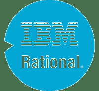
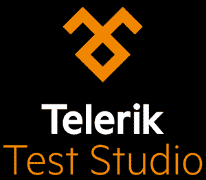
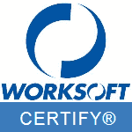

# 20 个最佳自动化测试工具（2020 年 7 月更新）

> 原文： [https://www.guru99.com/automated-testing-tools.html](https://www.guru99.com/automated-testing-tools.html)

任何测试自动化的成功都取决于为项目确定合适的工具。 有了众多可供选择的开源和商业自动化工具，自动化[测试](/software-testing.html)工具的选择就变得很棘手。 以下是精选的顶级自动化工具-

### 1） [ACCELQ](https://bit.ly/2Ti6AUg)

[ACCELQ](https://bit.ly/2Ti6AUg) 是唯一基于云的无代码测试自动化平台，可无缝地实现 API 和 Web 测试的自动化，从而为企业实现连续测试。 以下是主要重点：

*   基于 AI 的测试自动化可实现快速开发并应对变化
*   测试自动化资产的测试开发速度提高了 3 倍，维护成本降低了 70％
*   强大而灵活的功能，完全无需编写代码即可处理最复杂的自动化
*   连续测试自动化平台支持 CI / CD 与 Jira，AzureDevOps，Jenkins 等集成
*   Salesforce 测试自动化以及对 Salesforce 闪电和自定义对象的无缝支持
*   企业技术测试自动化对 Web，API，微服务，数据库，大型机，PDF 等的支持。

* * *

### 2） [TestProject](http://guru99.link/testproject)

[TestProject](http://guru99.link/testproject) 是世界上第一个基于云的，由社区提供动力的免费测试自动化平台，该平台使用户能够轻松测试所有操作系统上的 Web，Android 和 iOS 应用程序。 使用 Selenium 和 Appium 与您的团队轻松协作，以确保质量和速度。 使用 TestProject 强大的 SDK，可以使用高级内置记录功能，创建和使用插件（整个社区共享的自动化操作）或开发编码测试，而这些操作完全免费！

*   无需复杂的设置或配置
*   无需任何编码技能即可上手
*   与您的团队和整个社区共享和重用插件
*   详细的报告仪表板
*   与您的 CI / CD 工作流程无缝集成

* * *

### 3） [Ranorex](https://bit.ly/2N7tcDZ)

全球有 14,000 多个用户使用 [Ranorex Studio](https://bit.ly/2N7tcDZ) （一种用于测试自动化的多合一工具）来加速测试。 Ranorex 通过无代码的即点即用界面对初学者来说很容易，但对于具有完整的 C＃或 VB.NET IDE 和开放 API 的自动化专家而言，Ranorex 则功能强大。

**功能：**

*   在台式机，Web 和移动设备上进行功能性 UI 和端到端测试
*   跨浏览器测试
*   SAP，ERP，Delphi 和旧版应用程序。
*   iOS 和 Android
*   在本地或远程，并行或在 Selenium Grid 上运行测试
*   可靠的报告

Ranorex 与领先的解决方案集成在一起，例如 Git，TFS，Jenkins，Bamboo，Bugzilla，SpecFlow，NeoLoad，TestRail 等，以提供完整的测试工具链。

* * *

### [4）TestCraft](https://bit.ly/2KdsOVX)

[TestCraft](https://bit.ly/2KdsOVX) 是无代码的 Selenium 测试自动化平台。 革命性的 AI 技术和独特的可视化建模可以更快地创建和执行测试，同时消除测试维护开销。 测试人员无需编码即可创建全自动测试场景。 客户可以更快地发现错误，更频繁地发布错误，与 CI / CD 集成并提高其数字产品的整体质量。

**主要功能：**

*   无需编程技能。 利用手动测试人员的业务知识，并允许他们创建自动化测试方案
*   大大降低维护成本。 由于我们的 AI 机制，脚本会自动进行调整以进行更改。 只需单击几下，即可进行主要更改
*   基于硒。 快速集成和利用社区开发的模块
*   提供即时的价值实现。 无需安装（SaaS）。 容易掌握

* * *

### 5） [HeadSpin](https://bit.ly/384qTL8)

[HeadSpin](https://bit.ly/384qTL8) 是世界上第一个互联智能平台 TM ，它提供 Web，移动，IoT 和 5G 解决方案，以统一跨应用程序，设备和网络的测试，监视和分析。 HeadSpin 支持开发，质量保证，运营和产品团队，以优化关联体验并确保数字业务成功。

**Features:**

*   在共享设备云上访问 30 多个国家/地区的 300 多个设备：
*   远程调试
*   支持 Real SIM 的 Android 和 iOS 设备
*   500 多个并行测试
*   回归测试
*   自动化
*   本地化测试
*   本地调试和代码分析

* * *

### 6） [Subject7](https://bit.ly/2KyNpSA)

[Subject7](https://bit.ly/2KyNpSA) 是一个自动化平台，可通过一系列命令提供端到端测试自动化功能。 可通过易于使用的 Web 界面使用这些命令。 模仿用户操作，每个命令都隐藏了诸如 Selenium，Appium，SikuliX，JMeter，ZAP 等行业标准软件包的复杂性。

**主要功能：**

*   易于使用的非编码器 Web 界面
*   与 JIRA，Jenkins 和 REST 支持的 DevOps 管道集成
*   利用 AWS，Azure 和 Google 云进行零设置并扩展执行范围
*   电子邮件通知，视频记录，团队协作等
*   使用 Selenium 和 Appium 等开源标准来驱动 Web 和移动

* * *

### 7） [ZeuZ](https://bit.ly/2T3Y8b8)

[ZeuZ](https://bit.ly/2T3Y8b8) Automation 是一个 AI 辅助的单击测试自动化框架，测试人员喜欢使用它！ 对于手动测试人员而言，它没有脚本且简单，但功能强大，具有专家所需的多合一功能。 ZeuZ 具有 CI / CD 集成，智能调试，丰富的报告，协作功能，可实现真正的端到端自动化。

**Features:**

*   跨平台：Web，移动，桌面，API，IoT 和云服务
*   无需代码，可在一个测试用例中使用一个 UI 涵盖所有技术，或使用内置程序逻辑来实现数千个
*   多合一：管理和运行手动+自动化，功能，回归，UI，性能，数据驱动的测试
*   测试脚本记录，人工智能支持的对象识别，内置等待机制
*   丰富的报告，通知，协作工具&批量更新
*   灵活的部署：本地或在云中的单机或 100 台 VM
*   高级调试（向下钻取，智能问题分组，步骤测试）
*   Jira，Jenkins 插件，第三方集成
*   API，并可通过自定义操作和脚本（Selenium，Appium 等）进行扩展

* * *

### 8） [LambdaTest](https://bit.ly/2uEELtf)

[LambdaTest](https://bit.ly/2uEELtf) 是领先的基于云的跨浏览器测试平台之一，它使用户能够在 2000 多种真实浏览器&操作系统的组合上执行其网站或 Web 应用程序的自动化兼容性测试。

主要特点：

*   在 2000 多个真实浏览器&操作系统上的自动跨浏览器测试
*   使用 JIRA，Asana，Github，Slack，Monday.com 等工具进行一键式错误记录。
*   与各种 CI / CD 工具集成，例如 Circle CI，Jenkins，Travis CI 等。
*   通过 LambdaTest 云上托管的 VM 进行实时交互式测试。
*   一次自动进行 25 种组合的屏幕截图测试

* * *

### 9） [TestArchitect](https://bit.ly/2KRMhuW)

[TestArchitect](https://bit.ly/2KRMhuW) 是一种无代码测试自动化工具，致力于通过利用关键字驱动的测试来扩大自动化覆盖率&的生产率。 少数技术含量较高的测试人员可以为更多的技术含量较低的测试人员提供支持，以实现 80％的自动化覆盖率，并使用 TestArchitect 实现更多的自动化。

**Key Features:**

*   使用基于动作的测试（一种现代形式的关键字驱动测试）的无代码自动化，以实现高可重用性和更低的维护成本。
*   像 Excel 一样直观的电子表格 IDE
*   支持的平台：台式机，跨浏览器，移动测试，API，计算机视觉测试等。
*   操作系统：Windows，Linux，macOS，Android & iOS
*   与大多数领先的 CI / CD / DevOps 工具集成的插件，例如 Azure DevOps，TFS，Jenkins 等。

* * *

### 10） [Parasoft Selenic](https://bit.ly/2IKWRBg)

[Parasoft Selenic](https://bit.ly/2IKWRBg) 利用 AI 解决您的 Selenium 问题，因此您不必摆脱 Selenium。 它可以直接与您现有的 Selenium 测试一起使用，因此您不必局限于专有平台。

**Key Features:**

*   运行时自我修复，执行后由 AI 驱动的建议。 您可以有效地维护现有的 Selenium 脚本，从而减少维护，修复和修复损坏的测试所花费的时间。
*   使用页面对象模型创建 Selenium 测试套件。 团队可以从一开始就迅速建立可维护的测试实践。
*   使用“测试影响分析”优化测试执行。 将测试执行与基础代码更改进行互相关可为您提供更快的 CI / CD 管道反馈。

* * *

### 11）[压扁](https://bit.ly/2FOBKNN)

[Squish](https://bit.ly/2FOBKNN) 是全球 3000 多家公司选择的新型 GUI 测试自动化工具，用于自动化其图形用户界面（GUI）和人机界面（HMI）的功能回归测试和系统测试。 Squish GUI 测试工具是 100％跨平台的工具，具有

*   对所有主要 GUI 技术的深入支持
*   全面支持所有桌面，移动，Web 和嵌入式平台
*   测试脚本录制
*   强大而可靠的对象识别和验证（基于对象和基于图像）
*   不依赖于屏幕截图或外观
*   强大的集成开发环境（IDE）
*   多种流行的脚本语言可用于测试脚本
*   全面支持行为驱动开发（BDD）
*   通过命令行工具完全控制
*   与测试管理和 CI 系统集成

* * *

### 12）[和风](https://bit.ly/2ZCoB4M)

[Zephyr](https://bit.ly/2ZCoB4M) 是销售测试工具排名第一的工具，为各种规模的敏捷团队提供端到端解决方案。 获得发布更好的软件所需的灵活性，可见性和见解，更快

**Key Features:**

*   一键式集成 JIRA，Confluence，Jenkins，Bamboo 等
*   云，服务器和数据中心部署选项
*   高级分析和 DevOps 仪表板
*   无需年度承诺
*   获取-[更多信息](https://bit.ly/2ZCoB4M)

* * *

### 13）[硒](/selenium-tutorial.html)

[Selenium](/selenium-tutorial.html) 是目前需要的一种开源 Web 自动化工具，并且在市场上被广泛使用。 它可以跨 Windows，Mac 和 Linux 等多种操作系统以及 Firefox，Chrome，IE 和无头浏览器之类的浏览器实现自动化。

硒测试脚本可以用 Java，C＃，Python，Ruby，PHP，Perl 和 JavaScript 等编程语言编写。 Selenium 通过其浏览器附加 Selenium IDE 提供记录和回放功能。 强大的 Selenium WebDriver 可帮助您创建更复杂和高级的自动化脚本。

[了解有关硒](/selenium-tutorial.html)的更多信息

* * *

### 14）HP UFT（aka QTP）

HPE Unified Functional Test 是领先的跨平台自动化测试工具。 它可以自动执行 Web，桌面，SAP，Delphi，Net，ActiveX，Flex，Java，Oracle，Mobile，PeopleSoft，PowerBuilder，Siebel，Stingray，Visual Basic 等其他应用程序的自动化。 清单是可以自动化的开发环境！

UFT 使用 VBScript 作为脚本语言。

该工具与 HP ALM（测试管理工具）和 HP LoadRunner（性能测试工具）紧密集成。

UFT 的一些独特功能包括业务流程测试，关键字驱动的框架，XML 支持，强大的检查点，测试结果。

[了解有关 HP – UFT 的更多信息。](/quick-test-professional-qtp-tutorial.html)

* * *

### 15）瓦蒂尔

Watir 也是开放源代码的 Web 自动化测试。它的发音为“水”。

Watir 在 Windows 上支持 IE。 Watir + WebDriver 支持 FireFox，Opera 和无头浏览器 HTML Unit。

脚本语言是 Ruby，但是您可以自动化使用任何语言开发的 Web 应用程序。

Watir 使用 Ruby，为您提供了与数据库连接，读取平面文件以及 excel 的功能-对于数据驱动的测试很重要。 您可以重用可在测试脚本之间重复的测试代码。

与 RDD，Cucumber 等 BDD 工具集成

[下载 Watir。](http://watir.com/)

* * *

### 16）IBM Rational Functional Tester

Rational Functional Tester 是 IBM 的商业自动化测试工具。 它支持广泛的开发环境，例如 Siebel，Net，SAP，Java，PowerBuilder，Flex，Dojo。

它支持 2 种脚本语言 Java 和 VB.Net

Rational Functional Tester（RFT）与 IBM Rational Quality Manager（测试管理工具）紧密集成。

该工具支持功能测试，回归测试& **数据驱动的测试。**

情节提要测试是 RFT 的一项独特功能，该功能将测试脚本记录为针对被测应用程序执行的操作的一系列屏幕截图。 测试人员可以更改屏幕截图以增强脚本。

[下载 IBM Rational Functional Tester](http://www-03.ibm.com/software/products/en/functional)

* * *

### 17）Telerik 测试室

Test Studio 是 Telerik 提供的最新自动化工具。 它支持自动化的应用程序，例如 HTML5，Angular，AJAX，JavaScript，Silverlight，WPF，MVC，Ruby 和 PHP，iOS，Android。 Telerik 提供跨浏览器支持，并且是一种记录和回放工具。

它支持 2 种脚本语言 C＃和 VB.Net

Test Studio 可以与 Team Foundation Server 和 GIT 等源代码控制系统连接，并执行持续测试。

Telerik 允许您安排测试，并行执行测试，并具有强大的测试报告功能。

[下载 Telerik Test Studio](http://www.telerik.com/download/teststudio)

* * *

### 18）丝绸测试

Silk Test 是 MicroFocus 提供的功能和回归自动化测试工具。

Silk Test 提供了 3 个产品 Workbench，Silk4J 和 Silk4NET。 工作台使用 VB.net 脚本语言，Silk4J & Silk4NET 可以使用 Java / VB.NET，C＃等

SilkTest 支持跨浏览器测试，移动测试&通过关键字驱动的测试提供协作式测试设计环境。

[下载 SilkTest](https://www.microfocus.com/products/silk-portfolio/silk-test/)

* * *

### 19）黄瓜

Cucumber 是一种开源的行为驱动开发（BDD）工具。 黄瓜支持 Ruby，Java，Scala，Groovy 等语言。

起草测试脚本是测试人员，开发人员和客户的共同努力。 黄瓜仅支持 Web 环境。 测试代码以简单的英语语言 Gherkin 编写。 黄瓜代码可以在不同的框架（如 Selenium，Ruby 等）上执行

黄瓜的重点是最终用户体验。

[了解有关黄瓜](/cucumber-tutorials.html)的更多信息

* * *

### 20）WorkSoft 认证

WorkSoft Certify 是 SAP 的自动化测试工具。 它可以测试和自动化 SuccessFactors，Concur，Syclo，Ariba Network，SAP Fiori 用户体验（UX）

WorkSoft Certify 可以在无人值守的情况下运行测试，并自动执行端到端业务流程。 即使 SAP 项目处于实施，升级或维护阶段，也可以部署该工具。

WorkSoft Certify 维护诸如测试脚本维护之类的中央测试对象存储库，并且重用变得容易。 它提供了集成的测试数据管理工具。

[下载 WorkSoft 认证](https://www.worksoft.com/sap-test-automation)

* * *

### 21）Catalog Studio

Katalon Studio 是一个开源自动化工具，支持 Web 和移动环境。

它可以在 Selenium 和 Appium 之上运行，从而通过对象间谍，用户友好的 IDE，对象存储库&浏览器插件等功能增强了这些框架。

该工具使用 Groovy 作为脚本语言&，支持外部 Java 库。 Katalon 允许您重复使用用 Java 编写的 Selenium 脚本，并直接在工具中使用。 它与 Jenkins，Bamboo 和 TeamCity 等持续集成系统无缝协作。

[下载 Catalog Studio](https://www.katalon.com/)

* * *

### 22）完成测试

[Testcomplete](https://smartbear.com/product/testcomplete/features/) 是 SmartBear 提供的功能强大且易于使用的功能测试自动化工具。 它可以跨桌面，移动和 Web 应用程序自动化测试。

TestComplete 支持许多脚本语言，例如 VBScript，Python 和 JavaScript，以及各种测试技术，例如关键字驱动的测试，数据驱动的测试，回归测试和分布式测试。

借助该工具的记录和重放功能以及强大的对象识别引擎，您还可以创建复杂的自动化测试脚本，而无需编写任何代码。

[下载 TestComplete](https://smartbear.com/product/testcomplete/features/)

还是很困惑？ 请参考[如何选择自动化工具的指南。](/testing-automation-why-right-tools-are-necessary-for-testing-success.html)

### 常问问题

## ⚡选择测试自动化工具时应考虑哪些因素？

选择工具之前，应考虑以下因素

*   所需平台支持：Web，桌面，Citrix，SAP 等
*   许可费用（如果适用）
*   如果是外包项目，则需要考虑自动化工具的客户/客户偏好
*   对员工进行工具培训的成本
*   自动化工具的硬件/软件要求
*   自动化工具供应商的支持和更新策略。

## 💻 How to select the best Test Automation Tool?

这是确定项目所需最佳工具的简单过程

*   识别需要自动化的测试
*   研究和分析可满足您的自动化需求和预算的自动化工具
*   根据需求，列出两个最合适的工具
*   试行两种最佳工具，然后选择更好的一种
*   与其他利益相关者讨论选择的自动化工具，解释选择并获得他们的认可
*   继续测试自动化

市场上没有最好的工具。 您需要找到实现自动化测试项目目标的最佳工具。

## ❓为什么选择正确的自动化工具很重要？

有许多可用的自动化测试工具。 其中有些是免费的，而有些则很昂贵。 这些自动化工具中的一些是很久以前创建的，而有些则刚刚进入市场。 每个工具都是唯一的，并具有特定的特征。

各种各样的测试自动化工具使得很难为一个项目选择最佳的工具，并且测试人员最终会得到不符合项目要求的工具。 因此，为您的项目选择正确的工具非常重要。

## ⚡ Which factors should you consider while selecting a Test Automation Tool?

You should consider the following factors before selecting a tool

*   所需平台支持：Web，桌面，Citrix，SAP 等
*   许可费用（如果适用）
*   如果是外包项目，则需要考虑自动化工具的客户/客户偏好
*   对员工进行工具培训的成本
*   自动化工具的硬件/软件要求
*   自动化工具供应商的支持和更新策略。

You should consider the following factors before selecting a tool

*   所需平台支持：Web，桌面，Citrix，SAP 等
*   许可费用（如果适用）
*   如果是外包项目，则需要考虑自动化工具的客户/客户偏好
*   对员工进行工具培训的成本
*   自动化工具的硬件/软件要求
*   自动化工具供应商的支持和更新策略。

You should consider the following factors before selecting a tool

*   所需平台支持：Web，桌面，Citrix，SAP 等
*   许可费用（如果适用）
*   如果是外包项目，则需要考虑自动化工具的客户/客户偏好
*   对员工进行工具培训的成本
*   自动化工具的硬件/软件要求
*   自动化工具供应商的支持和更新策略。

## 💻 How to select the best Test Automation Tool?

Here, is a simple process to determine the best tool for your project needs

*   识别需要自动化的测试
*   研究和分析可满足您的自动化需求和预算的自动化工具
*   根据需求，列出两个最合适的工具
*   试行两种最佳工具，然后选择更好的一种
*   与其他利益相关者讨论选择的自动化工具，解释选择并获得他们的认可
*   继续测试自动化

There is no best tool in the market. You need to find the best tool for your test automation project goals.

Here, is a simple process to determine the best tool for your project needs

*   识别需要自动化的测试
*   研究和分析可满足您的自动化需求和预算的自动化工具
*   根据需求，列出两个最合适的工具
*   试行两种最佳工具，然后选择更好的一种
*   与其他利益相关者讨论选择的自动化工具，解释选择并获得他们的认可
*   继续测试自动化

There is no best tool in the market. You need to find the best tool for your test automation project goals.

Here, is a simple process to determine the best tool for your project needs

*   识别需要自动化的测试
*   研究和分析可满足您的自动化需求和预算的自动化工具
*   根据需求，列出两个最合适的工具
*   试行两种最佳工具，然后选择更好的一种
*   与其他利益相关者讨论选择的自动化工具，解释选择并获得他们的认可
*   继续测试自动化

There is no best tool in the market. You need to find the best tool for your test automation project goals.

## ❓ Why choosing the correct automation tool is important?

There are many Automation Testing Tools available. Some of them are free while some are expensive. Some of these automation tools were created long ago, while some have just made it into the market. Each tool is unique and possesses specific characteristics.

A broad range of test automation tools makes it difficult to select the best one for a project, and often tester's end up with tools that do not conform to project requirements. Hence, choosing the right tool for your project is very important.

There are many Automation Testing Tools available. Some of them are free while some are expensive. Some of these automation tools were created long ago, while some have just made it into the market. Each tool is unique and possesses specific characteristics.

A broad range of test automation tools makes it difficult to select the best one for a project, and often tester's end up with tools that do not conform to project requirements. Hence, choosing the right tool for your project is very important.

There are many Automation Testing Tools available. Some of them are free while some are expensive. Some of these automation tools were created long ago, while some have just made it into the market. Each tool is unique and possesses specific characteristics.

A broad range of test automation tools makes it difficult to select the best one for a project, and often tester's end up with tools that do not conform to project requirements. Hence, choosing the right tool for your project is very important.