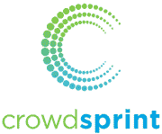

# 2020 年 13 家最佳人群测试（Crowdsource）公司

> 原文： [https://www.guru99.com/crowdsourced-testing-companies.html](https://www.guru99.com/crowdsourced-testing-companies.html)

众包测试是将原型软件和产品发送给专家测试人员的一种做法，而不是内部进行测试。 这也称为人群测试。 如今，由于缩短了上市时间，它已成为传统测试的替代方法。

这里是最受欢迎的众包测试服务及其下载链接的列表。

### 1） [Testlio](https://bit.ly/3bjvmu8)

[Testlio](https://bit.ly/3bjvmu8) 是托管应用程序测试的领导者。 凭借强大的客户服务，经过验证的测试人员遍布全球的网络以及完善的软件平台，我们提供了灵活，可扩展且按需的测试解决方案。

**功能：**

*   近 100 个国家/地区的数千个专业级测试人员
*   专门选择测试人员的专用 Testlio 项目经理&负责测试范围
*   一套测试解决方案，包括：端到端，可用性，本地化，功能，付款，回归等
*   选择行业中训练有素，最有动力的测试人员
*   受到美国运通（American Express），哥伦比亚广播公司（CBS），Hotels.com，微软，NBA 和 VRBO 等品牌的信任。 总计，Testlio 客户为超过 16.5 亿用户提供支持

* * *

### 2） [Digivante](https://bit.ly/2OO2nJ6)

[Digivante](https://bit.ly/2OO2nJ6) 是一家提供敏捷测试的人群测试公司。 Digivante 的解决方案旨在提高您的网站或应用程序的数字性能，从而为您提供竞争优势。 他们的平台可帮助在发布前识别每个问题，他们可在数小时内（而不是数天）提供全面的回归测试。

**Features:**

*   在每个冲刺中进行快速而全面的测试
*   敏捷测试将回归测试时间从几天减少到几小时
*   它允许功能，可访问性，自动化，本地化和可用性测试
*   错误可以导出到 JIRA 和其他错误跟踪工具
*   独立的交付经理提供高质量的交付物
*   它提供 100％的代码覆盖率和 100％的设备覆盖率

* * *

### 3）[全局应用测试](https://bit.ly/2m1Sycg)

[全球应用测试](https://bit.ly/2m1Sycg)使团队可以在超过 105 个国家/地区与 25,000 多名经过审查的专业人员一起使用真实设备在真实环境中进行测试。 数以百计的领先品牌依靠 Global App Testing 的影响力至上的质量方法，使敏捷和 DevOps 团队可以更快，更频繁地发布

**Features:**

*   使客户能够以最少的测试工作交付高质量的产品。
*   Impact First 测试模型将最佳自动化与智能众包相结合，毫不费力地提供了快速，准确，可行的测试结果。
*   Global App Testing 通过基于云的独特 SaaS 平台提供测试管理，测试执行（通过人群）&测试结果和分析。

* * *

### 4）钴

[Cobalt](https://cobalt.io/how) 是现代的应用程序安全平台。 该众包测试工具支持用于所有类型的渗透测试和漏洞评估的完整的“查找到修复”工作流。

**Features:**

*   GitHub + JIRA 集成
*   时间轴可帮助您保持最新状态
*   允许快速过滤，节省时间
*   对测试人员和报告进行排名

**下载链接：** [https://cobalt.io/how](https://cobalt.io/how)

* * *

### 5）用户测试：

[UserTesting 的](https://www.usertesting.com/solutions/product)错误测试工具可让您获得有关任何经验，原型，网站和测试人员的宝贵反馈，以便与专家测试人员一起检查您的站点或应用程序。 您可以在真实用户的帮助下测试您的应用程序。

**Features:**

*   在开发中尽早发现问题，因为它们更容易解决且成本更低
*   与真实人一起验证产品体验，而不用猜测
*   验证产品的可用性
*   测试草图和原型

**下载链接：** [https://www.usertesting.com/solutions/product](https://www.usertesting.com/solutions/product)

* * *

### 6）众筹：

[Crowdprint](https://crowdsprint.com/crowdsourced-testing/) 可帮助您将总体测试成本降低 50-70％。 它还可以帮助您的组织将测试覆盖率增加多达 10 倍。

**Features:**

*   它使您可以与真实用户一起在真实网络上的真实设备上分析您的应用程序。
*   它还在专家测试人员的帮助下提供目标测试。
*   它可以提高发现错误并解决问题的检测率。

**下载链接：** [https://crowdsprint.com/crowdsourced-testing/](https://crowdsprint.com/crowdsourced-testing/)

* * *

### 7）测试鸟

[Testbirds](https://www.testbirds.com/services/quality-assurance/) 在世界各地的专业测试人员的帮助下提供人群测试服务。 它为您提供了让最终用户搜索错误的机会。 由经验丰富的项目经理根据严重性对这些错误进行分类。

**Features:**

*   灵活的平台，可在 24 小时内提供
*   测试人员使用他们自己的（智能手机/ PC /平板电脑使您能够在真实环境中获得测试结果。
*   探索性错误测试，结构化错误测试，本地化测试&回归测试
*   使用错误批准验证发现的错误

**下载链接：** [https://www.testbirds.com/services/quality-assurance/](https://www.testbirds.com/services/quality-assurance/)

* * *

### 8）用户感觉

[Userfeel](https://www.userfeel.com/features) 是一项人群测试服务，在分析，网站优化，网页设计& Web 开发方面拥有丰富的经验。 该公司提供多语言支持。

**Features:**

*   使用任何操作系统在台式机，手机，平板电脑上进行测试
*   允许按年龄，性别，国家，语言和网络经验筛选测试人员
*   筛选器问题的功能，可以更详细地过滤测试面板
*   使用 Google Speech API 支持所有语言的自动语音转录

**下载链接：** [https://www.userfeel.com/features](https://www.userfeel.com/features)

* * *

### 9）掌声：

[掌声](https://www.applause.com/testing/)是一种人群测试工具，可以帮助您发现严重的错误。 他们的测试人员团队可以快速提供最相关且可行的结果。 它同时支持手动&自动测试。

**Features:**

*   无限次数地进行测试
*   提供目标人群进行测试
*   数小时而非数周即可收到测试结果
*   直接在您的错误跟踪系统中工作。
*   所有错误自动导入系统
*   成功时可让您验证错误修复

**下载链接：** [https://www.applause.com/testing/](https://www.applause.com/testing/)

* * *

### 10）Beta 系列：

[Beta 系列](https://betafamily.com/pricing)是一个人群测试社区，用于执行移动和 Web 应用程序的 Beta 测试。 在此站点中，您可以雇用人员来测试您的应用并获得用户体验的评价。 每个测试用例的结果将作为报告发送，回答您将分配给测试人员的问题和任务。

**下载链接：** [https://betafamily.com/pricing](https://betafamily.com/pricing)

* * *

### 11）人群测试

星尘产品[人群测试](https://www.stardust-testing.com/en/our-methods/community-of-testers/)工具可让您检查网站和移动应用程序。 公司根据具体测试项目的需要提供资源，截止日期。 它提供功能化的&本地化测试，管理整个人群测试。

**下载链接：** [https://www.stardust-testing.com/en/crowdtesting/](https://www.stardust-testing.com/en/our-methods/community-of-testers/)

* * *

### 12）测试 Yantra：

[测试 yantra](http://www.testyantra.com/managed-crowd-testing-services) 提供人群测试服务，并执行各种类型的短期测试项目。 该工具的主要重点是人群 Beta 测试。

**Features:**

*   测试人员在受控环境中工作
*   两级错误验证
*   详细的错误影响报告
*   用户施加实时负载（300-500 个用户）
*   通过实时流与客户的互动

**下载链接**： [http://www.testyantra.com/managed-crowd-testing-services](http://www.testyantra.com/managed-crowd-testing-services)

* * *

### 13）狼人

[Bugwol​​f](https://bugwolf.com/features) 使您可以聘请可以在多个平台和设备上执行测试的专业测试人员。

**Features:**

*   通过游戏化测试过程使测试变得愉快
*   专业测试仪市场的地方
*   您可以下载错误报告，将数据导入到 JIRA，Rational & Bugzilla 等错误跟踪工具中。

**下载链接：** [https://bugwol​​f.com/features](https://bugwolf.com/features)