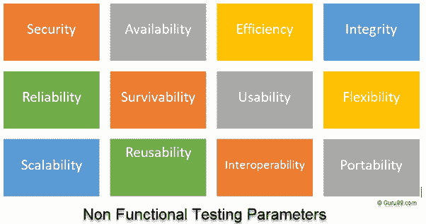
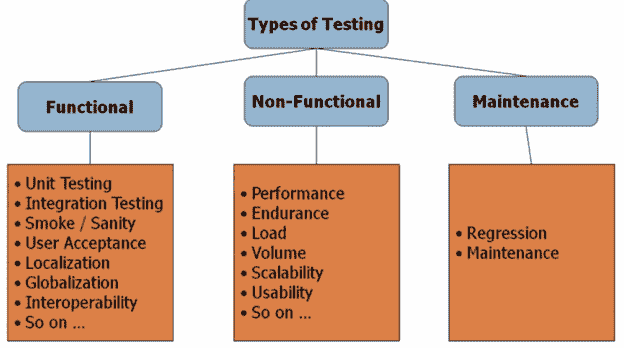

# 什么是非功能测试？ 带示例的类型

> 原文： [https://www.guru99.com/non-functional-testing.html](https://www.guru99.com/non-functional-testing.html)

## 什么是非功能测试？

**非功能测试**定义为一种软件测试，用于检查软件应用程序的非功能性方面（性能，可用性，可靠性等）。 它旨在根据非功能参数测试系统的就绪状态，而功能测试永远不会解决这些参数。

非功能测试的一个很好的例子是检查可以同时登录软件的人数。

非功能测试与功能测试同等重要，并影响客户满意度。

在本教程中，我们将学习

*   [非功能测试的目标](#1)
*   [非功能测试的特征](#2)
*   [非功能测试参数](#3)
*   [软件测试的类型](#4)
*   [非功能测试类型](#5)
*   [非功能测试用例示例](#6)

## 非功能测试的目标

*   非功能测试应提高产品的可用性，效率，可维护性和可移植性。
*   帮助降低与产品的非功能性方面相关的生产风险和成本。
*   优化产品的安装，设置，执行，管理和监视方式。
*   收集并产生用于内部研发的度量和指标。
*   改进和增强对产品行为和所用技术的了解。

## 非功能测试的特征

*   非功能测试应该是可测量的，因此没有地方进行主观表征，例如好，更好，最好等。
*   在需求流程开始时不太可能知道确切的数字
*   优先考虑需求很重要
*   确保在软件工程中正确标识了质量属性。

## 非功能测试参数

### 1）安全性：

该参数定义如何保护系统免受内部和外部来源的故意和突然的攻击。 这是通过[安全测试](https://www.guru99.com/what-is-security-testing.html)进行测试的。

### 2）可靠性：

任何软件系统在没有故障的情况下连续执行指定功能的程度。 通过[可靠性测试](https://www.guru99.com/reliability-testing.html)测试

### 3）生存能力：

该参数检查软件系统是否继续运行，并在系统出现故障时自行恢复。 通过[恢复测试](https://www.guru99.com/recovery-testing.html)对此进行了检查

### 4）可用性：

该参数确定用户在系统运行期间可以依赖系统的程度。 通过[稳定性测试进行检查。](https://www.guru99.com/stability-testing.html)

### 5）可用性：

用户通过与系统的交互可以轻松学习，操作，准备输入和输出。 [可用性测试](https://www.guru99.com/usability-testing-tutorial.html)对此进行了检查

### 6）可扩展性：

该术语是指任何软件应用程序可以扩展其处理能力以满足需求增长的程度。 通过[可伸缩性测试](https://www.guru99.com/scalability-testing.html)测试

### 7）互操作性：

该非功能性参数检查软件系统与其他软件系统的接口。 通过[互操作性测试](https://www.guru99.com/interoperability-testing.html)对此进行了检查

### 8）效率：

任何软件系统可以处理容量，数量和响应时间的程度。

### 9）灵活性：

该术语是指应用程序可以在不同的硬件和软件配置中轻松工作。 像最低 RAM，CPU 要求一样。

### 10）便携性：

从当前硬件或软件环境进行传输的软件灵活性。

### 11）可重用性：

它是指软件系统的一部分，可以转换为在另一应用程序中使用。

## 软件测试类型

通常，有三种测试类型

*   **功能性**
*   **非功能性**
*   **维护**

在这些测试类型下，您有多个“测试级别”，但是通常，人们将其称为“测试类型”。 在不同的书籍和参考资料中，您可能会发现上述分类有所不同。

上面的列表并不完整，因为**超过 [100 种测试类型](https://www.guru99.com/types-of-software-testing.html)** 和计数。 不用担心，随着您在测试行业中的年龄增长，您会逐渐接手它们。 另外，请注意，并非所有测试类型都适用于所有项目，而是取决于项目的性质&范围。 在后面的教程中将对此进行更多介绍。

## 非功能测试类型

*   性能测试
*   负载测试
*   故障转移测试
*   兼容性测试
*   可用性测试
*   压力测试
*   可维护性测试
*   可扩展性测试
*   容量测试
*   安全测试
*   灾难恢复测试
*   符合性测试
*   便携性测试
*   效率测试
*   可靠性测试
*   基准测试
*   耐力测试
*   文件测试
*   恢复测试
*   国际化测试
*   本地化测试

## 测试用例示例非功能测试

Following are examples of Non-Functional Testing

| 测试用例 ＃ | 测试用例 | 域 |
| 1 | 最多 1000 个用户同时访问时，应用程序加载时间不应超过 5 秒 | 性能测试 |
| 2 | 该软件应可在所有版本的 Windows 和 Mac 上安装 | 兼容性测试 |
| 3 | 所有网页图片均应带有 alt 标签 | 辅助功能测试。 |