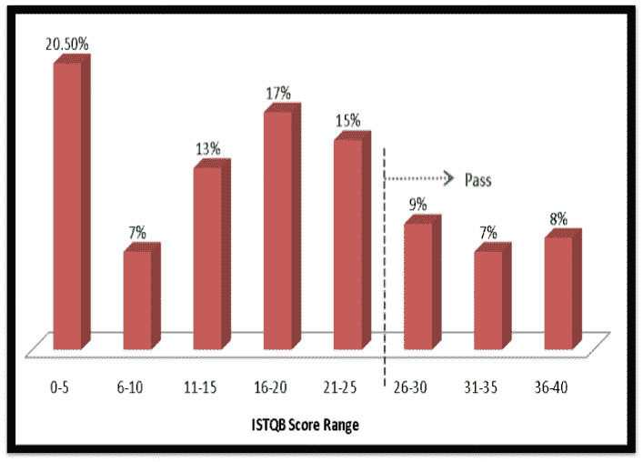
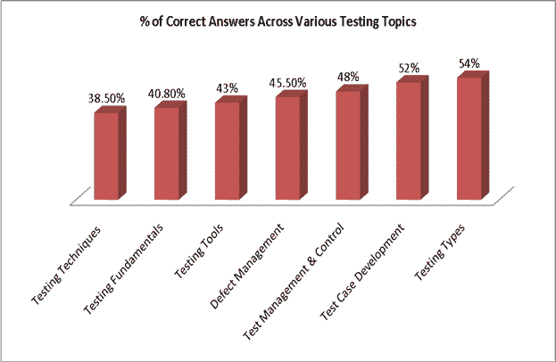
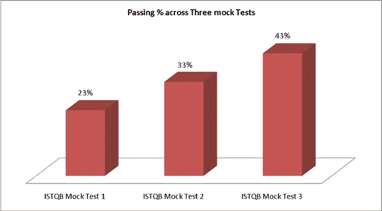

# ISTQB 认证：完整的模拟学习考试材料

> 原文： [https://www.guru99.com/istqb.html](https://www.guru99.com/istqb.html)

## 什么是 ISTQB？

ISTQB 的完整形式是“国际软件[测试](/software-testing.html)资格委员会”。 它提供**国际认可的**认证，称为“ ISTQB 认证测试仪”。

### 为什么要参加认证？ 认证有任何市场价值吗？

这是一个很有争议的话题，可以辩论直到死。

但是这里有一些提示可能会帮助您做出决定。

*   最重要的是**体验**。 没有任何认证可以提供您在进行实时项目时获得的曝光和培训。 期！
*   如果您是**较新的**，或者是非技术背景的并且想要在软件行业找到一份工作，则可以通过认证。 试想一下，作为雇主，我没有任何其他参数可以判断您的技术水平，因此认证是一个很好的起点。
*   如果您是**经验丰富的专业人员**，并且正在寻找工作变动，则证书会修饰您的简历。 更重要的是，无论您的经验多么丰富，在学习认证的过程中总会有一些新的质量检查领域可供学习。 但是不要以为仅凭认证就可以获得工作机会。

### ISTQB 提供的认证类型是什么？

|  | 基金会 CTFL | 先进的 CTAL |
| 合格 | 只需要 6 个月的专业测试经验就可以了 | 候选人必须持有基础证书 |
| 子考试 | 没有 | 

*   技术测试分析师
*   测试分析师
*   测试经理

每个子级别都有单独的论文。 考生必须通过以上所有 3 项考试，才能获得“高级证书” |
| 问题数 | 40 | 65 |
| 合格率 | 65% | 65% |
| 考试时间 | 60 分钟 | 180 分钟 |
| 我可以从哪里学习？ | 请参阅我们的初学者[软件测试课程](/software-testing.html) | 请参阅我们的[课程，以了解测试经理](/test-management.html) |
| 如何注册 | 以上全部取决于您要参加考试的**国家/地区**。 请转到[链接](http://www.istqb.org/istqb-where-you-are/geographic-coverage.html)，您将在其中找到 ISTQB 的成员站点列表。 因此，如果您想在美国参加考试，请转到[美国软件测试资格委员会](https://www.astqb.org/)链接。 在这里，您将找到有关考试日期，费用，注册详细信息等的信息。印度用户[在这里注册](http://istqb.in/) |

## ISTQB 认证测试

进行模拟[认证测试](/tests.html)。

*   [ISTQB 模拟测试 1](/component/com_joomlaquiz/Itemid,1187/quiz_id,17/view,quiz/)
*   [ISTQB 模拟测试 2](/component/com_joomlaquiz/Itemid,1187/quiz_id,18/view,quiz/)
*   [ISTQB 模拟测试 3](/component/com_joomlaquiz/Itemid,1187/quiz_id,19/view,quiz/)

## ISTQB 学习指南！

撰写本文时，超过 **15000 个 ISTQB 期望剂**已在 Guru99 进行了模拟 ISTQB 测试。

可以肯定地说，我们在 Internet 上拥有**最大的**组 **ISTQB 考试数据**。

**这是我们的数据的样子**

*   超过 **15,000** 人在 Guru99 上进行了 ISTQB 测试
*   最高分是 **40** 在 40 中
*   最低分数是 **0**
*   平均分数是 **17.5**

这是分数的分布-



我们聘请了**数据科学家**从该数据集中做出有意义的推断，并帮助**您在 ISTQB** 中获得了更高的得分，并得出了以下可行的结论-

### 您应该关注哪些主题？

我们将应试者给出的正确答案与问题所属的主题相结合。 结果令人大开眼界–



如您所见-ISTQB 有抱负的人在与“测试技术”相关的问题上得到的答案最多，而在与“测试类型”相关的问题上表现出色。

### ISTQB 有抱负的人应该重点关注的 3 个主题–

1.  **测试技术** –要重点关注的重要测试技术是[等价分区](/equivalence-partitioning-boundary-value-analysis.html)和边界值分析以及相关的数学问题，测试[复习](/testing-review.html)。

2.  **测试基础知识**-要重点关注的主题是 [STLC](/software-testing-life-cycle.html) ，[测试原理](/software-testing-seven-principles.html)和早期测试。

3.  **Testing Tools** - Important to learn the 'features' of the various types of

    [测试工具](/testing-tools.html)有助于回答相关问题。

#### 您最需要注意哪些问题？

我们整理了一个经常被错误回答的问题清单。 请密切注意它们，因为这类问题确实会在 ISTQB 考试中出现。 建议您练习类似类型的问题。

## 十大问题，未正确回答。

在第 10 位，我们有一个与测试管理和控制有关的问题。 只有 35％的应试者正确回答了

**问题 10。给定以下几组测试管理术语（v-z）和活动描述（1-5），以下两组中哪一个是最佳的？**

 **v –测试控制
w –测试监控
x-测试估算
y-事件管理
z-配置控制

1-计算所需测试 资源 2-维护测试结果记录
3-测试超限时重新分配资源 4-报告偏离测试计划的情况
5-跟踪异常测试结果** 

a）v-3，w-2，x-1，y-5，z-4

b）v-2，w-5，x-1，y-4，z-3

c）v-3，w-4，x-1，y-5，z-2

d）v-2，w-1，x-4，y-3，z-5

**正确答案：** c）V-3，w-4，x-1，y-5，z-2

在第 9 位，我们有一个与测试基础知识有关的问题。 只有 33.9％的应试者正确回答了

**问题 9。失败是：**

a）在软件中找到； 错误的结果。

b）偏离规定的行为

c）计算机程序中的错误步骤，过程或数据定义

d）产生错误结果的人为行动

**正确答案：** b）偏离指定的行为。

在数字 8，我们有一个与测试类型有关的问题。 只有 33％的应试者答对了

**问题 8。驱动程序也称为：**

**i。 锹
ii。 测试线束
iii。 脚手架** 

a）i，ii 为真，iii 为假

b）i，iii 为真，ii 为假

c）ii，iii 为真，i 为假

d）以上都是正确的

**正确答案：** c）ii，iii 为真，i 为假

在第 7 题中，我们又有一个来自测试基础知识的问题。 只有 31％的应试者正确回答了

**问题 7。验证涉及以下哪项：-**

 **i。 ii。帮助检查内置产品

的质量。 帮助检查我们是否已构建正确的产品。

iii。 iv。帮助开发产品

。 监视工具的浪费和过时。** 

a）i，ii，iii，iv 是正确的。

b）我为真，而 ii，iii，iv 为假

c）i，ii，iii 为真，iv 为假

d）ii 为真，i，iii，iv 为假

**正确答案：** b）i 为真，ii，iii，iv 为假。

**提示**：“验证”-帮助检查内置产品的质量

在第 6 条，我们有来自测试技术的问题。 只有 30.7％的应试者正确回答了

**问题 6。在旨在计算应缴税款的系统中：一名雇员可免税$ 4000。 下一个 1500 美元的税率为 10％，下一个 28000 美元的税率为 22％，再多的一个税率应为 40％，以下哪几组数字属于同一对等类别？**

a）$ 4800； $ 14000； $ 28000

b）5200 美元； $ 5500； $ 28000

c）$ 28001； $ 32000； $ 35000

d）$ 5800； $ 28000； $ 32000

**正确答案：** d）5800 美元； $ 28000； $ 32000

在第 5 位，同样来自测试技术的问题只有 23.67％的应试者正确回答了

**问题 5。给定以下程序**

 **```
IF X = Z
THEN Statement 2;
END
```** 

McCabe 的圈复杂度为：

a2

b）3

c）4

d）5

**正确答案：** a）2

数字 4 被“测试技术”中的一个问题占据。 只有 23％的应试者正确回答了

**问题 4。以下关于评论的哪些陈述是错误的？**

a）无法根据用户需求规格进行审核

b）评审是测试代码的最无效方法

c）评审不太可能在测试计划中发现错误。

d）应对规格，规范和测试计划进行审查

**正确答案：** b）评论是测试代码的最无效方法

测试技术似乎统治了这个清单！ 只有 22％的人认为该问题正确。

**问题 3。输入字段取 1900 年至 2004 年之间的出生年份。用于测试该字段的边界值为：**

a）0,1900,2004,2005

b）1900 年，2004 年

c）1899,1900,2004,2005

d）1899、1900、1901、2003、2004、2005

**正确答案：** d）1899，1900，1901,2003,2004,2005

在＃2，我们有来自测试工具的问题。 只有 17％的应试者正确回答了

**问题 2。以下哪项活动可以最大程度地节省使用 CAST 的成本？**

a）测试管理

b）测试设计

c）测试执行

d）测试计划

**正确答案：** c）测试执行

**技巧**：CAST =计算机辅助软件测试

所有人的祖父都是测试基础知识中的一个问题。 只有一小部分的应试者得到正确的答案。

**问题 1.将软件开发生命周期的每个阶段与测试生命周期相匹配：**

 **i。 高层设计
ii。 代码
iii。 低层设计
iv。 业务需求

单元测试
b。 验收测试
c。 系统测试
d。 集成测试** 

a）i-d，ii-a，iii-c，iv-b

b）i-c，ii-d，iii-a，iv-b

c）i-b，ii-a，iii-d，iv-c

d）i-c，ii-a，iii-d，iv-b

**正确答案：**

d）i-c，ii-a，iii-d，iv-b

## ISTQB 考试技巧

**技巧 1-**您想在 ISTQB 中 [Excel](/excel-tutorials.html) 上需要重点关注的最重要的事情是**实践**。 遵守以下图表。



在 guru99，我们提供了 3 个 ISTQB 模拟[测试](/tests.html)，通常学生们一个接一个地参加。 从“测试 1”到“测试 3”，您可以看到合格率从 23％增加到 43％。 正如谚语所说：“ **练习使人完美**”。 同样，从参加考试 1 到参加考试 **3** 的**人数逐渐减少，这表明参加所有考试的人数并不多。**

**技巧 2-**您会发现一个特定的挑战，不要浪费时间。 跳过，尝试在本文末尾回答。

**技巧 3-**您不确定答案，请使用消除选项的过程来得出正确的答案

**技巧 4-**您正在考试当天，请放松和信任任何学习过的人，远离他人令人困惑的陈述。

## ISTQB 转储

[下载 ISTQB 模拟测试](https://drive.google.com/uc?export=download&id=0ByI5-ZLwpo25NXh6UUZqTF9MNk0)的 PDF

祝好运！