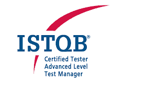

# ISTQB CTAL（高级）考试及学习资料

> 原文： [https://www.guru99.com/ctal-certified-exam-preparation.html](https://www.guru99.com/ctal-certified-exam-preparation.html)

要参加高级考试，您需要基础证书。 ISTQB 还建议您在参加考试之前有实践经验。

对进阶水平及其认证的研究是为了增强知识和意识，最重要的是，实施学习以提高日常工作的质量，最终将获得良好的职业发展。

在本教程中，您将学习-

*   [申请 CTAL 考试](#1)
*   [CTAL 考试模式](#2)
*   [清除 ISTQB 考试的有用提示](#3)

## 申请 CTAL 考试

通用名称 CTAL（认证测试员高级级别）下有三个不同的考试和认证模块

*   测试经理
*   测试分析师
*   技术测试分析师

### 入学程序

注册时与基础级别的注册相同，您必须上载以下三个文档

*   基础级别的计分卡，
*   经验证明
*   教育证书。

上传文件并注册后，您需要发送 DD 和文件的纸质副本。 文件。 付款过程可能会因国家/地区而略有不同。

网站上提到了有关 DD 的详细信息，注册后您将收到包含详细信息的邮件。 收到 DD 后，您会在邮件中得到确认。

### 考试费用

公开（个人）考试– 4000 /-+ 580 /-服务税= 4580 /-

企业考试– 3500 /-+ 507.50 /-服务税= 4007.50 /-

## CTAL 考试模式

*   首先是要熟悉 ISTQB 页面上的信息： [http://www.istqb.org/](http://www.istqb.org/) 。
*   它将提供有关考试形式的一些有用信息，并显示指导原则，以帮助您通过考试。
*   下表列出了每个模块的问题数量和考试时间。

| **模块** | **问题数量** | **考试时长**（以分钟为单位） |
| 高级测试经理 | 65 | 180 |
| 高级测试分析师 | 60 | 180 |
| 高级技术测试分析师 | 45 | 120 |

要通过高级考试，必须至少达到 65％的分数。 对于每个问题，您可以根据难易程度获得 1 分，2 分或 3 分。

每个问题都是根据认知水平（即 K 级）（也称为知识水平）进行分类的。

高级考试涵盖 3 个不同的 K 级：理解（K2），应用（K3）和分析（K4）。 考试期间，只允许使用普通纸和简单的非可编程计算器。

ISTQB 高级水平考试旨在检查您对基础和高级水平课程大纲中软件测试的整个学科的了解。 当您开始为 ISTQB Test Manager 做准备时，您的心态应该是 Manager，从经理的角度思考和学习，简而言之，让自己成为经理。 同样适用于测试分析师和技术测试分析师。

复习基础水平学习

**K（知识）** –级别&相关难度级别

高级级别涵盖 4 个不同的 k 级别（K1 至 K4），它确定要测试的理解级别，而不是问题的难度。

*   K1（记住）=记住并认识一个术语或概念。
*   K2（理解）=选择与问题主题相关的陈述的解释。
*   K3（应用）=选择一个概念或技术的正确应用并将其应用于给定的上下文。
*   K4（分析）=为了更好地理解，应试者可以将与过程或技术相关的信息分成其组成部分，并可以区分事实和推论。

在测试分析师/技术测试分析师/测试经理的考试中，高级课程大纲的所有部分也可以在 K1 级别进行考试。

### 我可以从哪里学习？

您可以阅读我们的[测试管理教程](https://www.guru99.com/test-management.html)，它将帮助您进行 CTAL（高级）学习。

## 清除 ISTQB 认证考试的有用提示

有关测试分析师&测试管理器的大多数问题来自“测试过程”，“测试管理” &“缺陷管理”，因此请花大量时间在这些章节上。

*   知道概念是行不通的，您需要在日常工作中实施学习。 问题是基于场景的，因此请多次阅读问题，然后再加以解决。
*   必须深入研究章节并获得清晰的理解。
*   要研究技术测试分析师考试，请使用“高级软件测试第 3 卷”。 雷克斯·布莱克（Rex Black）和杰米·米切尔（Jamie L.Mitchell）
*   要研究测试分析师，请参考 Rex Black Advanced Software Testing-Vol。 1：
*   要研究测试管理器，请参考 Rex Black Advanced Software Testing – Vol.2：

以下是测试经理，测试分析师&技术测试分析师建议的学习时间

| **测试管理器** |   | **测试分析师** |   | **技术测试分析师** |   |
| **章节** | **学习时间** | **Chapters** | **学习时间** | **Chapters** | **Study time** |
| 软件测试的基本方面 | 30 分钟 | Basic Aspects of software testing | 30 米 | 基于风险的测试 | 90 分钟 |
| 测试流程 | 180 分钟 | Testing Processes | 180 米 | 结构化基础测试 | 120 分钟 |
| 测试管理 | 120 mins | Test Management | 120 米 | 分析技术 | 180 mins |
| 技术测试 | 最长时间 | Test Techniques | Max time | 技术测试的质量特征 | 180 mins |
| 测试软件特性 | 210 分钟 | Testing of Software Characteristics | 210 mins | 评论 | 180 mins |
| Reviews | 180 mins | Reviews | 180 mins | 测试工具和自动化 | 90 mins |
| 事件管理 | 120 mins | 缺陷管理 | 120 mins |   |   |
| 测试工具自动化 | 90 mins | 测试工具 | 60 分钟 |   |   |
| 人际技巧团队组成 | 30 mins |   |   |   |   |

祝好运！

***本文由 Sundip Nag 提供。***

*   [下一个](/software-testing.html)