# 如何下载和安装 UFT 或 QTP [最新版本]

> 原文： [https://www.guru99.com/uft-qtp-download-install.html](https://www.guru99.com/uft-qtp-download-install.html)

从 Micro Focus 站点安装 HP UFT 或 QTP 试用版需要两个步骤。

*   [第 1 部分）下载](#1)
*   [第 2 部分）安装](#2)

我们将一步一步地进行操作

**第 1 部分）下载**

**步骤 1）**转到 [https://software.microfocus.com/signup](https://software.microfocus.com/signup) 。 输入数据并单击注册

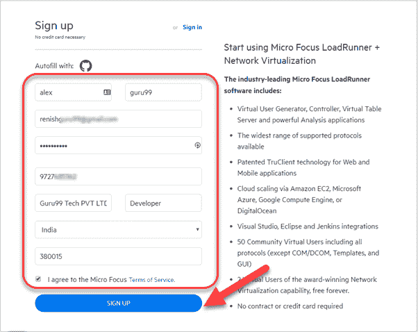

**步骤 2）**在下一个屏幕中，您将看到消息注册成功。

**步骤 3）**检查您的收件箱并确认您的电子邮件。

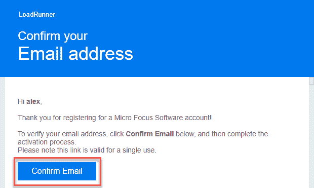

**步骤 4）**进入登录页面- [https://login.software.microfocus.com/msg/actions/showLogin](https://login.software.microfocus.com/msg/actions/showLogin)

1.  输入你的电子邮箱
2.  点击继续

**步骤 5）**在下一个屏幕中，

1.  输入密码
2.  点击“登录”按钮。

**步骤 6）**您将被带到仪表板。

1.  单击探索菜单。
2.  单击统一功能测试（UFT）。

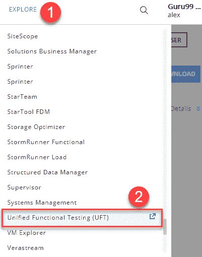

**步骤 7）**单击免费试用按钮。

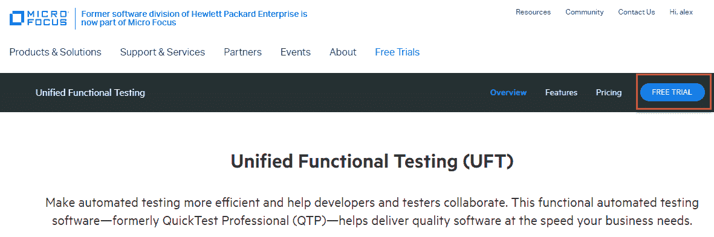

**步骤 8）**单击下一步按钮

**步骤 9）**单击按钮“转到我的帐户”。

**步骤 10）**您将被带到仪表板。 点击下载按钮

**步骤 11）**在下一个屏幕中，单击 UFT_14.01_Setup.exe

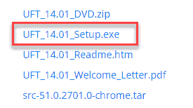

**步骤 12）** UFT 下载过程开始。

**第 2 部分）安装 UFT**

**步骤 1）**单击 PC 中下载的 UFT_14.01_Setup.exe

**步骤 2）**单击下一步

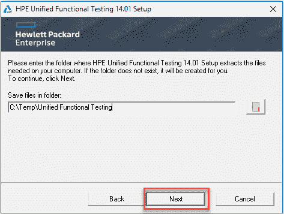

**步骤 3）**安装过程开始

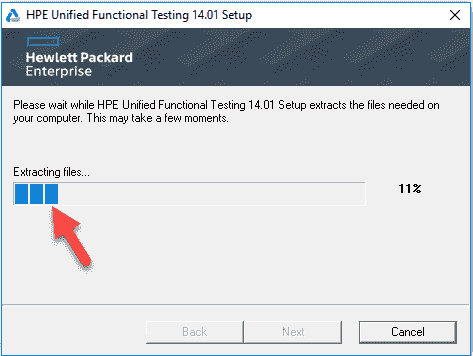

**步骤 4）**在下一个屏幕中，

1.  选择 Microsoft Office Access 数据库引擎 2010
2.  单击确定按钮

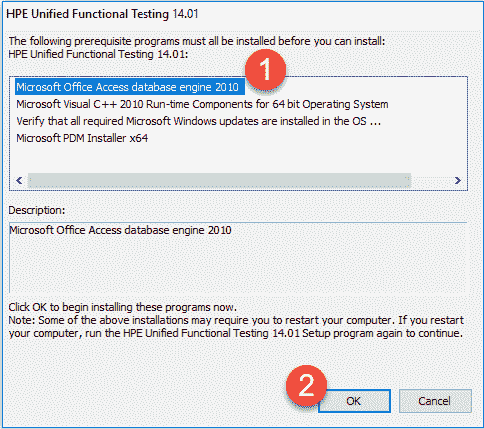

**步骤 5）** Microsoft Office Access 数据库引擎 2010 安装程序安装将开始

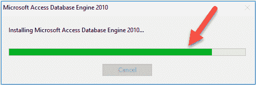

**步骤 6）** Microsoft Visual C ++ 2010 可再发行组件安装开始

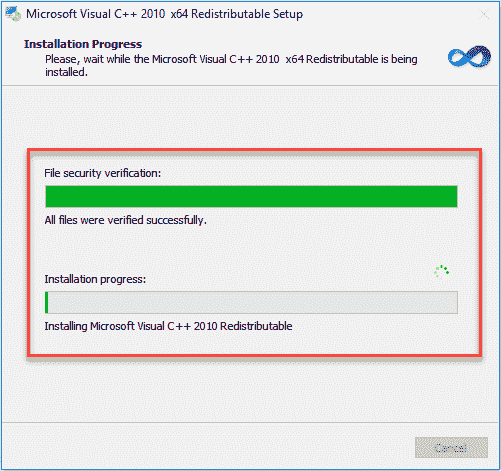

**步骤 7）**依赖性安装完成后，在欢迎屏幕上单击下一步按钮。

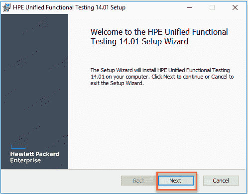

**步骤 8）**在下一个屏幕中，

1.  选中所有复选框。
2.  点击下一个按钮

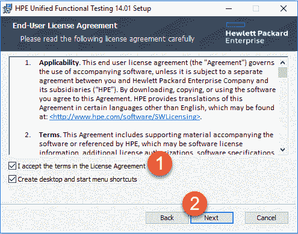

**步骤 9）**保留默认选项，然后单击“下一步”按钮

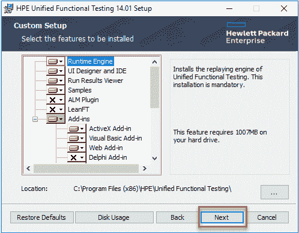

**步骤 10）**在下一个屏幕中，

1.  选中所有复选框。
2.  点击下一个按钮

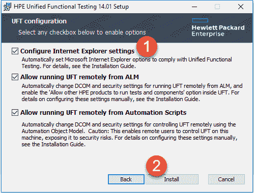

**步骤 11）**安装过程开始**。**

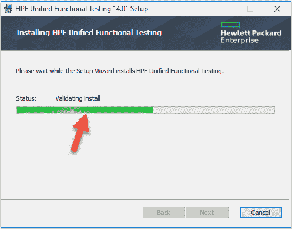

**步骤 12）**安装过程已完成，然后单击完成按钮。

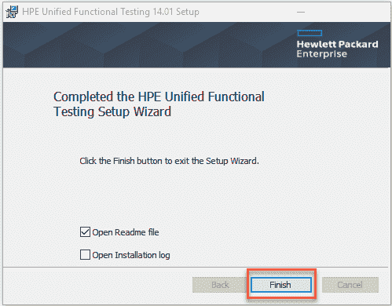

**步骤 13）**在重新启动确认框中，选择是

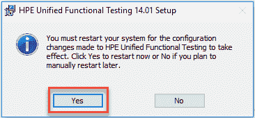

**步骤 14）**重新启动后，单击桌面上的 HPE UFT 图标

**步骤 15）**单击继续按钮。

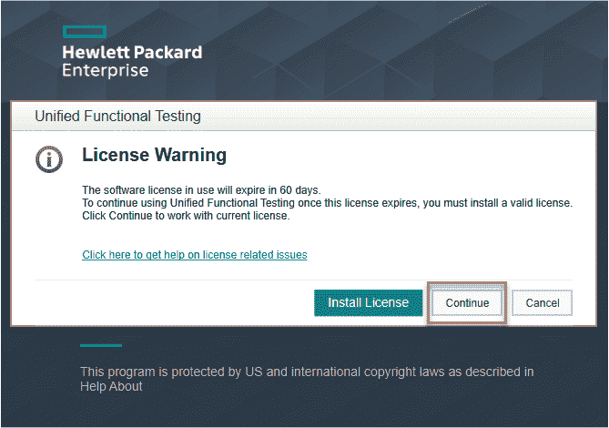

**步骤 16）**在下一个屏幕中，单击确定按钮。

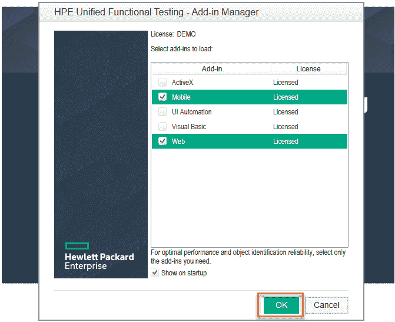

**步骤 17）** HPE UFT 仪表盘被显示。

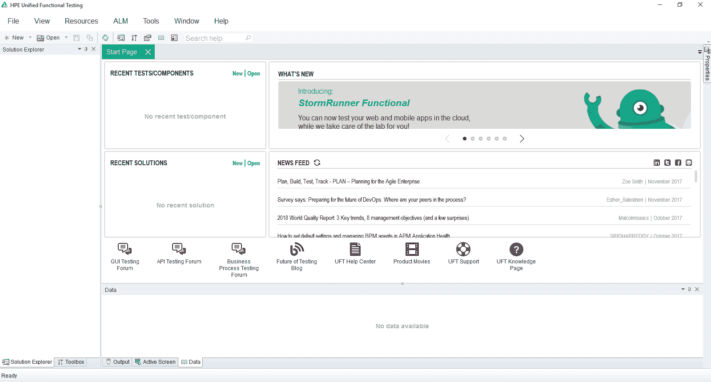

### QTP / UFT 版本历史

| 版 | 发布日期 |
| 10.0 | 2009 年发行 |
| 11.0 | 2010 年发行 |
| 11.5 | 2012 年发布[重命名为统一功能测试] |
| 12.0 | 2014 年发行 |
| 12.5 | 2015 年发行 |
| 14.0 | 2017 年发行 |
| 14.03 | 2018 年发行 |