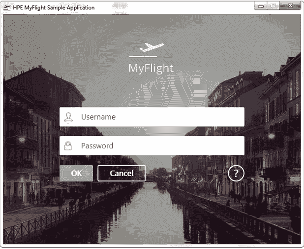
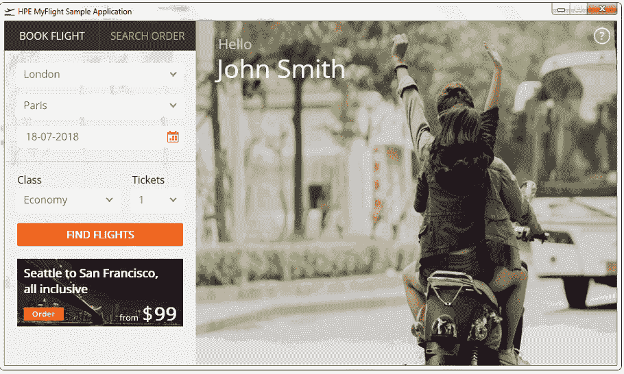

# HP UFT / QTP 中的航班预订应用程序

> 原文： [https://www.guru99.com/uft-qtp-flight-reservation.html](https://www.guru99.com/uft-qtp-flight-reservation.html)

本教程介绍了 Flight Reservation Application，该教程将在其余教程中动手使用。

**注意：**

HP QTP 预先安装了 Flight Reservation Application

使用**航班预订**，您可以预订两个城市之间的航班，甚至可以修改或删除现有的预订。

您也可以使用您的自定义签名将预订传真给客户。

航班预订有一个``报告和图表''部分，可帮助分析机票销售趋势。

对于任何新代理，都会预先填充少量的预订，因此您不必创建测试数据。

该应用程序旨在帮助学习 Micro Focus UFT 提供的所有功能。 有时，您可能会发现此应用程序存在漏洞，但您的重点不应是应用程序的技术准确性，而应将其用作工具来学习 QTP 的各种功能。