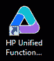
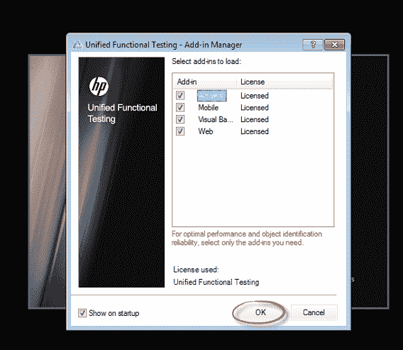
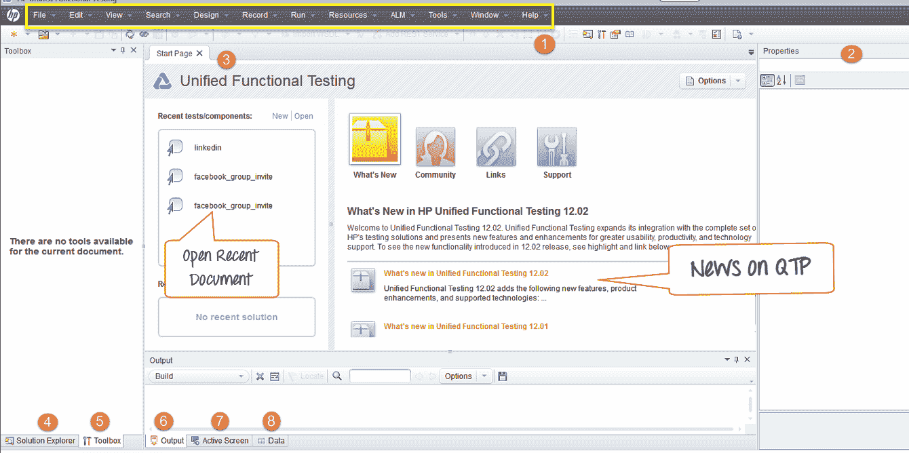
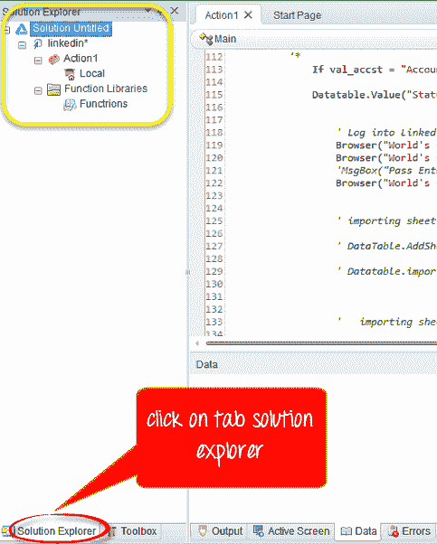
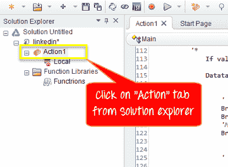
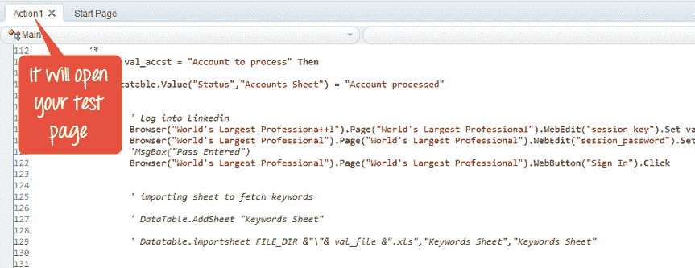
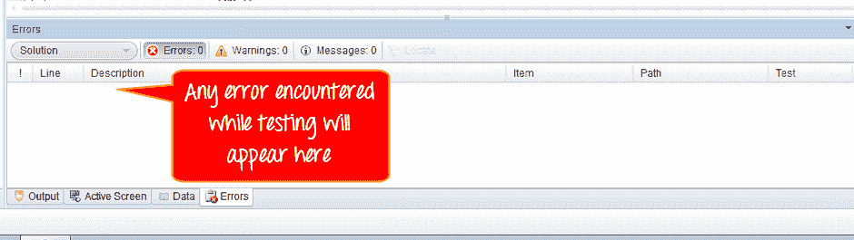
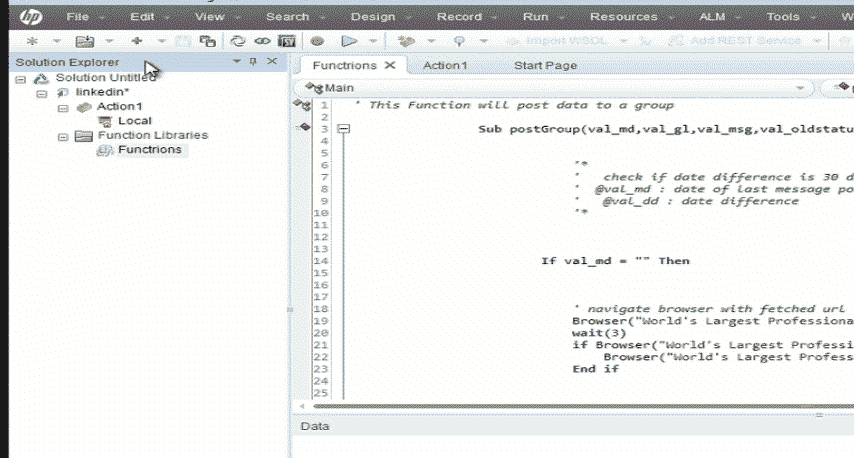

# 如何使用 QTP / UFT IDE

> 原文： [https://www.guru99.com/uft-qtp-ide.html](https://www.guru99.com/uft-qtp-ide.html)

本教程介绍了 Quick Test Professional IDE

### 启动 UFT

要启动 HP QTP，请在“开始”菜单中，

选择程序> Quick Test Professional 文件夹> Quick Test Professional 或双击 HP UFT 图标

### 加载项管理器

首次启动 Micro Focus UFT 时，将打开**加载项管理器**对话框。

它显示所有已安装加载项的列表。 您可以选择要为测试加载的加载项，然后单击“确定”。 QTP 启动后，您可以稍后添加或删除加载项。 现在，坚持默认设置并继续前进

**建议**仅选择特定[测试](/software-testing.html)会话所需的加载项。 因为有时，不同的加载项会相互干扰，从而降低对象标识和 QTP 的性能。 QTP 会记住您加载的加载项，以便下次打开 QTP 时，默认情况下会选择在上一个会话中选择的加载项。 另外，如果您不想在下次启动 QTP 时打开此对话框，请清除“在启动时显示”复选框。 单击确定。

### 首页

**起始页**描述了当前版本中的新功能，包括有关这些功能的更多信息的链接。 它还提供了到流程指导的链接，该指南提供了使用 QTP 的最佳实践。 您可以从“最近使用的文件”列表中打开一个文档，也可以单击“欢迎使用”中的按钮！ 打开新文档或现有文档的区域。

以下是 IDE 的重要组件

1.  菜单栏
2.  属性窗口
3.  文件标签
4.  解决方案资源管理器
5.  工具箱标签
6.  输出标签
7.  活动画面
8.  数据标签

如果您不希望 QTP 在下次打开 QTP 时显示“起始页”，请选中“启动时不显示起始页窗口”复选框。 当您选择此选项时，打开另一个 QTP 文档后，当前 QTP 会话的“起始页”也会自动隐藏。 要再次显示开始页面，请选择查看>开始

### 解决方案资源管理器

**解决方案资源管理器**是**层次树**，其中包含当前测试中的所有操作和测试以及它们的引用，事件和流。

通过**功能库**，您可以创建可在测试中多次使用的代码或功能。

该功能的详细信息将显示在面板右侧的“属性”面板下

### 数据表

您可以通过窗口底部菜单栏中的数据标签输入与测试相关的**数据**。 此面板是可与测试一起使用的数据源的树形层次结构。

“ **Action** ”选项卡提供了测试代码的详细信息。

 ](/images/1-2015/012315_1049_HowtouseQTP7.png) [ 

要查看在执行[自动化测试](/automation-testing.html)期间遇到的**错误**，可以使用底部面板中的错误选项卡。

### 移动 IDE 窗格

您可以根据自己的喜好移动 QTP 窗格。

假设我们要移动解决方案资源管理器。

在“ QTP”窗口中，拖动“解决方案资源管理器”的标题栏。

拖动窗格时，标记将显示在活动窗格中和 QTP 窗口的每个边缘上。

拖动解决方案资源管理器，然后将光标停留在各种标记上。 显示一个阴影区域，指示窗格的新位置。 让我们将其移至顶部。 释放鼠标按钮。 解决方案资源管理器窗格固定到位，并在阴影区域中显示为新窗格。

