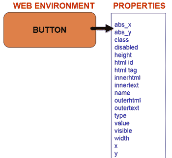
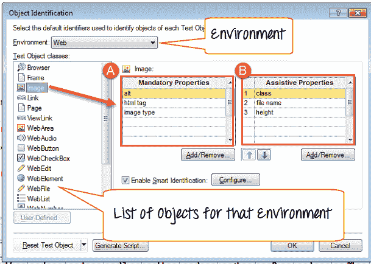

# 对象识别如何在 QTP / UFT 中工作？

> 原文： [https://www.guru99.com/uft-qtp-object-identification.html](https://www.guru99.com/uft-qtp-object-identification.html)

### 什么是对象识别？

QTP 还使用类似于“人类”的技术进行对象识别。 在记录期间，时间 QTP 尝试了解对其执行操作的 GUI 对象的属性。 在运行期间，Micro Focus UFT 会将存储的对象属性与屏幕上可用对象的实际属性进行比较，并唯一标识一个对象，而与对象在屏幕上的位置无关

存储的对象及其属性称为 **TEST 对象**

在运行时，被测应用程序上可用的实际对象称为**运行时对象**

这是 HP UFT 的**“测试对象模型”**

### 什么是对象存储库？

有关测试对象的信息存储在**对象存储库**中

**加载项**帮助提前指示要记录的对象的性质的快速测试，以减少学习其属性所需的时间

以下视频教程演示了 QTP 如何识别 GUI 对象（屏幕上）

QTP 将对象及其属性存储在对象存储库中，以在运行时识别它们。 对象可能具有与之关联的大量属性。 例如，在 Web 环境中，一个 Button 可以具有以下关联的属性。

如果 QTP 尝试记住某个对象的所有可用属性，则对象存储库的**大小将膨胀，脚本执行时间将大大增加。 为避免这种情况，默认情况下，QTP 不会存储对象的所有属性，但会限制对象的典型属性数量，这有助于其唯一标识。** 各种环境和对象的属性选择（将在记录期间保存）存储在对象标识中

## 对象描述，强制&辅助属性

对象 ***属性*** 及其 ***值*** 称为**对象描述**。 对象描述用于唯一地标识相应的对象。 例如，对于 WebButton 属性*“名称”* 及其值“ *登录”* ，可以一起称为该 Web Button 的对象描述。

要访问，请在 QTP 的工具菜单中，选择对象标识。 在“对象识别”对话框中，您可以看到安装和加载的所有环境的下拉列表。

您可以选择一个环境，QTP 会自动填充属于该环境的所有受支持对象的列表。 在右侧的 QTP 上列出将为对象存储的属性。 列表分为

1.  **默认情况下，将为该对象存储强制属性**
2.  **辅助属性**如果在脚本录制期间 QTP 无法创建对象的唯一说明，它将存储**辅助属性**

为了更好地理解这一点，请考虑 Web Image 的示例。

*   QTP 将存储 alt 值，HTML 标记，图像类型，强制性属性，即使仅使用 alt 属性即可唯一地标识它。
*   如果无法使用强制属性创建唯一描述，则 QTP 将存储辅助属性。 在这种情况下，QTP 将存储 class 属性。
*   如果此属性有助于创建对象的唯一说明，则 QTP 不会存储文件名 height 属性。 如果类属性不足以创建唯一描述，则 QTP 将存储文件名属性。 如果 filename 属性创建了唯一描述，则 QTP 将不存储 height 属性，依此类推。
*   假设在记录时间内，QTP 仅存储了类属性。 在运行时，QTP 将忘记强制属性和辅助属性之间的区别，并比较所有记录的属性。
*   即使任何一个属性与它的存储值都不匹配，**脚本也会失败**