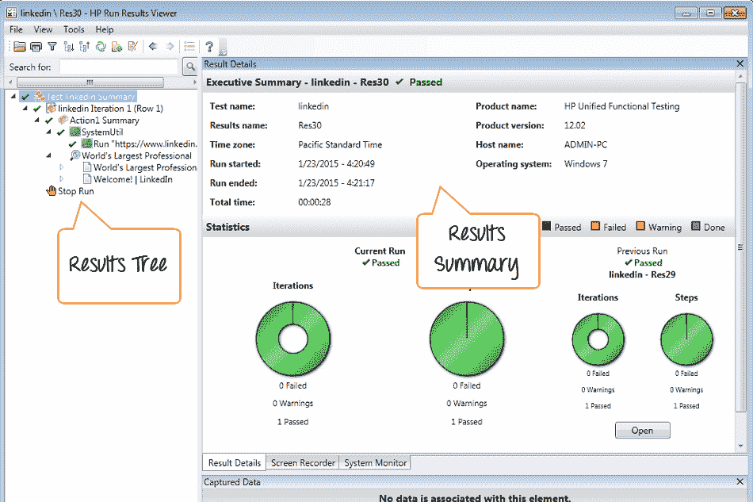
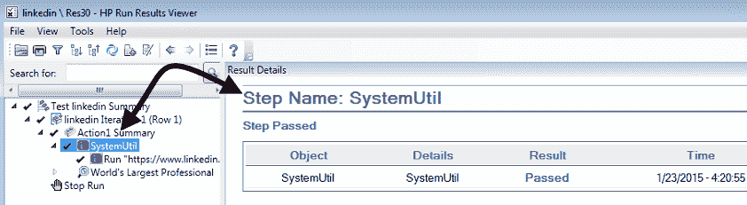
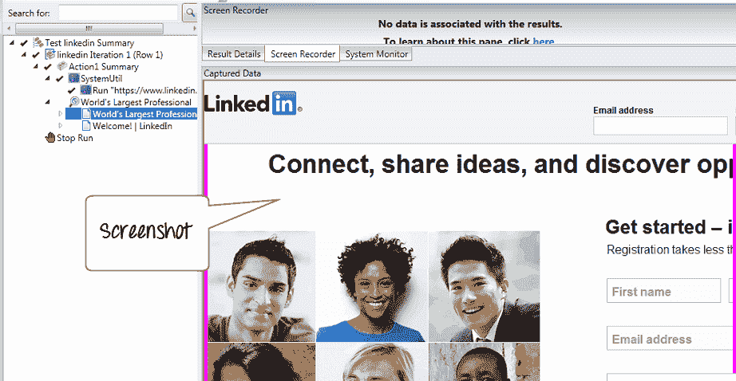
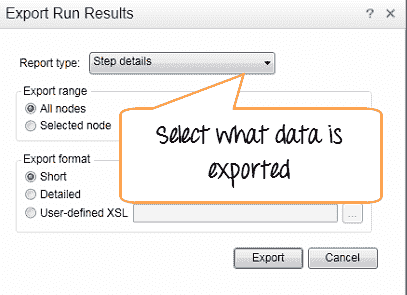
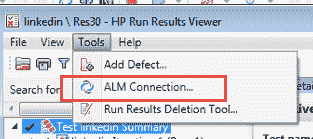

# 通过打印/导出示例了解 QTP / UFT 中的测试结果

> 原文： [https://www.guru99.com/uft-qtp-test-results.html](https://www.guru99.com/uft-qtp-test-results.html)

让我们了解 Micro Focus UFT 生成的测试结果

在 HP QTP 中，右侧显示“测试结果摘要”。

左侧是“测试结果树”-测试运行时执行的测试步骤的基于图标的视图。 类似于“关键字视图”中的测试树

如果您在树中选择一个步骤，则右侧面板会为其提供完整的详细信息

您可以使用工具>选项> [GUI 测试](/gui-testing.html)捕获整个测试运行的电影/屏幕截图。

您可以打印/导出结果。

您可以将结果/缺陷导出到 Quality Center。

