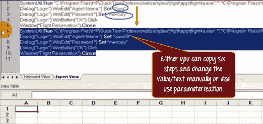
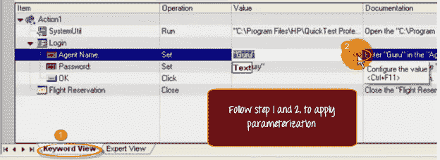
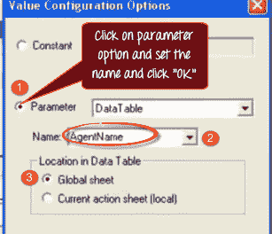
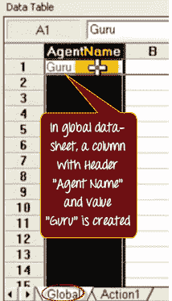
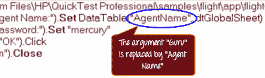
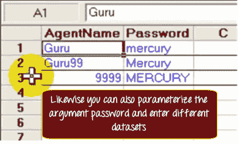
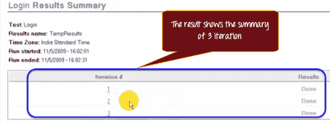

# QTP / UFT 中的参数化示例

> 原文： [https://www.guru99.com/uft-qtp-parameterization.html](https://www.guru99.com/uft-qtp-parameterization.html)

### 什么是 QTP 参数化？

QTP 使我们可以在运行时选择不同的测试输入。 通过外部参数提供不同输入值的过程称为参数化。

### QTP 中的参数化类型

参数类型可以是：

1.  数据表参数
2.  测试/动作参数
3.  环境变量参数
4.  随机数参数

### QTP 中的参数化

此 Micro Focus UFT 教程演示了如何进行参数化以成功登录到航班预订应用程序。 您可能想知道为什么要花大力气使这一简单场景自动化。 输入有效的代理名称&密码后，我们将检查用户是否成功登录到应用程序。 如果我们扩展方案的范围以包括**有效的 ALPHANUMERIC 代理名称&密码**的组合，则对参数化的需求变得显而易见。 在这种情况下，测试步骤将保持不变。 但是我们将有更多的数据到 TEST 的组合。 在此示例中，我们将限制为仅 8 种可能的组合中的 3 种。

| 测试场景 | 测试步骤 | 测试数据 |
| 输入有效的字母
代理名称&的
组合后，检查用户是否成功登录
到应用程序 | 步骤 1）打开航班预订应用程序
步骤 2）输入有效的代理名称
步骤 3）输入有效的密码
步骤 4）按 OK
步骤 5）成功登录后关闭应用程序。 | 代理名称= Guru
密码=水银
代理名称= Guru99
密码= MERCURY
代理名称= 9999
密码=汞 |

为此，您可以复制六个步骤，也可以提供不同的数据值（实际上是您手动执行的操作），或者可以使用**参数化。**

参数化参数的最简单方法，在我们的案例中，Guru 是

1.  **点击关键字视图**
2.  **单击参数化图标。**

“值配置”对话框打开。 当前，该值设置为常量。 单击参数单选按钮。 QTP 为此参数分配一个默认名称。 您可以选择一个名称，然后单击“确定”。

在全局工作表中，创建带有标题“代理名称”和值 Guru 的列。 您可以为此参数输入更多值。

当您单击“专家视图”时，您会看到“代理名称”被“专家”替换，并使用了工作表类型。

同样，您也可以参数化密码 Password 并输入不同的测试数据集。

该数据表的含义是 QTP 将重复我们已记录三遍的相同六个步骤。 在第一次迭代期间，它将使用第一行中的数据。 在第二个阶段，它将使用第二行中的数据，依此类推。 现在运行脚本。 这是第一次迭代。 这是第二次迭代。 **在** **状态栏中，QTP 提供该行的信息，当前它用作测试数据**，并突出显示数据表中的相应行。 结果将显示 3 次迭代的摘要。

### 参数化的优点

*   参数化允许我们在运行时选择不同的值
*   它减少了时间和精力
*   使用数据驱动程序使我们可以将相同的数据用于各种输入框。 （数据驱动程序是 HP UFT 提供的一项功能，它可以在一个窗口中显示所有可以参数化的常数。它可以轻松地对大型脚本进行参数化。