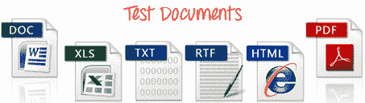

# 软件测试中的测试文档

> 原文： [https://www.guru99.com/testing-documentation.html](https://www.guru99.com/testing-documentation.html)

## 什么是测试文档？

测试文档是在软件测试之前或期间创建的工件的文档。 它可以帮助测试团队估算所需的测试工作量，测试范围，资源跟踪，执行进度等。它是一整套文档，可让您描述和记录测试计划，测试设计，测试执行，得出的测试结果 来自测试活动。

在本教程中，您将学习：

*   [什么是测试文档？](#1)
*   [为什么要测试形式？](#2)
*   [测试文档示例](#3)
*   [获得测试文档的最佳做法](#4)
*   [测试文档](#5)的优势
*   [测试文档](#6)的缺点

## 为什么要测试形式？

对于新手来说，很容易假设 Testing 正在临时执行代码的各个部分并验证结果。 但是在现实世界中，测试是一项非常正式的活动，并有详细记录。 测试文档使测试的计划，审查和执行变得容易且可验证。

测试形式的程度取决于

*   测试中的应用程序类型
*   您的组织遵循的标准
*   开发过程的成熟度。

测试活动通常消耗软件开发项目工作的 30％到 50％。 文档有助于确定可应用于将来项目的测试过程改进。

## 测试文档示例

这里是重要的测试文档类型：

| 测试类型 | 描述 |
| 测试政策 | 这是一份高级文档，描述了组织的原则，方法和所有重要的测试目标。 |
| 测试策略 | 标识要为项目执行的测试级别（类型）的高级文档。 |
| 测试计划 | 测试计划是一个完整的计划文档，其中包含测试活动的范围，方法，资源，时间表等。 |
| 需求追踪矩阵 | 这是一个将需求与测试用例联系起来的文档。 |
| 测试场景 | 测试场景是软件系统的一项或一项，可以通过一个或多个测试用例进行验证。 |
| 测试用例 | 它是一组输入值，执行先决条件，预期执行后继条件和结果。 它是针对测试场景而开发的。 |
| 测试数据 | 测试数据是在执行测试之前存在的数据。 它用来执行测试用例。 |
| 缺陷报告 | 缺陷报告是有关软件系统中任何无法执行其预期功能的缺陷的书面报告。 |
| 测试总结报告 | 测试摘要报告是一个高级文档，其中总结了进行的测试活动以及测试结果。 |

## 获得测试文档的最佳做法

*   质量检查团队需要参与项目的初始阶段，以便并行创建测试文档
*   不只是创建和保留文档，还可以在需要时进行更新
*   使用版本控制来管理和跟踪文档
*   尝试记录所需的内容，以便您了解自己的工作以及需要向利益相关者提供的内容
*   您应该对诸如 excel 表格或 doc 文件之类的文档使用标准模板
*   将所有与项目相关的文档存储在一个位置。 每个团队成员都应该可以访问该参考文件，并在需要时进行更新
*   创建测试文档时，没有提供足够的细节也是常见的错误

## 测试文档的优势

*   创建测试文档的主要原因是减少或消除有关测试活动的任何不确定性。 帮助您消除在分配任务时经常出现的歧义
*   文档不仅提供了软件测试的系统方法，而且还充当了软件测试过程中新生的培训材料。
*   展示测试文档以展示成熟的测试过程也是一种很好的营销&销售策略
*   测试文档可帮助您在特定时限内为客户提供优质产品
*   在软件工程中，测试文档还可以通过配置文档和操作员手册来帮助配置或设置程序。
*   测试文档可帮助您提高与客户的透明度

## 测试文档的缺点

*   文档的成本可能会超过其价值，因为这非常耗时
*   很多时候，它是由写得不好或不懂材料的人写的
*   跟踪客户请求的更改并更新相应的文档很累。
*   不良的文档直接反映了产品的质量，因为客户和组织之间可能会产生误解

## 摘要

*   测试文档是在软件测试之前或期间创建的工件的文档。
*   测试形式的程度取决于 1）被测应用程序的类型 2）组织遵循的标准 3）开发过程的成熟度。
*   测试文件的重要类型是测试策略，测试策略，测试计划，测试用例等。
*   质量检查团队需要参与项目的初始阶段，以便并行创建测试文档
*   创建测试文档的主要原因是减少或消除有关测试活动的任何不确定性。
*   文档的成本可能会超过其价值，因为这非常耗时