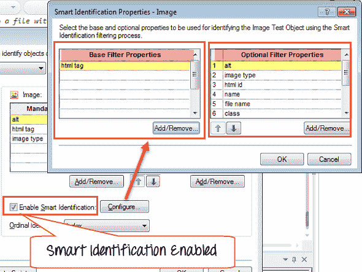

# QTP / UFT 中的智能识别示例

> 原文： [https://www.guru99.com/uft-qtp-smart-identification.html](https://www.guru99.com/uft-qtp-smart-identification.html)

### QTP 中的智能识别是什么？

*   如果通常的对象识别过程失败，Micro Focus UFT 会触发智能识别，如果在“对象识别”设置中启用了“智能识别”，这是一种更灵活的对象识别机制。
*   智能识别使用两类属性

1.  **基本过滤器属性。** 包含特定测试对象类的最基本属性； 那些值不能更改而不改变原始对象本质的对象
2.  **可选过滤器属性**。 其他有助于识别对象的属性

HP UFT“ **”忘记了**“学习到的测试对象描述，并创建一个新的对象候选列表，其中包含与基本过滤器属性列表中定义的所有属性匹配的对象。 QTP 使用基本过滤器属性来减少对象候选者列表。 这个想法是将范围缩小到只匹配一个或多个已保存描述属性的对象。

如果在测试运行期间调用了智能识别，则会在测试结果树中生成一条警告消息，指示已调用智能识别并插入了智能识别步骤。

### 如何启用/禁用智能识别

### 智能识别如何工作？

## 修改对象属性以避免智能识别

**带有关键提示的视频笔录突出显示**

*   您可能已经观察到智能识别会减慢脚本的执行速度，这是不希望的
*   为了避免智能识别，我们可以更改默认的对象识别属性
*   在 QTP 中，对象标识可以从强制属性中删除“名称”，然后将其替换为“ HTML ID”，以使我们的测试不受名称更改的影响
*   您可以为脚本重新记录相同的步骤
*   现在，如果您将名称从“提交”更改为“登录”并运行脚本，则该脚本将在没有任何智能识别的情况下执行
*   同样，在被测试的应用程序中，**是否会频繁更改某个对象的任何必需或辅助属性，您可以将其替换为其他合适的属性，以加快脚本执行的速度**
*   财产调整是一个经验游戏领域，随着年龄的增长，您将逐渐掌握它

资源资源

[下载以上教程中使用的网页进行自我练习](https://drive.google.com/uc?export=download&id=0B_vqvT0ovzHcbXh0WGpkUlNpM3M)