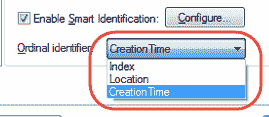

# QTP / UFT 中的顺序标识符：对象识别示例

> 原文： [https://www.guru99.com/uft-qtp-ordinal-identifiers.html](https://www.guru99.com/uft-qtp-ordinal-identifiers.html)

### 什么是序号？

如果强制和辅助属性不足以在记录会话期间识别对象，则 QTP 会使用**序号标识符**以及其他捕获的属性来在记录会话期间识别对象。 默认情况下，每个测试对象类都存在一个序号标识符类型。

在“对象标识”窗口中，可以修改对象的默认“序号”

HP UFT 中存在三种类型的序号标识符。

1.  基于索引
2.  基于位置
3.  创作时间

**基于索引的**

*   使用基于索引的序号标识符时，在记录时，QTP 将为对象的 **INDEX 属性**分配一个值
*   该值基于对象在源代码中出现的顺序。
*   第一次出现的值为 0
*   索引属性值是特定于对象的。
*   因此，如果使用 Index：= 3 来描述 WebEdit 测试对象，则 Quick Test 搜索页面上的第四个 WebEdit 对象。
*   同样，您使用 Index：= 1 来描述 WebButton 测试对象，Quick Test 在页面上搜索第二个 WebButton 对象。

**基于位置的**

*   当使用基于位置的顺序标识符时，在录制时，Micro Focus UFT 将为对象的 **LOCATION** **属性**指定一个值，以唯一地标识该对象。
*   该值基于对象在窗口，框架或对话框中相对于具有相同属性的其他对象出现的顺序。
*   该对象的首次出现是 0。
*   值在从上到下以及从左到右的列中分配。

**建立时间**

*   使用创建时间顺序标识符时，在录制时，QTP 将为 Web 浏览器的**创建时间** **属性**分配一个值
*   标识符仅适用于 Web 环境
*   该值指示浏览器相对于其他打开的浏览器的打开顺序。
*   录制时打开的第一个浏览器收到值 CreationTime = 0，随后的浏览器被赋予值 1，2，3 ...，依此类推

资源资源

[下载以上教程中使用的网页进行自我练习](https://drive.google.com/uc?export=download&id=0B_vqvT0ovzHcdzlIV2IyZkk5T0E)