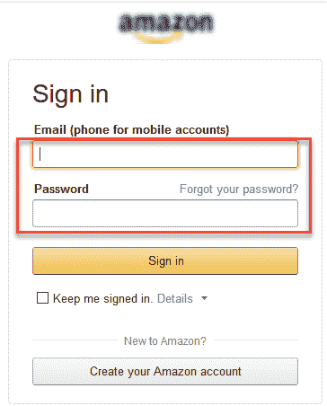
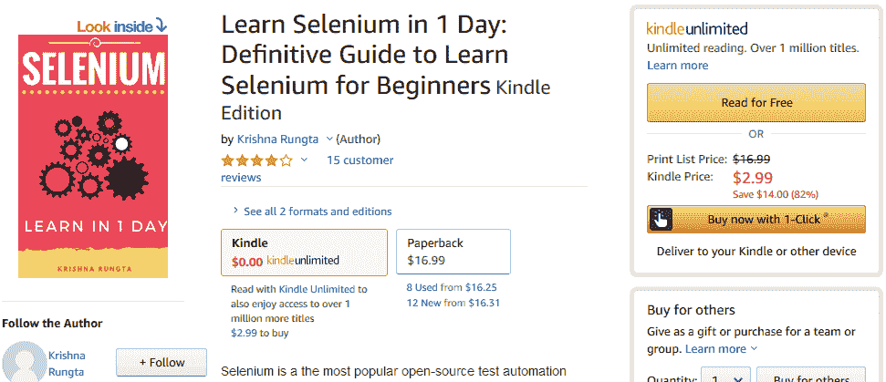
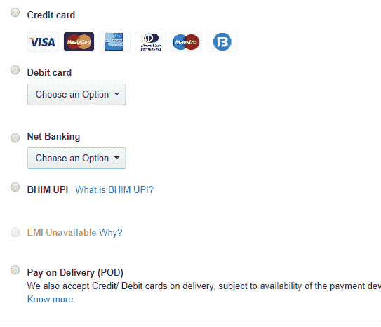

# 什么是测试方案？ 带有示例的模板

> 原文： [https://www.guru99.com/test-scenario.html](https://www.guru99.com/test-scenario.html)

## 什么是测试方案？

A **TEST SCENARIO** is defined as any functionality that can be tested. It is also called *Test Condition* or *Test Possibility*. As a tester, you should put yourself in the end user’s shoes and figure out the real-world scenarios and use cases of the Application Under Test.

### 什么是方案测试？

方案测试是软件测试的一种变体，其中方案用于测试。 场景有助于更轻松地测试更复杂的系统

让我们借助下面的视频进行研究-

## 为什么要创建测试方案？

创建测试方案的原因如下：

*   创建测试方案可确保完整的测试范围
*   测试场景可以由业务分析人员，开发人员，客户等各种利益相关者批准，以确保对被测应用程序进行全面测试。 它确保该软件适用于最常见的用例。
*   它们可作为确定测试工作量的快速工具，从而为客户制定建议或组织工作人员。
*   它们有助于确定最重要的端到端事务或软件应用程序的实际使用。
*   对于研究程序的端到端功能，测试方案至关重要。

## 什么时候不创建测试方案？

在以下情况下可能无法创建测试方案

*   被测应用程序很复杂，不稳定，并且项目时间紧迫。
*   遵循敏捷方法论的项目（例如 Scrum，看板）可能不会创建测试方案。
*   可能无法为新的错误修复程序或[回归测试](/regression-testing.html)创建测试方案。 在这种情况下，测试方案必须在先前的测试周期中已被大量记录。 对于维护项目尤其如此。

## 如何编写测试方案

作为测试人员，您可以按照以下五个步骤创建测试方案-

*   **步骤 1** ：阅读被测系统（SUT）的需求文档，例如 BRS，SRS，FRS。 您还可以参考要测试的应用程序的用例，书籍，手册等。
*   **步骤 2** ：针对每个要求，找出可能的用户操作和目标。 确定需求的技术方面。 确定系统滥用的可能情况，并以黑客的心态评估用户。
*   **步骤 3：**阅读需求文档并进行应有的分析后，列出不同的测试方案来验证软件的每个功能。
*   **步骤 4：**一旦列出了所有可能的测试方案，就会创建一个[可追溯性矩阵](/traceability-matrix.html)，以验证每个要求的每个&都有对应的测试方案
*   **步骤 5：**创建的方案由您的主管审查。 后来，项目中的其他利益相关者也对它们进行了审查。

## 创建测试方案的技巧

*   根据项目方法，每个测试方案应至少与一个需求或用户案例相关联。
*   在创建一次验证多个需求的测试方案之前，请确保您具有一个测试方案，用于单独检查该需求。
*   避免创建跨越多个需求的过于复杂的测试方案。
*   方案的数量可能很大，并且全部运行这些方案的成本很高。 根据客户优先级，仅运行选定的测试方案

## 示例 1：电子商务应用程序的测试方案

对于电子商务应用程序，一些测试方案将是

**测试方案 1：**检查登录功能

为了帮助您了解“测试方案”和“测试用例”之间的差异，将针对此测试方案的特定测试用例为：

1.  输入有效的电子邮件 ID 和密码后，检查系统行为。
2.  输入*无效的*电子邮件 ID 和*有效的*密码时，检查系统行为。
3.  输入*有效的*电子邮件 ID 和*无效的*密码时，检查系统行为。
4.  输入*无效的*电子邮件 ID 和*无效的*密码时，检查系统行为。
5.  将电子邮件 ID 和密码留空并输入登录名后，检查系统行为。
6.  检查忘记密码是否按预期工作
7.  输入有效/无效的电话号码和密码后，请检查系统行为。
8.  选中“保持我签名”后检查系统行为

显而易见，测试用例更加具体。

**测试方案 2：**检查搜索功能

**测试方案 3：**检查产品说明页面

**测试方案 4：**检查付款功能

**测试方案 5：**检查订单历史记录

除了这 5 个方案外，这里还有所有其他方案的列表

*   检查主页行为以寻找回头客
*   检查类别/产品页面
*   检查客户服务/联系页面
*   查看每日优惠页面

## 示例 2：银行站点的测试方案

**测试方案 1** ：检查登录和身份验证功能

**测试方案 2** ：可以进行转帐支票

**测试方案 3** ：可以查看支票帐户对帐单

**测试方案 4** ：可以创建支票定期存款/定期存款

等等…

## 测试方案模板

[下载测试方案模板 Excel（.xlsx）](https://drive.google.com/uc?export=download&id=17Y9KNDeUiglfNpBZyfCBg-FAcEEwUYOr "Download Test Scenario Template(.xlsx)")