# QTP / UFT 中的数据，关键字&混合自动化框架

> 原文： [https://www.guru99.com/creating-automation-frameworks-with-qtp.html](https://www.guru99.com/creating-automation-frameworks-with-qtp.html)

在本教程中，我们将使用 QTP（HP UFT）创建

*   [数据驱动框架](#1)
*   [关键字驱动框架](#2)
*   [混合框架](#3)

因此，让我们开始吧-

## 数据驱动框架

数据驱动框架是由输入和输出数据的不同组合驱动的框架。

传递不同数据组合的一种方法是通过参数化。 在这种方法中，我们使用了 QTP 的不同功能。 要了解有关参数化的更多信息，请在处访问[。](/uft-qtp-parameterization.html)

但是，在 DDF 中，编写脚本来进行参数化。 当必须使用多个输入测试 AUT 的功能并捕获相应的输出时，这种框架非常有用。 这些输入可以从数据库，Excel，Outlook，文本文件等外部文件中读取，并将各自的输出写回到相应的外部源。

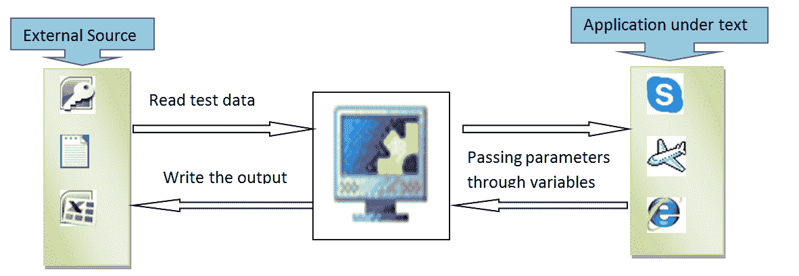

数据驱动框架涉及的一般步骤是：

1.  为要测试的应用程序准备[测试用例](/test-case.html)
2.  将对象从 AUT 添加到 OR
3.  根据测试用例编写脚本

在本教程中，我们将使用 Excel 作为测试数据的外部源，为示例测试用例开发数据驱动的框架设计。

## 步骤 1）为被测应用程序准备测试用例

**测试用例**：打开订单号并获取该订单的客户名称。 对不同的订单号重复相同的过程

**外部源**：Excel 文件

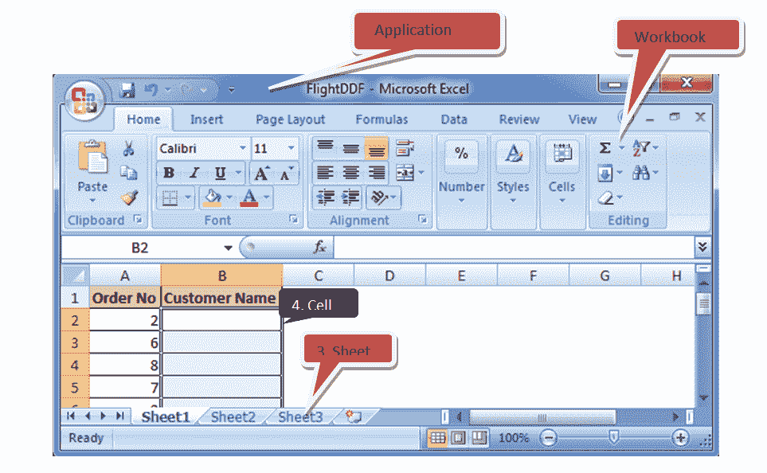

该示例的外部源是一个 Excel 文件。 必须编写 Micro Focus UFT 中的 VB 脚本才能打开 Excel 文件，以便读取测试数据。 这可以以分层的方式实现。

1.首先打开一个 Excel 文件作为“应用程序”

2.然后必须从指定位置打开工作簿

3.存在测试数据的表。

4.最后，必须读取单元格。

## 步骤 2）将对象从 AUT 添加到 OR

一旦测试用例准备就绪，就开始将所有必需的对象添加到存储库中。 在我们的测试案例中，需要添加的对象如下

*   航班预订应用程序中的“打开文件夹”图标

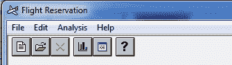

*   单击“打开文件夹”图标可以获取“订单号”复选框


*   订货号（在其中输入数字）的 WinEdit 框

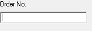

*   确定按钮

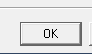

*   “名称”字段是 WinEdit 框。 单击特定按钮的“确定”按钮后，将使用名称填充该字段。

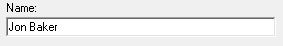

添加所有必需的对象后，对象存储库将显示如下：

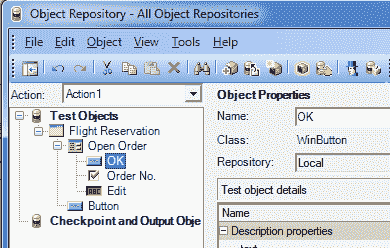

## 第 3 步）根据测试用例编写脚本

在运行脚本之前，请确保已保存并关闭了包含测试数据的 Excel 文件。

下面的脚本是从 Excel 中读取订单号，然后通过变量“ vOrder”将其分配给应用程序，并通过变量“ vName”从应用程序中写入客户名称。

**Excel 名称**：FlightDDF.xlsx

**工作表名称**：工作表 1

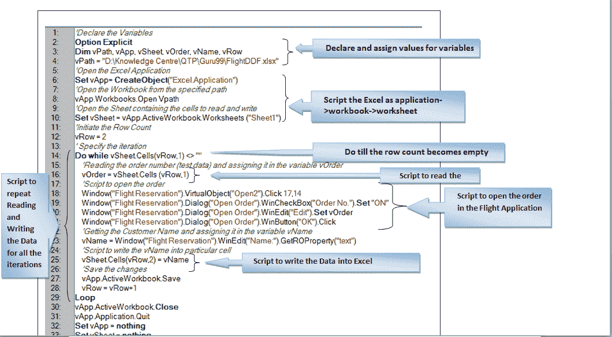

### 输出量

一旦运行了以上脚本，就可以从 Excel 中获取输出，如下所示：

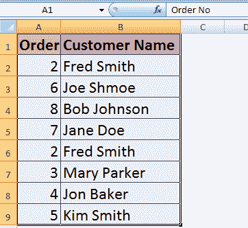

数据驱动框架也可以通过编写描述性程序来开发。

### 使用数据库作为 DDF 的外部源

如果外部源是数据库，则可以使用以下步骤执行相同的测试用例

1.  编写 VBScript 建立数据库连接
2.  VBScript 打开记录集或表。
3.  VBScript 打开所需的字段
4.  从该字段读取特定的单元格。

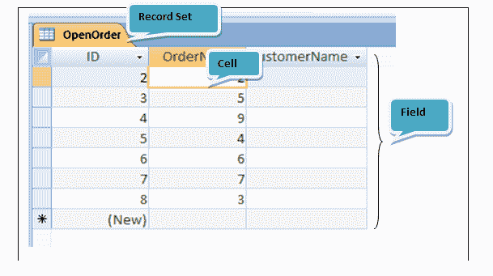

### 脚本

```
To Establish a Microsoft Database connection
```

驱动程序= {Microsoft Access 驱动程序（* .mdb）}; DBQ = <数据库的路径>

**记录集名称：** OpenOrder

**字段名称：** OrderNo，CustomerName

P.S：无法使用以下脚本连接 Microsoft Access 2010。

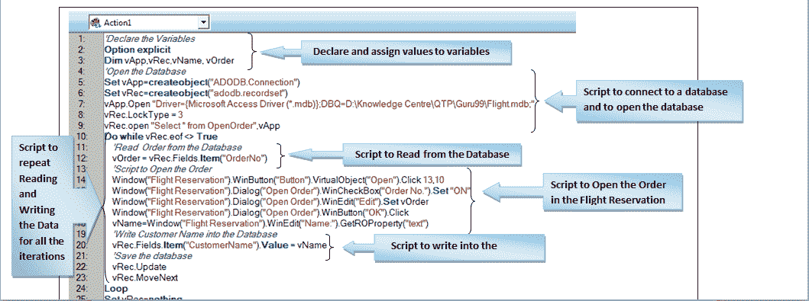

### Output

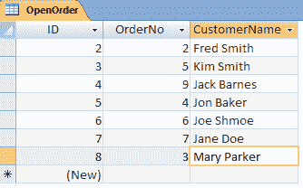

### DDF 的优点

*   单个测试中可以读取和写入大量测试数据到外部文件中
*   循环语句用于重复几次迭代的相同步骤。 因此减少了编码工作
*   由于数据是直接读写到外部文件中的，因此无需复制，粘贴或导出数据即可使用它们
*   可以从外部文件读取测试数据，并且可以将输出写入任何其他外部文件

### DDF 的缺点

*   开发此框架需要脚本知识
*   有时，来自外部来源（如数据库）的数据数量或组合可能会使 QTP 变慢甚至崩溃

## 关键字驱动框架

关键字驱动框架是关键字驱动测试的框架。 此处**关键字指的是用户定义的功能**。 在此框架中，将创建关键字以执行特定的测试步骤或测试用例。 然后，将这些关键字调用到驱动程序测试中，以在同一测试中运行多个测试用例。

要了解 QTP 中的用户定义功能，请在此处访问[](/uft-qtp-functions-library-call.html)

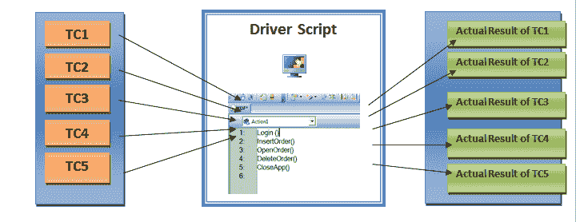

通常，可以通过三种方式来开发框架以进行测试。

1.  记录并运行测试
2.  将对象添加到本地存储库，并为所有测试步骤编写脚本
3.  为所有测试步骤编写描述性程序

在本教程中，通过记录和运行测试来开发 KDF。

我们的目标是针对五个不同的测试用例运行一个测试，例如登录到应用程序，插入订单，打开订单，删除订单并关闭应用程序。 因此，我们将记录这些测试用例的测试步骤，并分别使用关键字 Login，InsertOrder，OpenOrder，DeleteOrder 和 CloseApp 创建函数。

**测试用例 1：登录到应用程序**

**关键字：**登录（）

**录制脚本：**

**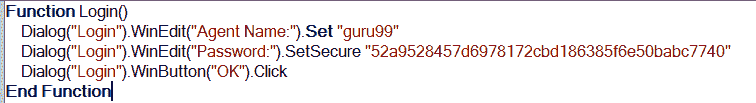** 

**测试用例 2：插入订单**

**关键字：** InsertOrder（）

**Recorded Script:**

**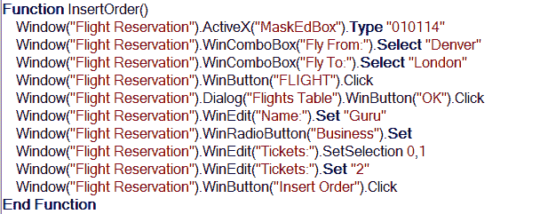** 

**测试案例 3：打开订单**

**关键字：** OpenOrder（）

**Recorded Script:**

**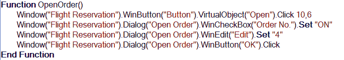** 

**测试案例 4：删除订单**

**关键字：** DeleteOrder（）

**Recorded Script:**

**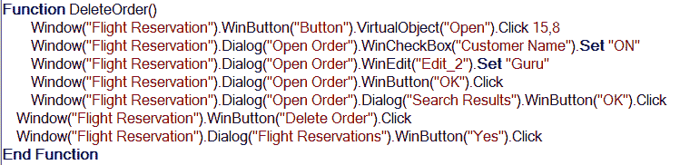** 

**测试案例 5：关闭应用程序**

**关键字：** CloseApp（）

**Recorded Script:**


为不同测试用例创建的功能将保存在功能库中，并与主测试关联。 在主测试中为所需的测试用例调用关键字就足够了，从而减少了主测试中驱动程序脚本的大小。

这个简单框架的驱动程序脚本如下：

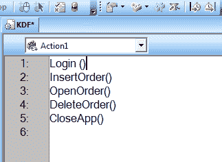

通过运行上面的脚本，可以从一个测试中获得所有五个测试用例的实际结果。

### 优点

*   只需调用各自的关键字，就可以在单个测试上运行任意数量的测试用例
*   为所有 Web / Windows 对象&编写通用的描述性编程，将它们作为关键字调用将有助于为不同的动态应用程序运行相同的测试
*   减少驱动程序脚本的大小

### 缺点

*   如果要运行的测试用例数量很少，那么开发这些框架所花费的时间将非常长。
*   在同一测试中为许多应用程序设计 KDF 时，并不总是使用记录步骤的方法。

## 混合框架

混合框架是数据驱动框架（DDF）和关键字驱动框架（KDF）的组合，其中可以在同一测试中执行带有多个输入的多个测试用例。

在本文中，将在单个测试中执行 KDF 中使用的相同测试用例。 所有测试用例的关键字和脚本与 KDF 中的相同。 但是，TC3：打开订单已被参数化。 因此，编写此测试用例的脚本是为了从 Excel 文件接收订单号，并将客户名称写入 excel 文件。

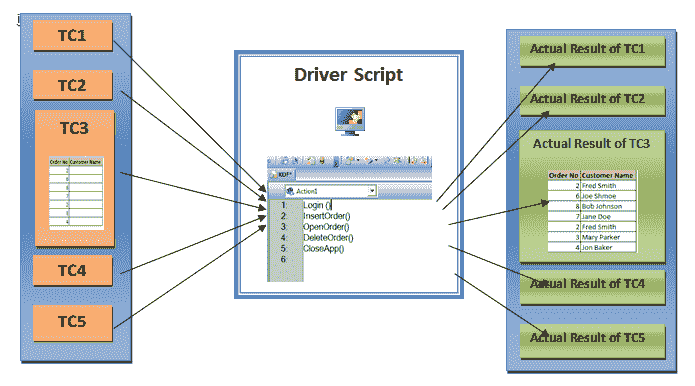

**Test Case1: Login into the application**

**Keyword:** Login ()

**Test Case2: Insert the Order**

**Keyword:**InsertOrder()

**测试案例 3：打开多个订单号的订单**

**Keyword:**OpenOrder()

**描述：**这里使用与开发 DDF 相同的脚本，从而实现多次迭代的测试用例。

**脚本：**

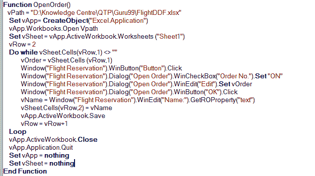

**Test Case4: Delete the Order**

**Keyword:**DeleteOrder()

**Test Case5: Close the application**

**Keyword:**CloseApp()

通过遵循这种简单的方法，可以实现 TC3 的参数化。 如果适用，所有其他测试用例也可以在同一测试中进行参数化。

例如，这是设计混合框架的非常简单的方法。 使用描述性编程也可以实现相同的框架。

### Advantages

*   与其他框架相比，运行使用混合框架设计的测试所需的时间相对较少
*   当我们需要同一测试套件中的所有测试用例和与特定测试用例相关联的输入时，可以使用此方法。

### 坏处

*   需要结合不同框架的明确知识。