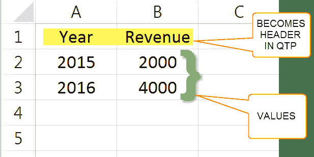
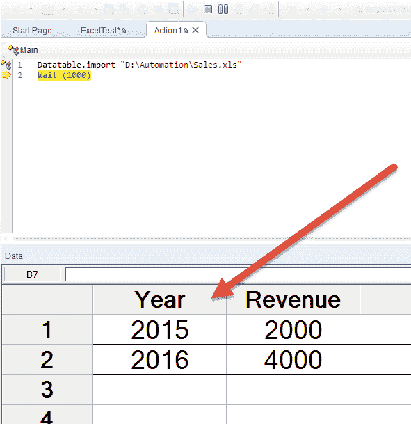
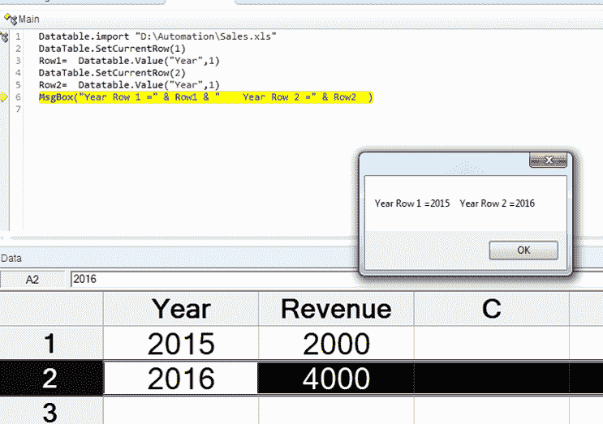
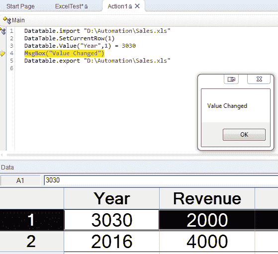
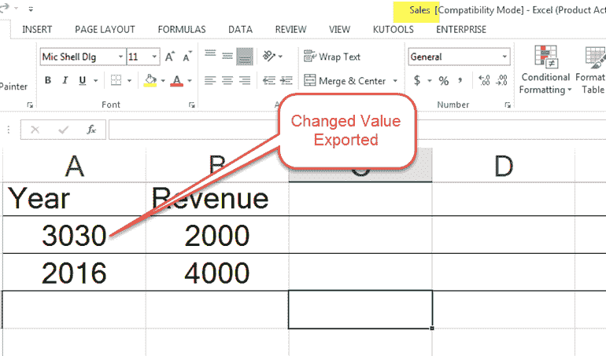

# 如何在 QTP / UFT 中从 EXCEL 导入，读取，更改数据

> 原文： [https://www.guru99.com/using-excel-with-qtp-hp-uft.html](https://www.guru99.com/using-excel-with-qtp-hp-uft.html)

在本教程中，我们将通过 Micro Focus UFT 使用 Excel。

考虑我们要导入以下 Sales.xls



**导入 HP UFT 后，第一行成为列标题。 因此，相应地构建数据**。

导入整个 Excel 文件的语法是

```
DataTable.Import(FileName)
```

就我们而言

```
Datatable.import "D:\Automation\Sales.xls"	
```



导入特定工作表的语法是

```
DataTable.ImportSheet(FileName, SheetSource, SheetDest)
```

使用方法 Getrowcount 获取工作表中的行数

```
Datatable.import "D:\Automation\Sales.xls"row = Datatable.getsheet(1).Getrowcount MsgBox row	
```


设置当前行以使用方法 SetCurrentRow

```
Datatable.import "D:\Automation\Sales.xls"DataTable.SetCurrentRow(1)
```

'在下面的代码中，1 是工作表编号

```
Row1=  Datatable.Value("Year",1)
DataTable.SetCurrentRow(2)
Row2=  Datatable.Value("Year",1)
MsgBox("Year Row 1 =" & Row1 & "    Year Row 2 =" & Row2  )
```



使用**值**方法更改导入工作表中的数据。 使用**导出**方法导出 Excel



