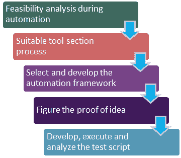

# QTP / UFT 移动应用测试教程

> 原文： [https://www.guru99.com/mobile-testing-with-qtp-hp-uft.html](https://www.guru99.com/mobile-testing-with-qtp-hp-uft.html)

QTP 或 UFT（统一功能测试）工具是用于**自动化测试过程**的软件[测试](/software-testing.html)工具。 它特别用于“回归”或“功能”测试。 QTP 的一些功能包括

*   它仅在 Windows 环境中运行
*   它使用“ VB 脚本”作为脚本语言
*   根据版本的不同，它支持不同的技术（Web，Java，.Net，SAP 等）

Micro Focus UFT 是 QTP 的最新版本。 它是 **HP QTP +服务测试的组合。** 它还支持 Hudson 和 Jenkins 等开源 CI（连续集成）系统。 了解了手机和平板电脑的需求，UFT 为[移动](/mobile-testing.html)测试提供了扩展支持。 有了此 HP UFT 移动支持，它将能够创建与移动平台无关的脚本。 这个在 iOS 上开发的脚本也可以在 Android 上运行。

对于任何自动化工具，自动化测试过程都应经过以下过程

**自动化测试**

*   **Feasibility analysis during automation**:

    在对软件执行[自动化测试](/automation-testing.html)之前，必须检查软件是否可以自动化

*   **Suitable tool section process**:

    根据软件需求，用途和功能选择自动化工具

*   **Select and develop the automation framework**:

    选择自动化工具后，下一步是选择合适的自动化框架

*   **Proof of concept**:

    通过端到端设置建立 POC 或概念证明，以评估工具是否可以执行应用程序的自动化

*   **Develop, run and analyze the test script**:

    一旦准备好脚本，脚本就应该执行，从而导致分析和[缺陷](/defect-management-process.html)日志记录。

## 比较 QTP 与其他移动测试工具

|   | **QTP &云测试工具（** DeviceAnywhere，Perfectiomobile **）** | **QTP & SeeTest 工具** |
| 录音机 | 没有 | 是 |
| 安全 | 有限 | 完全安全 |
| 可用性 | 受限（每小时订购高级） | 随时可用（设备在测试人员手中） |
| 从 QTP 运行测试 | YES | YES |
| 从 QTP 编辑测试 | YES | YES |
| 在 QTP 中接收报告 | YES | YES |
| 测试真实的物理设备 | 是（远程连接的云中的设备） | 是（所有设备，所有型号） |
| 测试专有硬件 | NO | YES |
| 测试模拟器 | NO | YES |
| 测试手机的覆盖范围 | 全部包括旧设备 | 仅智能手机（Android，Blackberry，Symbian 等） |
| 设备通过 USB 本地连接 | 否（通过云远程） | YES |

## 各种移动测试方法

*   **兼容性测试**：它验证应用程序在不同的屏幕尺寸，内部硬件，分辨率等下能否正常工作。

*   **互操作性测试**：它检查各种功能，例如在不同的移动设备上共享会议，简单的消息传递，视频消息传递，呼叫建立等
*   **功能测试**：它测试移动设备的操作方面，例如存储介质处理选项，控件等。
*   **可用性功能**：它包括应用程序导航测试，移动界面测试，应用程序的配色方案等
*   **性能测试**：它检查移动设备的压力和负载能力
*   **本地化和国际化测试**：此测试可确保设备支持国际化和本地化测试
*   **数据交换和同步测试**：它验证设备可以与 PC，PDA 和其他移动设备等其他设备完美同步

## QTP 或 UFT 在移动测试中的优势

*   非常简单易用
*   轻松安排和监控
*   HP 的全面帮助台支持
*   与其他面向对象的编程语言相比，使用 [VBScript](/vbscript-tutorials-for-beginners.html) 语言并且易于编码