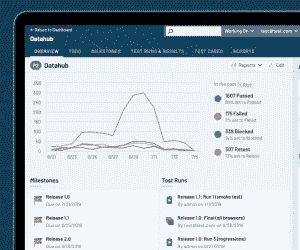
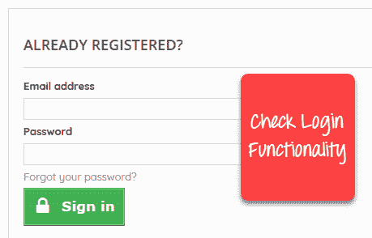

# 如何编写测试用例：带有示例的示例模板

> 原文： [https://www.guru99.com/test-case.html](https://www.guru99.com/test-case.html)

## 什么是测试用例？

**测试用例**是一组执行的操作，用于验证软件应用程序的特定功能。 测试用例包含为特定测试场景开发的测试步骤，测试数据，前提条件，后置条件，以验证任何要求。 测试用例包括特定的变量或条件，测试工程师可以使用这些变量或条件比较预期的结果和实际的结果，以确定软件产品是否按照客户的要求运行。

### 测试场景与测试案例

测试场景非常模糊，涵盖了广泛的可能性。 测试都是非常具体的。

对于[测试方案](/test-scenario.html)：检查登录功能，有许多可能的测试用例：

*   测试案例 1：检查输入有效用户 ID &密码的结果
*   测试案例 2：输入无效的用户 ID &密码时检查结果
*   测试案例 3：当用户 ID 为空时检查响应&登录按钮，以及更多

这不过是一个测试用例。

## 如何创建测试用例

Let’s create a Test Case for the scenario: Check Login Functionality

**步骤 1）**该场景的一个简单测试案例是

| 测试用例 ＃ | 测试用例描述 |
| 1 | 输入有效的电子邮件和密码后检查响应 |

**步骤 2）**为了执行测试用例，您需要测试数据。 在下面添加

| Test Case # | Test Case Description | 测试数据 |
| 1 | Check response when valid email and password is entered | 电子邮件：此电子邮件地址已受到防止垃圾邮件机器人的保护。 您需要启用 JavaScript 才能查看它。 密码：lNf9 ^ Oti7 ^ 2h |

识别测试数据可能很耗时，有时可能需要重新创建测试数据。 需要记录的原因。

**步骤 3）**为了执行测试用例，测试人员需要在 AUT 上执行一组特定的操作。 记录如下：

| Test Case # | Test Case Description | 测试步骤 | Test Data |
| 1 | Check response when valid email and password is entered | 1）输入电子邮件地址 2）输入密码 3）点击登录 | 电子邮件：此电子邮件地址已受到防止垃圾邮件机器人的保护。 您需要启用 JavaScript 才能查看它。密码：lNf9 ^ Oti7 ^ 2h |

很多时候，测试步骤都不像上面那样简单，因此它们需要文档。 同样，测试用例的作者可能会离开组织或去度假，生病，下班或者非常忙于其他关键任务。 可能会要求最近雇用的人来执行测试用例。 记录在案的步骤将对他有帮助，也有助于其他利益相关者的审查。

**步骤 4）**测试用例的目的是检查 AUT 的行为是否达到预期的结果。 这需要记录如下

| Test Case # | Test Case Description | Test Data | 预期结果 |
| 1 | Check response when valid email and password is entered | 电子邮件：此电子邮件地址已受到防止垃圾邮件机器人的保护。 您需要启用 JavaScript 才能查看它。
密码：lNf9 ^ Oti7 ^ 2h | 登录应该成功 |

在测试执行期间，测试人员将检查预期结果与实际结果，并指定通过或失败状态

| Test Case # | Test Case Description | Test Data | Expected Result | 实际结果 | 过关失败 |
| 1 | Check response when valid email and password is entered | 电子邮件：此电子邮件地址已受到防止垃圾邮件机器人的保护。 您需要启用 JavaScript 才能查看它。 密码：lNf9 ^ Oti7 ^ 2h | Login should be successful | 登录成功 | 通过 |

**步骤 5）**除了测试用例之外，可能还有一个类似 Pre-Condition 的字段，它指定在测试可以运行之前必须具备的条件。 对于我们的测试用例，先决条件是安装浏览器以访问被测站点。 测试用例还可以包括“发布后条件”，该条件指定了在测试用例完成后适用的所有内容。 对于我们的测试案例，后置条件将是登录时间&日期存储在数据库中

## 标准测试用例的格式

以下是标准登录测试用例的格式

| **测试用例 ID** | **测试场景** | **测试步骤** | **测试数据** | **预期结果** | **实际结果** | **通过/失败** |
| TU01 | 使用有效数据检查客户登录 | 

1.  转到网站 [http://demo.guru99.com](http://demo.guru99.com)
2.  输入 UserId
3.  输入密码
4.  单击提交

 | 用户名= guru99 密码= pass99 | 用户应登录到应用程序 | 不出所料 | Pass |
| TU02 | 使用无效数据检查客户登录 | 

1.  转到网站 [http://demo.guru99.com](http://demo.guru99.com)
2.  输入用户名
3.  输入密码
4.  点击提交

 | 用户名= guru99 密码= glass99 | 用户不应登录到应用程序 | As Expected | Pass |

整个表可以在 Word，Excel 或任何其他测试管理工具中创建。 这就是测试用例设计的全部内容

**正在草拟包含以下信息的测试案例时**

*   对要测试的需求的描述
*   有关如何测试系统的说明
*   测试设置，例如被测应用程序的版本，软件，数据文件，操作系统，硬件，安全性访问，物理或逻辑日期，一天中的时间，先决条件（例如其他测试）以及与被测试需求相关的任何其他设置信息
*   投入和产出或行动和预期成果
*   任何证明或附件
*   使用有效的案例语言
*   测试用例不应超过 15 个步骤
*   用输入，目的和预期结果对自动测试脚本进行注释
*   该设置提供了先决条件测试的替代方法
*   与其他测试一起，它应该是不正确的业务场景订单

## 编写良好的测试用例示例的最佳实践。

**1.测试用例必须简单透明：**

创建尽可能简单的测试用例。 它们必须清楚简洁，因为测试用例的作者可能不会执行它们。

使用自信的语言，例如转到主页，输入数据，单击此按钮，依此类推。 这使理解测试步骤变得容易，并且测试执行速度更快。

**2.认真地与最终用户一起创建测试用例**

任何软件项目的最终目标都是创建满足客户要求并且易于使用和操作的测试用例。 测试人员必须创建测试用例，并牢记最终用户的观点

**3.避免重复测试用例。**

不要重复测试用例。 如果需要一个测试用例来执行其他测试用例，请在前提条件栏中通过其测试用例 ID 调用该测试用例。

**4.不假设**

准备测试用例时，请勿假定您的软件应用程序具有功能。 遵守规范文件。

**5.确保 100％覆盖率**

确保编写测试用例以检查规范文档中提到的所有软件要求。 使用[可追溯性矩阵](/traceability-matrix.html)确保没有任何功能/条件未经测试。

**6.测试用例必须是可识别的。**

命名测试用例 ID，以便在跟踪缺陷或在以后识别软件需求时容易识别它们。

**7.实施测试技术**

无法检查软件应用程序中的所有可能条件。 软件测试技术可帮助您选择一些测试案例，最大程度地发现缺陷。

*   **边界值分析（BVA）：**顾名思义，它是一种用于定义特定值范围内的边界测试的技术。
*   **等效分区（EP）：**此技术将范围划分为趋于具有相同行为的相等部分/组。
*   **状态转换技术**：当软件行为在特定操作后从一种状态变为另一种状态时，使用此方法。
*   **错误猜测技术：**这是猜测/预测在进行手动测试时可能出现的错误。 这不是一种正式的方法，它利用了测试人员在应用程序方面的经验

8\. **自清洁**

您创建的测试用例必须将[测试环境](/test-environment-software-testing.html)返回到测试前状态，并且不应使测试环境不可用。 对于配置测试尤其如此。

9\. **可重复的** **和自立式**

无论由谁进行测试，测试案例每次都应产生相同的结果

**10.同行评审。**

创建测试用例后，请他们的同事对其进行审查。 您的同龄人可以发现您的测试用例设计中的缺陷，您很容易错过这些缺陷。

## 测试用例管理工具

测试管理工具是帮助管理和维护测试用例的自动化工具。 测试用例管理工具的主要功能是

1.  **用于记录测试用例：**使用工具，您可以使用模板来加快测试用例的创建
2.  **执行测试用例并记录结果：**测试用例可以通过工具执行，并且可以轻松记录获得的结果。
3.  **自动进行缺陷跟踪：**失败的测试会自动链接到 Bug 跟踪器，然后可以将其分配给开发人员并通过电子邮件通知进行跟踪。
4.  **可追溯性：**需求，测试用例，测试用例的执行都通过工具相互链接，并且每个用例都可以相互跟踪以检查测试范围。
5.  **保护测试用例：**测试用例应可重复使用，并应防止由于版本控制不佳而丢失或损坏。 测试用例管理工具提供的功能包括

*   命名和编号约定
*   版本控制
*   只读存储
*   受控访问
*   异地备份

流行的测试管理工具包括：[质量中心](/hp-alm-free-tutorial.html)和 [JIRA](/jira-tutorial-a-complete-guide-for-beginners.html)

## 资源资源

*   请注意，所使用的模板因项目而异。 阅读此[教程](/download-sample-test-case-template-with-explanation-of-important-fields.html)，以了解包含重要字段说明的测试用例模板

[下载上述测试用例模板 Excel（.xls）](https://drive.google.com/uc?export=download&id=0ByI5-ZLwpo25eXFlcU5ZMTJsT28)