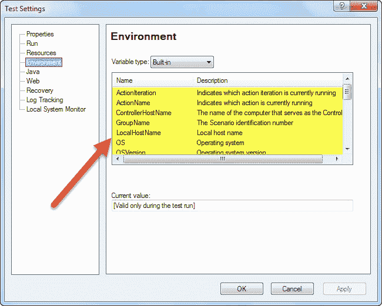
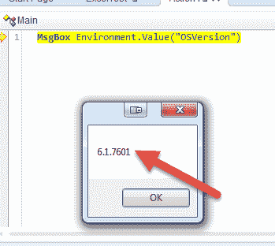
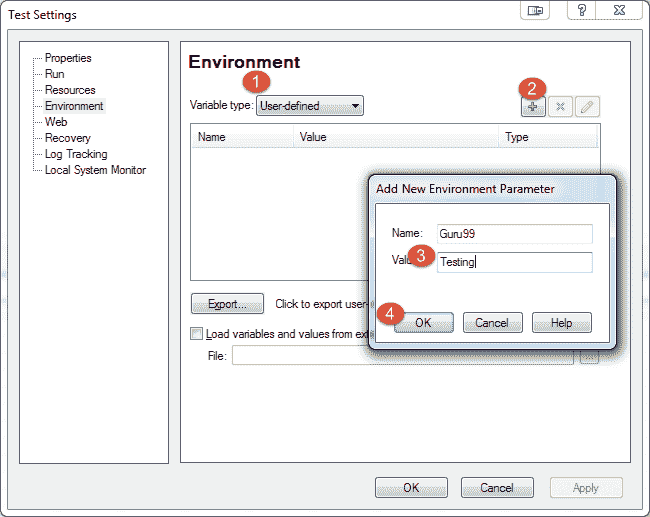
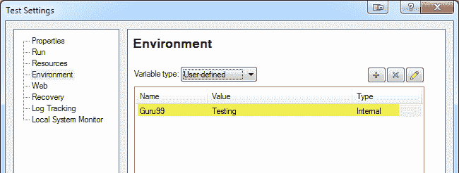
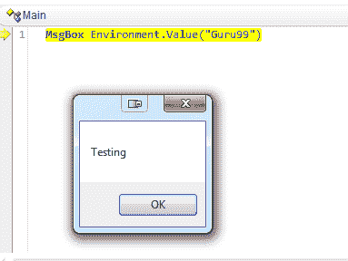

# QTP（UFT）中的环境变量与示例

> 原文： [https://www.guru99.com/environment-variable-in-qtp-hp-uft.html](https://www.guru99.com/environment-variable-in-qtp-hp-uft.html)

## 什么是环境变量？

环境变量是计算机上可以存储值的动态“对象”，而值又可以由 Windows 中的一个或多个软件程序引用。

环境变量本质上是动态的，可以更改。 程序可以引用许多环境变量，这些变量对于查找有关其计算环境的信息很有用。

**HP UFT 环境变量**

所有操作，函数库和恢复方案都可以访问 Micro Focus UFT 环境变量。

## QTP 环境变量的类型

环境变量是可以在测试中全局使用的那些变量。 有两种类型的环境变量

*   **内置变量**
*   **用户定义的变量（具有 2 个子类型）**
    *   **内部**
    *   **外部**

### 内置变量

在 QTP 中，内置变量是预定义变量。 它使用户能够检索有关正在执行的测试的信息，并获取有关正在执行测试的 O.S（操作系统）的信息。 一些内置变量是动作迭代，操作系统，测试目录，本地主机名，操作系统版本等。

转到文件**->** 设置**->** “环境”选项卡以查看环境变量部分，以查看环境变量列表。

在运行会话期间，可以根据需要获取和使用环境变量中的值。

例：

**MsgBox** Environment.Value（“ OSVersion”）

### 用户定义的变量

在执行测试之前，这些是用户定义的变量。 它可以在不同的测试中全局使用，也可以仅限于一项测试。

用户定义的变量分为两种类型

*   内部
*   外部

1.  **用户定义-内部变量**：这些变量由用户在执行测试之前定义，并且仅对特定测试可用
2.  **User defined- External Variables:** These variables are defined by the user and it can be used globally across different tests.

    外部变量可以通过两种方式加载。 在通过环境选项卡或用户定义的屏幕执行测试之前，可以通过检查加载变量复选框然后选择 XML 文件来手动完成此操作。

    您可以如下创建用户定义的变量

    

    

    您可以按以下方式访问变量

    **MsgBox** Environment.Value（“ Guru99”）

    