# 使用 QTP / UFT 进行 API 测试：完整的教程

> 原文： [https://www.guru99.com/api-testing-with-qtp-hp-uft.html](https://www.guru99.com/api-testing-with-qtp-hp-uft.html)

## 什么是 API 测试？

在[测试](/software-testing.html) API 之前，我们需要了解 API。 API（[应用程序编程接口](/api-testing.html)）是可以由其他软件应用程序执行的软件功能和过程的集合。

因此 [API 测试](/api-testing.html)是：

*   不使用 GUI 进行测试
*   以编程方式模拟数据或控制遵循方案。
*   关注功能，而不关注行为或客户体验。


## 为什么 API 测试很重要？

API 测试具有四个显着优势

1.  **API 测试是趋势**

如下图所示，Api Testing 在过去十年中发展非常迅速。 与其他测试相比，它变得非常流行。

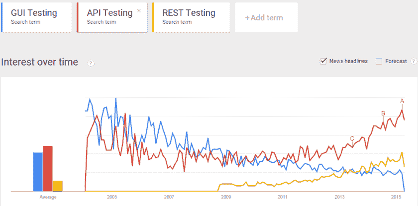

2.  **省时。**

通过 API 测试，我们可以使用并行执行来减少测试执行时间。 与其他测试类型相比，您最多可以节省 5 倍。

3.  **独立于语言**

在 API 测试中，数据是通过 [XML](https://en.wikipedia.org/wiki/XML) 或 [JSON](http://json.org/) 交换的，因此可以使用任何语言来测试响应。 例如，如果您的服务的响应为 JSON 格式，则可以轻松地使用 Java， [C＃](/c-sharp-tutorial.html)或任何语言来解析数据。

4.  **易于 GUI 集成。**

## 使用 UFT 进行 API 测试（统一功能测试）

开源和商业都有很多工具。 Micro Focus UFT 是通过简单的 UI 和配置执行 API 测试的最佳工具。

QTP 的最新版本称为 HP Unified [功能测试](/functional-testing.html)（UFT），是 HP QTP（GUI 测试工具）和 HP Service Test（API 测试工具）的组合。 此外，QTP 支持 Web，Java，.Net，Oracle，Siebel，Web 服务以及许多其他主要语言和平台，某些较旧的版本不支持该平台。

## HP UFT 支持的 API 测试类型

1.  Web 服务
2.  休息
3.  面向对象的语言
4.  数据库
5.  专有 API

## 使用 QTP 开始首次 API 测试

在本教程中，我们正在测试 Facebook 的 Graph API。 我们将在下面以[测试用例](/test-case.html)测试 API

1.  获取 Facebook 上指定用户的个人资料。
2.  验证配置文件是否符合预期

这是为此 API 构建测试流程的步骤。

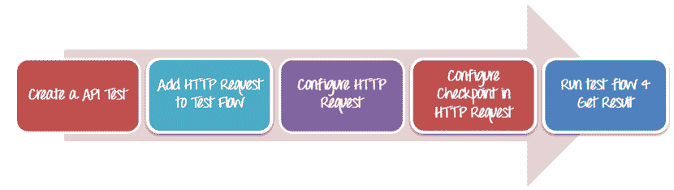

第 1 步：打开 HP UFT 并创建新的项目 API 测试

1.  Choose **Start > (All) Programs > HP Software > HP Unified Functional Testing > Unified Functional Testing.**

    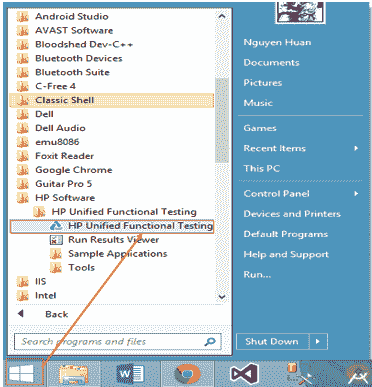

2.  Click **File > New > Test**. Select the **API Test** type

    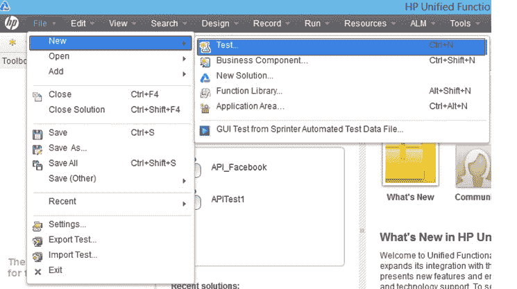

3.  When a dialog box opens, input name of API test: **API_Facebook**. And select a location to save this project.

    单击**创建**以创建项目 API 测试。

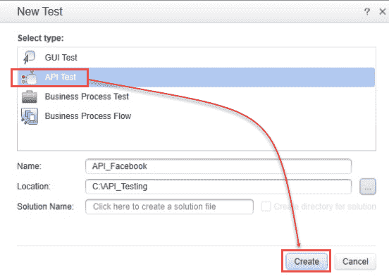

**步骤 2：将 HTTP 请求添加到测试流程。**

我们将使用 HTTP 请求向 Facebook API 发出请求。

1.  Select **Toolbox** > **Network**

    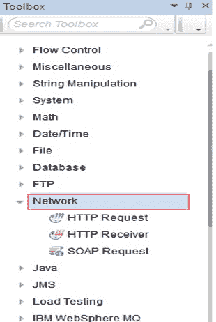

2.  将元素 **HTTP 请求**拖动到测试流程。

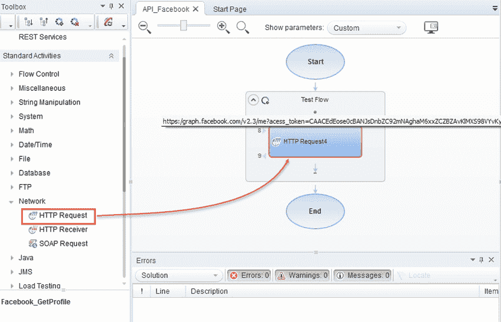

**步骤 3：配置参数并将其传递到 HTTP 请求**

1.  Right, click on Object **HTTP Request** to edit this object.

    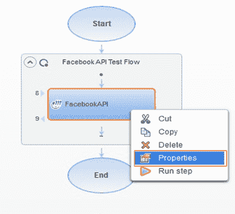

2.  In Properties part, Enter **URL**

    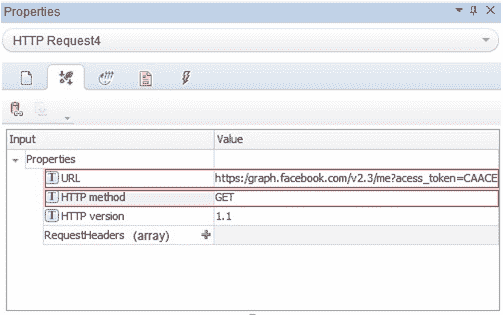

    ```
    https://graph.facebook.com/v2.3/me?access_token=CAACEdEose0cBANJsDnbZC92mNAghaM6xxZCZBZAvKlMXS98VYvKy%20OlrfAdsUWR8x5aw9Kqc0grscs9zb9IYED4VC3FwapIZBj%20dsuxy%20HdLcff38gYUBFNeRQlH%20fN7eXKoVZBNl0bR233ZAZCw8fLF1QLh98ry2ZBeYBhXLabtTDkFPZA1IqhaMG0mQp30zO1%20QxQ19nVCxZArJA6XRoB1o5FMepII5cn3DgbBmTgZD
    ```

    另外，您可以通过设置值**请求标头**将参数传递到 API

    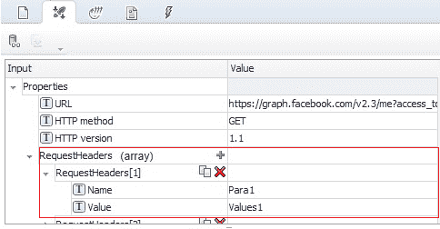

    您可以使用 Facebook 的[图形 API 浏览](https://developers.facebook.com/tools/explorer/145634995501895/)来获取 access_token 的值。

    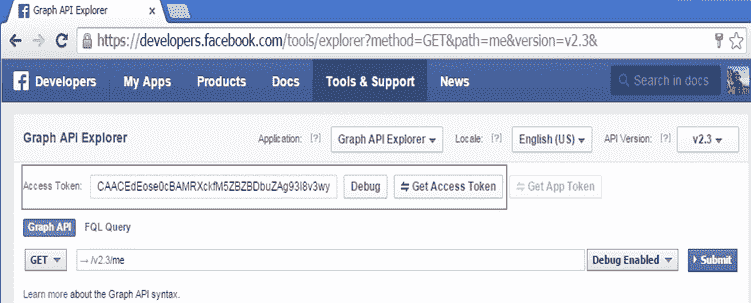

3.  设置 **HTTP 方法**是 **GET** 方法。
    1.  配置 **HTTP 方法**


2.  配置 **HTTP 请求**的**检查点**

在**检查点**部分中，设置的**状态代码**为“ 200”。 检查点使您无需手动检查结果即可查看操作是否成功。 检查点是验证测试成功或失败的方法，检查点取决于检查点。 如果状态代码为 200，则表示通过了测试用例。

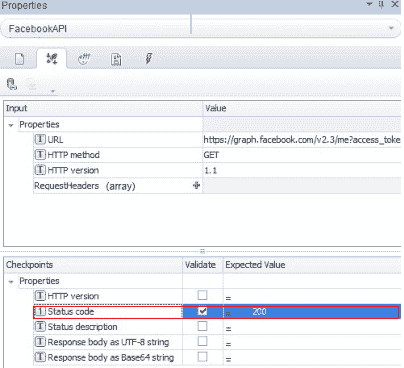

**步骤 3：运行测试**

单击**运行**按钮或按 F5 打开“运行测试”对话框。 单击**运行**进行编译并运行测试。

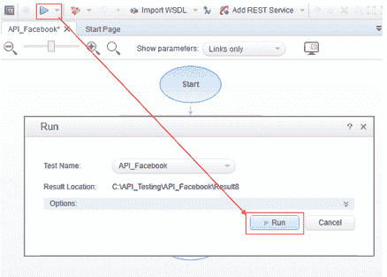

**步骤 4：查看结果**

将打开“运行结果查看器”。 在此示例中，如果测试用例失败，则测试结果如下图所示。

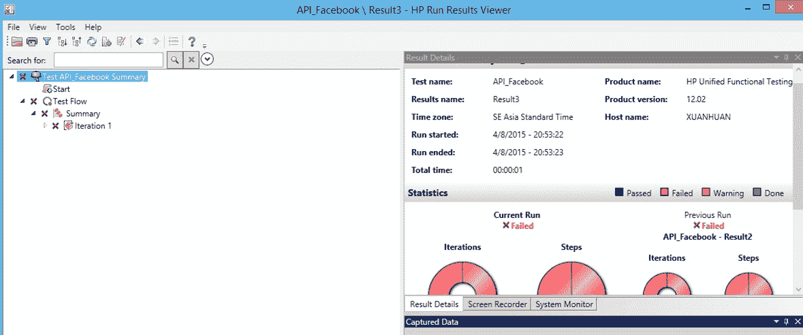

如果测试用例通过，我们报告如下

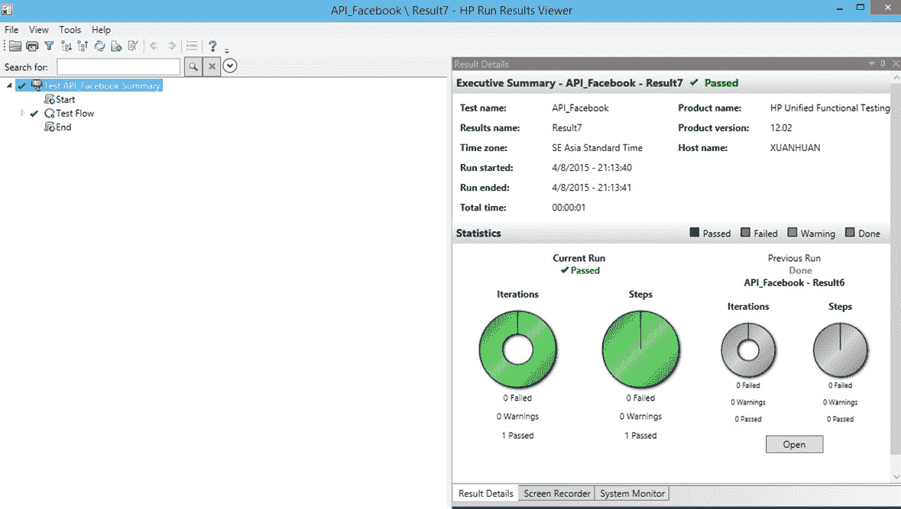

好的，现在我们已经使用 QTP 完成了您的首次 API 测试

**从这里去哪里**

既然您已经学会了使用 UTF 中的 API 测试创建测试，则可以为无 GUI 应用程序创建自己的测试。

## 摘要

API 测试是 GUI 下面的测试，并以编程方式模拟数据或控制遵循方案。

API 测试是软件开发过程中最受欢迎的测试之一，因为它具有许多优点

*   API 是测试的趋势
*   时间有效
*   语言无关
*   易于 GUI 集成

有许多工具可以执行 API 测试，QTP 是执行此测试的最佳工具之一。 尽管 QTP 有一些缺点，但是 QTP 仍然具有强大的 API 测试功能