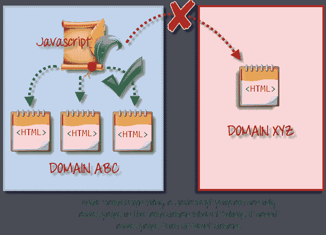
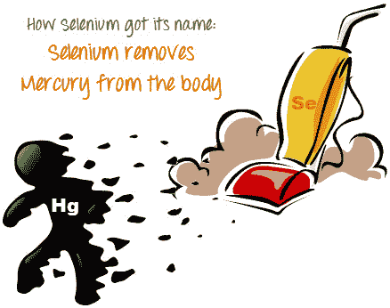
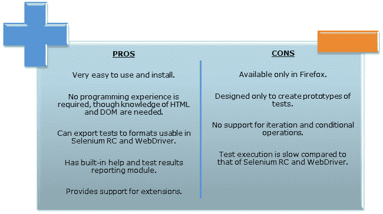
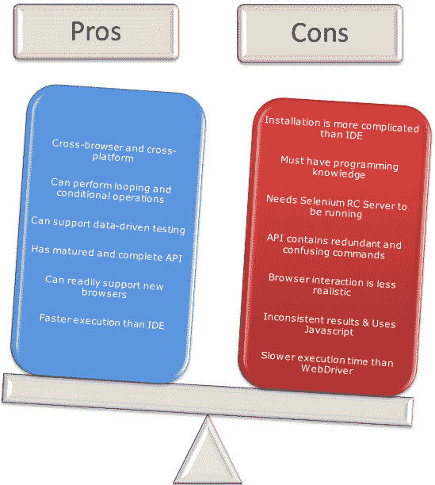
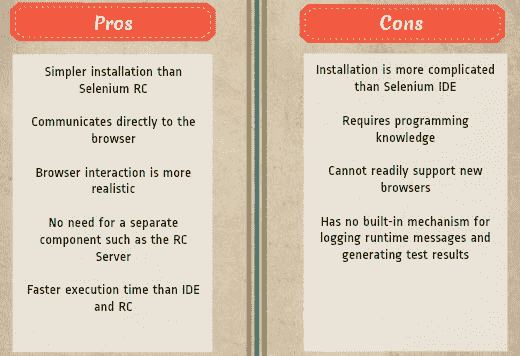

# 什么是硒？ 硒自动化测试简介

> 原文： [https://www.guru99.com/introduction-to-selenium.html](https://www.guru99.com/introduction-to-selenium.html)

## 什么是硒？

**SELENIUM** 是一个免费的（开放源代码）自动化测试框架，用于验证跨不同浏览器和平台的 Web 应用程序。 您可以使用 Java，C＃，Python 等多种编程语言来创建 Selenium 测试脚本。 使用 Selenium 工具完成的测试通常称为 Selenium Testing。

Selenium Software 不仅是一个工具，而且是一套软件，每个软件都可以满足组织的不同测试需求。 这是工具列表

*   硒综合开发环境（IDE）
*   硒遥控器（RC）
*   网络驱动器
*   硒网格

目前，Selenium RC 和 WebDriver 合并为一个框架，以形成 **Selenium 2** 。 顺便说一句，硒 1 是指硒 RC。

**What You Will Learn:** []

*   [什么是硒？](#1)
*   [谁开发了硒？](#2)
*   [同一起源策略问题](#3)
*   [硒遥控器（Selenium RC）的诞生](#4)
*   [硒网格的诞生](#5)
*   [Selenium IDE 的诞生](#6)
*   [WebDriver 的诞生](#7)
*   [硒 2 的诞生](#8)
*   [那么，为什么要命名硒？](#9)
*   [简介 Selenium IDE](#10)
*   [简介硒遥控器（Selenium RC）](#11)
*   [简介 WebDriver](#12)
*   [硒网格](#13)
*   [关于浏览器和环境支持的说明](#14)
*   [如何根据需要选择合适的硒工具](#15)
*   [硒和 QTP（现为 UFT）之间的比较](#16)
*   [QTP 优于硒](#17)

## 谁开发了硒？

由于 Selenium 是不同工具的集合，因此它也有不同的开发人员。 以下是为硒项目做出杰出贡献的关键人物

|  | 最初，硒是 Jason Huggins 在 2004 年创建的。 他是 ThoughtWorks 的工程师，当时正在研究需要经常测试的 Web 应用程序。 他意识到应用程序的重复[手动测试](/manual-testing.html)效率越来越低，因此，他创建了一个 [JavaScript](/interactive-javascript-tutorials.html) 程序，该程序可以自动控制浏览器的操作。 他将该程序命名为“ **JavaScriptTestRunner** ”。看到这个想法有助于自动化其他 Web 应用程序的潜力，他使 JavaScriptRunner 开源，之后将其更名为 **Selenium Core** 。 |

## 同源政策问题

**Same Origin 策略禁止 JavaScript 代码访问与启动域不同的域中的元素**。 例如，www.google.com 中的 HTML 代码使用 JavaScript 程序“ randomScript.js”。 相同的来源政策仅允许 randomScript.js 访问 google.com 中的页面，例如 google.com/mail、google.com/login 或 google.com/signup。 但是，它无法访问来自不同网站（例如 yahoo.com/search 或 guru99.com）的页面，因为它们属于不同的域。

这就是为什么在 Selenium RC 之前，测试人员需要安装 Selenium Core（JavaScript 程序）和包含要测试的 Web 应用程序的 Web 服务器的本地副本，以便它们属于同一个域的原因。

## 硒遥控器（Selenium RC）的诞生

.png)

不幸; 由于**相同来源策略施加的限制，使用 Selenium Core 的测试人员必须将整个测试应用程序和 Web 服务器安装在其自己的本地计算机上。** 因此，另一位 ThoughtWork 的工程师 **Paul Hammant** 决定创建一个服务器，该服务器将充当 HTTP 代理，以“欺骗”浏览器，使他们相信 Selenium Core 和被测试的 Web 应用程序来自同一个 域。 该系统被称为 **Selenium Remote Control** 或 **Selenium 1** 。

## 硒网格的诞生

.jpg)

Selenium Grid 由 **Patrick Lightbody** 开发，旨在满足尽可能减少测试执行时间的需求。 他最初将系统称为“ **托管质量检查**”。 它能够捕获重要阶段的浏览器屏幕截图，并且能够**同时将 Selenium 命令发送到不同的计算机。**

## Selenium IDE 的诞生

**.jpg)** 

**日本的 Shinya Kasatani** 创建了 **Selenium IDE** ，这是一个 Firefox 扩展，可以通过记录和回放功能使浏览器自动化。 他提出了这个想法，以进一步提高创建测试用例的速度。 他在 **2006** 中向 Selenium 项目捐赠了 Selenium IDE。

## WebDriver 的诞生

**.jpg) ** **Simon Stewart** 大约在 **2006** 时创建了 WebDriver，当时浏览器和 Web 应用程序对 Selenium 等 JavaScript 程序的功能和限制越来越强大 核心。 **这是第一个可以从操作系统级别控制浏览器的跨平台测试框架。** 

## 硒 2 的诞生

In **2008**, the whole Selenium Team decided to merge WebDriver and Selenium RC to form a more powerful tool called **Selenium 2**, with **WebDriver being the core**. Currently, Selenium RC is still being developed but only in maintenance mode. Most of the Selenium Project's efforts are now focused on Selenium 2.

## 那么，为什么叫硒？

这是 Jason 向他的团队开出的一个笑话。 在 Selenium 的开发过程中，另一个自动化测试框架很流行，该公司称为 **Mercury Interactive** （是的，在被 HP 收购之前，它最初是制造 QTP 的公司）。 由于硒是汞中毒的著名解毒剂，因此杰森建议使用该名称。 他的队友接受了这一框架，这就是我们迄今为止如何称呼该框架的方式。

## 简介 Selenium IDE

Selenium 集成开发环境（IDE）是 Selenium 套件中最简单的**框架**，也是**最容易学习的框架**。 这是一个 **Firefox 插件**，与其他插件一样，您可以轻松安装。 但是，由于其简单性，Selenium IDE 仅应用作**原型开发工具**。 如果要创建更多高级测试用例，则需要使用 Selenium RC 或 WebDriver。

 

## 简介硒遥控器（Selenium RC）

Selenium RC 长期以来一直是整个 Selenium 项目的**旗舰测试框架**。 这是**允许用户使用他们喜欢的编程语言**的第一个自动化 Web 测试工具。 从 2.25.0 版开始，RC 可支持以下编程语言：

*   [Java](/java-tutorial.html)
*   [C＃](/c-sharp-tutorial.html)
*   [PHP](/php-tutorials.html)
*   蟒蛇
*   佩尔
*   红宝石

## 简介 WebDriver

WebDriver 在许多方面证明自己比 Selenium IDE 和 Selenium RC 更好**。 它实现了一种更现代，更稳定的方法来自动化浏览器的动作。 WebDriver 与 Selenium RC 不同，它不依赖 JavaScript 实现自动化。 **它通过直接与浏览器通信来控制浏览器。****

支持的语言与 Selenium RC 中的语言相同。

*   爪哇
*   C＃
*   的 PHP
*   蟒蛇
*   佩尔
*   红宝石

## 硒网格

Selenium Grid 是与 Selenium RC 一起使用的工具**，可同时在不同的机器和不同的浏览器上运行并行测试**。 并行执行意味着一次运行多个测试。

**功能：**

*   在**多个浏览器和环境中启用**同时运行测试**。**
*   **极大地节省了时间**。
*   利用**集线器和节点**概念。 集线器充当与它连接的每个节点的 Selenium 命令的中央源。

## 关于浏览器和环境支持的说明

由于它们的体系结构差异，Selenium IDE，Selenium RC 和 WebDriver 支持不同的浏览器和操作环境集。

|  | 硒 IDE | WebDriver |
| --- | --- | --- |
| **浏览器** **支持** | Mozilla Firefox | Internet Explorer 6 至 11 版本，包括 32 位和 64 位

上面的 Microsoft Edge 版本 12.10240 &（部分支持正在开发的某些功能）
Firefox 3.0 及更高版本
Google Chrome 12.0。 及更高版本
Opera 11.5 及更高版本
Android-2.3 及更高版本，适用于手机和平板电脑
（设备&仿真器）[ 适用于手机（设备&仿真器）和平板电脑（设备&仿真器）的 HTG20]

iOS 3+

HtmlUnit 2.9 和 以上  |
| **操作系统** | Windows， Mac OS X， Linux [ | 上面的浏览器可以在其中运行的所有操作系统。 |

**注意：** Selenium WebDriver 被称为 Selenium RC 的后继产品，SeleniumHQ 正式宣布不推荐使用&。

## 如何根据需要选择合适的硒工具

| 

工具

 | 

为什么选择？

 |
| --- | --- |
| **硒 IDE** | 

*   了解有关自动化测试和 Selenium 的概念，包括：
*   Selenese 命令，例如 type，open，clickAndWait，assert，verify 等。
*   定位器（例如 id） ，名称，xpath，css 选择器等。
*   使用 runScript
*   执行定制的 JavaScript 代码，以各种格式导出测试用例。
*   创建很少或没有编程知识的测试。
*   创建简单的测试用例和测试套件，以后可以将其导出到 RC 或 WebDriver。
*   仅针对 Firefox 和 Chrome 测试 Web 应用程序。

 |
| **硒 RC** | 

*   使用比 Selenese
*   更具表现力的语言设计测试，以便在不同操作系统上的不同浏览器（HtmlUnit 除外）上运行测试。
*   使用 Selenium Grid 在多个环境中部署测试。
*   针对支持 JavaScript 的新浏览器测试您的应用程序。
*   使用基于 AJAX 的复杂方案测试 Web 应用程序。

 |
| **WebDriver** | 

*   在设计测试用例时使用某种编程语言。
*   测试基于 AJAX 的功能丰富的应用程序。
*   在 HtmlUnit 浏览器上执行测试。
*   创建定制的测试结果。

 |
| **硒网格** | 

*   在多个浏览器和操作系统中同时运行 Selenium RC 脚本。
*   要运行一个庞大的测试套件，需要尽快完成。

 |

## 硒和 QTP（现为 UFT）之间的比较

**快速测试专家（QTP）**是先前由公司 **Mercury Interactive** 拥有的专有自动化测试工具，在 2006 年被[Hewlett-Packard]收购**之前**。 Selenium 工具套件具有优于 QTP 的许多优点，如下所述-

硒优于 QTP 的优势

| 

**硒**

 | 

**QTP**

 |
| **开源**，**免费使用**和**。** | **商业**。 |
| **高度可扩展** | 有限的附加组件 |
| 可以在**不同的浏览器** 上运行测试 | 仅可以在 **Firefox** ， **Internet Explorer** 和 **Chrome** 中运行测试 |
| 支持**各种操作系统** | 只能在 **Windows** 中使用 |
| 支持**移动设备** | QTP 使用称为 HP 的 HP 解决方案支持移动应用程序测试自动化（iOS & Android）-HP Mobile Center |
| 可以在最小化**浏览器的**的同时执行测试 | 需要测试的应用程序在桌面上可见 |
| 可以并行执行的测试。 | 只能并行执行，但必须使用再次作为付费产品的 Quality Center。 |

## QTP 优于硒的优势

<caption>Advantages of QTP over Selenium</caption>
| 

**QTP**

 | 

**硒**

 |
| 可以同时测试 **Web 和桌面应用程序** | 仅可以测试 Web 应用程序 |
| 带有**内置对象存储库** | 没有内置的对象存储库 |
| **比 Selenium** 自动化更快，因为它是功能齐全的 IDE。 | 由于没有本地 IDE，并且只能使用第三方 IDE 进行开发，因此自动化速度较慢 |
| 数据驱动的测试更易于执行，因为**具有内置的全局和本地数据表**。 | 数据驱动的测试更加麻烦，因为您必须依靠编程语言的功能来设置测试数据的值 |
| **可以访问浏览器**中的控件（例如收藏夹栏，地址栏，后退和前进按钮等） | 无法访问被测 Web 应用程序之外的元素 |
| 提供专业的**客户支持** | 没有提供官方用户支持。 |
| 具有**固有功能，可将测试数据**导出为外部格式 | 没有本机功能将运行时数据导出为外部格式 |
| 内置参数化支持 | 参数化可以通过编程来完成，但是很难实现。 |
| 测试报告是自动生成的 | 没有本机支持来生成测试/错误报告。 |

尽管很明显， [QTP](/quick-test-professional-qtp-tutorial.html) 具有更先进的功能，但硒在三个主要方面超过了 QTP：

*   **费用**（因为硒是完全免费的）
*   **灵活性**（由于它可以支持多种编程语言，浏览器和平台）
*   **并行测试**（QTP 可以但仅在使用 Quality Center 时才能使用）

## 摘要

*   整个 Selenium 工具套件包含四个组件：
*   **Selenium IDE** ，这是一个 Firefox 加载项，只能用于创建相对简单的测试用例和测试套件。
*   **Selenium 远程控制**，也称为 **Selenium 1** ，这是第一个允许用户使用编程语言创建复杂测试的 Selenium 工具。
*   **WebDriver** 是一种较新的突破，它允许您的测试脚本直接与浏览器进行通信，从而从操作系统级别对其进行控制。
*   **Selenium Grid** 还是与 Selenium RC 一起使用的工具，可在不同的浏览器和操作系统上执行并行测试。
*   Selenium RC 和 WebDriver 合并形成 **Selenium 2** 。
*   就**成本和灵活性**而言，硒比 QTP 更具优势。 它也允许您**并行运行**，这与 QTP 中只允许按顺序运行测试不同。