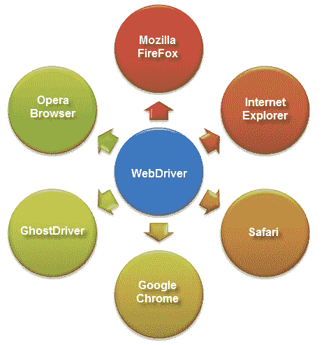
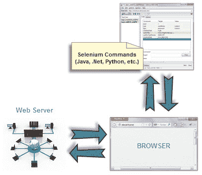
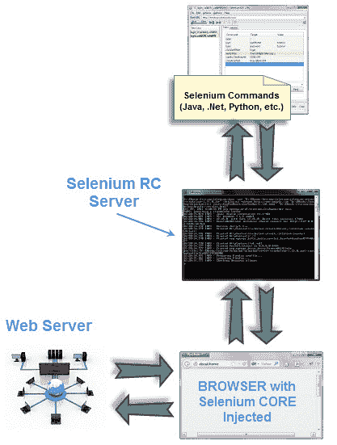
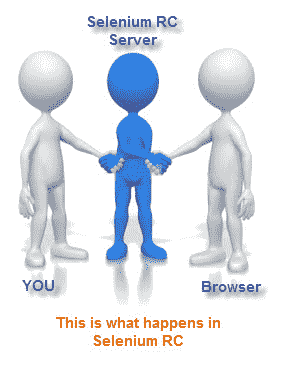
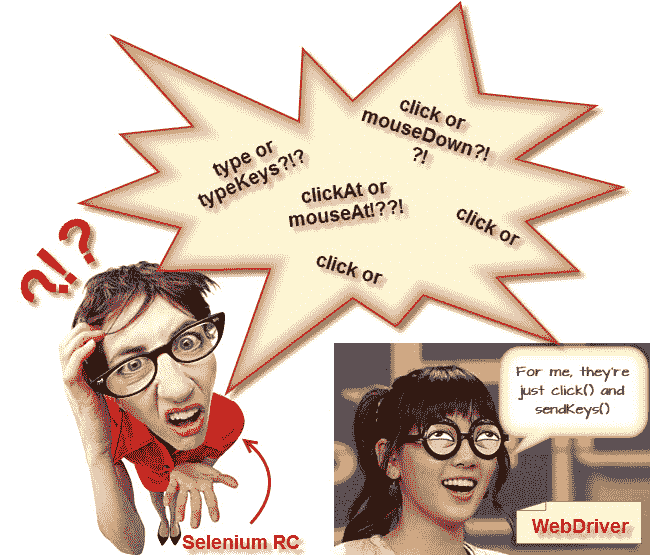
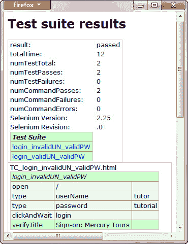

# 什么是 Selenium WebDriver？ 与 RC 的区别

> 原文： [https://www.guru99.com/introduction-webdriver-comparison-selenium-rc.html](https://www.guru99.com/introduction-webdriver-comparison-selenium-rc.html)

### 什么是 WebDriver？

WebDriver 是一个网络自动化框架，可让您针对不同的浏览器执行测试，而不仅仅是 Firefox，Chrome（与 Selenium IDE 不同）。

WebDriver 还使您可以**在创建测试脚本时使用编程语言**（在 Selenium IDE 中是不可能的）。

您现在可以使用**条件操作**，例如 if-then-else 或 switch-case。 您还可以像 do-while 一样执行循环。

.jpg)

WebDriver 支持以下编程语言

*   [Java](/java-tutorial.html)
*   。净
*   [PHP](/php-tutorials.html)
*   [Python](/python-tutorials.html)
*   [Perl](/perl-tutorials.html)
*   红宝石

**您不必全部了解。 您只需要一个人就可以了。** 但是，在本教程中，我们将使用 Java 和 Eclipse 作为我们的 IDE。

## Selenium RC 和 Webdriver 之间的区别

在 2006 年 WebDriver 出现之前，还有另一个**自动化工具，称为 Selenium Remote Control。** WebDriver 和 Selenium RC 都具有以下功能：

*   它们都允许您**在设计测试脚本时使用编程语言**。
*   它们都允许您**在不同的浏览器上运行测试。**

那么它们有何不同？ 让我们讨论答案。

## 1.建筑

**WebDriver 的体系结构比 Selenium RC 的**更简单。

*   它从操作系统级别控制浏览器
*   您只需要编程语言的 IDE（包含 Selenium 命令）和浏览器即可。

 

##### Selenium RC 的体系结构要复杂得多。

*   在开始测试之前，您首先需要启动**一个名为 Selenium Remote Control（RC）服务器**的单独的应用程序。
*   Selenium RC 服务器**充当 Selenium 命令和浏览器**之间的“中间人”
*   当您开始测试时，Selenium RC Server 将名为 Selenium Core 的 **Javascript 程序“注入”浏览器。**
*   注入后，Selenium Core 将开始从测试程序接收 RC 服务器中继的指令。
*   收到指令后， **Selenium Core 将以 Javascript 命令的形式执行它们。**
*   浏览器将遵循 Selenium Core 的说明，并将其响应中继到 RC 服务器。
*   RC 服务器将收到浏览器的响应，然后向您显示结果。
*   RC Server 将从测试脚本中获取下一条指令，以重复整个周期。

## 2.速度

**WebDriver 比 Selenium RC 更快，因为它**直接与浏览器对话，使用浏览器自己的引擎对其进行控制。

**Selenium RC 较慢，因为** **使用名为 Selenium Core 的 Javascript 程序。** 此 Selenium Core 是直接控制浏览器而不是您的一个。

## 3.现实生活中的互动

##### 

**WebDriver 以更现实的方式与页面元素进行交互。** 例如，如果您要测试的页面上有禁用的文本框，则 WebDriver 实际上无法像真实人无法输入的那样在其中输入任何值。

就像其他 [JavaScript](/interactive-javascript-tutorials.html) 代码一样，Selenium Core 可以访问禁用的元素。 过去，Selenium 测试人员抱怨 Selenium Core 能够在测试中向禁用的文本框输入值。 API 的差异

## 4\. API

**Selenium RC 的 API 更成熟，但包含冗余并且经常使命令混乱**。 例如，大多数时候，测试人员对于使用 type 还是 typeKeys 感到困惑。 还是使用 click，mouseDown 或 mouseDownAt。 更糟糕的是，**不同的浏览器也以不同的方式解释这些命令中的每一个！**

**WebDriver 的 API 比 Selenium RC 的**更简单。 它不包含冗余和混乱的命令。

## 5.浏览器支持

**WebDriver 可以支持无头 HtmlUnit 浏览器**

HtmlUnit 被称为“无头”，因为它是不可见的浏览器-无 GUI。

这是一个非常快速的浏览器，因为没有时间花费在等待页面元素加载上。 这样可以加快测试执行周期。

由于它对用户不可见，因此只能通过自动方式进行控制。

**Selenium RC 无法支持无头 HtmlUnit 浏览器。** 它需要一个真实可见的浏览器才能进行操作。

## WebDriver 的局限性

### WebDriver 无法立即支持新的浏览器

请记住，WebDriver 在操作系统级别上运行。 另外，请记住，不同的浏览器以不同的方式与操作系统通信。 如果出现新的浏览器，与其他浏览器相比，它与操作系统进行通信的过程可能会有所不同。 因此，**您必须给 WebDriver 团队一些时间来弄清楚**的新过程，然后他们才能在下一个 WebDriver 版本中实现它。

但是，由 WebDriver 的开发人员团队决定是否应支持新的浏览器。

### Selenium RC 具有内置的测试结果生成器

**Selenium RC 自动生成测试结果**的 HTML 文件。 该报告的格式由 RC 自行设置。 在下面查看此报告的示例。

**WebDriver 没有内置命令可自动生成测试结果文件**。 您将不得不依靠 IDE 的输出窗口，或者使用编程语言的功能自己设计报告并将其存储为文本，HTML 等。

## 摘要

*   WebDriver 是用于使用不同的编程语言在不同的浏览器中测试 Web 应用程序**的工具。**
*   现在，您可以进行强大的测试，因为 WebDriver **允许您在设计测试时使用选择的编程语言**。
*   WebDriver 的结构更简单，因此它比 Selenium RC 的**更快。**
*   WebDriver **直接与浏览器**通信，而 Selenium RC 需要 RC Server 的帮助。
*   与 Selenium RC 相比，WebDriver 的 API 更简洁。
*   WebDriver **可以支持 HtmlUnit** ，而 Selenium RC 无法。
*   WebDriver 的唯一缺点是：

*   它**无法随时支持新的浏览器**，但 Selenium RC 可以。
*   它**没有内置命令**用于自动生成测试结果。