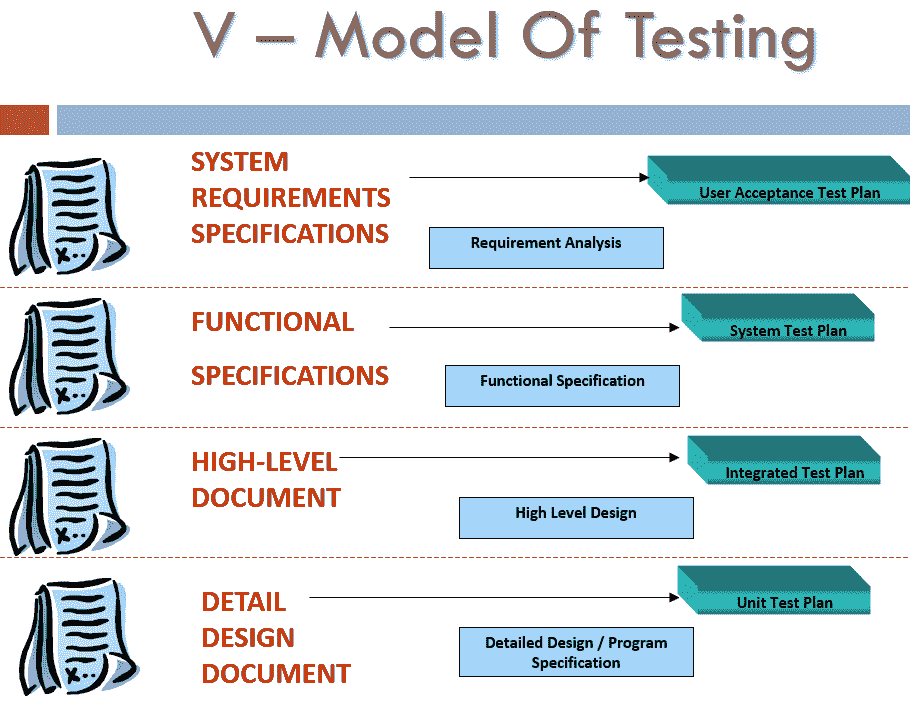

# 什么是软件测试中的测试分析（测试基础）？

> 原文： [https://www.guru99.com/test-analysis-basis.html](https://www.guru99.com/test-analysis-basis.html)

## 什么是测试分析？

测试分析是调查测试工件以建立测试条件/测试用例的过程。 因此，它也称为测试基础。

您从中获得测试信息的来源可能是

*   SRS（软件需求规范）
*   BRS（业务需求规范）
*   功能设计文件

测试人员可以通过查看被测应用程序来创建测试条件，也可以利用他们的经验。 但是大多数情况下，测试用例是从测试工件派生的。

#### 让我们借助案例研究来了解测试分析

考虑一个场景，客户端发送以下内容

```
Add search functionality to an eCommerce Store
```

即使尚未开发应用程序，也可以尝试为此需求开发一些测试用例。 在这里暂停，做功课，然后继续前进解决方案：

下面列出了您可能想到的许多测试用例

*   未输入关键字时检查搜索结果
*   如果搜索到的关键词没有相应的产品，请检查搜索结果
*   当搜索到的关键字有多个相应产品时，请检查搜索结果

在这里，您可以查看“测试基础”（客户端发送的要求），对其进行分析，然后将其转换为“测试条件”。
这是在 V-Model 的不同阶段发生的情况。 使用在不同阶段可用的相应文档来创建测试计划/案例。

<center>

<figure>

<figcaption>Test Analysis in V Model of Testing</figcaption>

</figure>

</center>