# 如何下载&安装 Selenium WebDriver

> 原文： [https://www.guru99.com/installing-selenium-webdriver.html](https://www.guru99.com/installing-selenium-webdriver.html)

硒安装过程分为三个步骤：

1.  安装 Java SDK
2.  安装 Eclipe
3.  安装 Selenium 驱动程序文件

在本教程中，我们将安装 Java Webdriver。 下面是详细过程

注意：Java，Eclipse，Selenium 的版本会随着时间不断更新。 但是安装步骤将保持不变。 请选择最新版本，然后继续以下安装步骤-

### 第 1 步-在计算机上安装 Java

在此处下载并安装 **Java 软件开发套件（JDK）** [。](http://www.oracle.com/technetwork/java/javase/downloads/index.html)

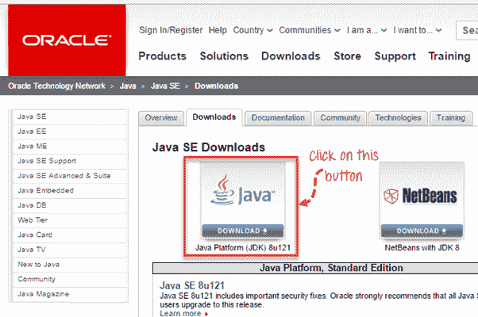

下一个 -

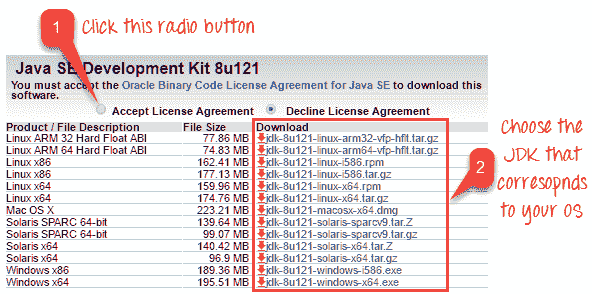

此 JDK 版本与 Java Runtime Environment（JRE）捆绑在一起，因此您无需单独下载和安装 JRE。

安装完成后，打开命令提示符并键入“ java”。 如果您看到以下屏幕，则可以继续进行下一步

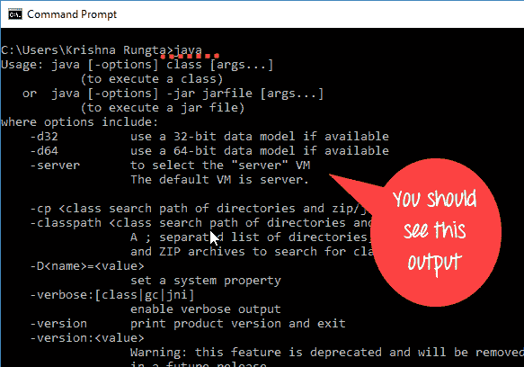

### 第 2 步-安装 Eclipse IDE

在此处下载最新版本的**“面向 Java 开发人员的 Eclipse IDE”** [。 确保在 Windows 32 位和 64 位版本之间正确选择。](http://www.eclipse.org/downloads/)

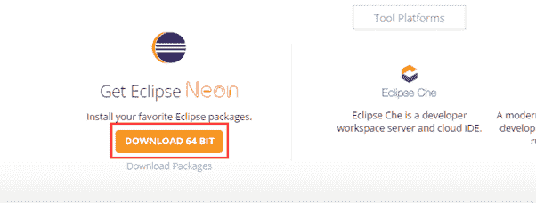

您应该可以下载名为“ eclipse-inst-win64”的 exe 文件进行安装。

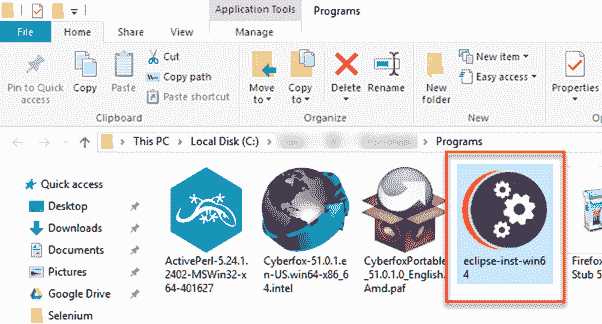

双击文件以安装 Eclipse。 将打开一个新窗口。 单击 Eclipse IDE for Java Developers。

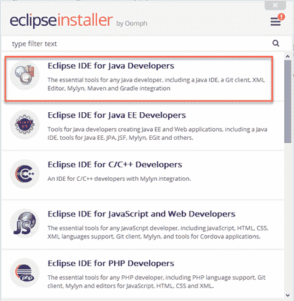

之后，将打开一个新窗口，单击标记为 1 的单击按钮，并将路径更改为“ C：\ eclipse”。 发布，单击标记为 2 的安装按钮

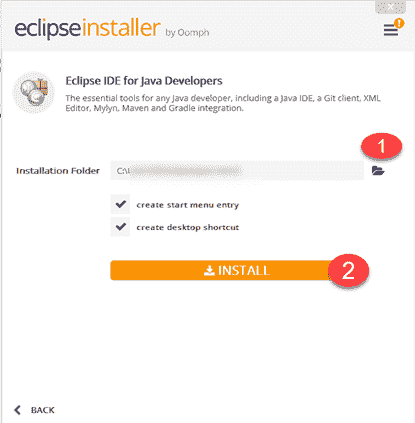

成功完成安装过程后，将出现一个窗口。 在该窗口上单击启动

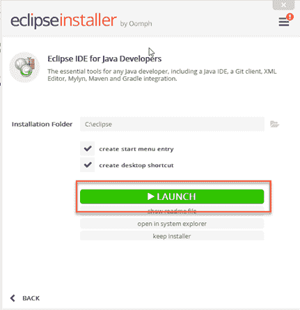

这将为您启动 Eclipse Neon IDE。

### 步骤 3-下载 Selenium Java 客户端驱动程序

您可以在此处下载 **Selenium Java Client 驱动程序** [。 在那里可以找到其他语言的客户端驱动程序，但只能选择 Java 的一种。](https://selenium.dev/downloads/)

此下载文件是一个名为“ selenium-3.14.0.zip”的 ZIP 文件。 为简单起见，请在您的 C 驱动器中提取此 ZIP 文件的内容，以便您拥有目录“ C：\ selenium-3.14.0 \”。 该目录包含所有我们稍后将在 Eclipse 上导入的 JAR 文件。

### 步骤 4-使用 WebDriver 配置 Eclipse IDE

1.  启动我们在步骤 2 中提取的“ eclipse”文件夹中的“ eclipse.exe”文件。如果正确执行了步骤 2，则可执行文件应位于 C：\ eclipse \ eclipse.exe。
2.  When asked to select for a workspace, just accept the default location.

    

3.通过文件> New > Java Project 创建一个新项目。 将该项目命名为“ newproject”。

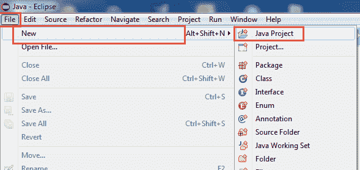

一个新的弹出窗口将打开，输入详细信息，如下所示

1.  项目名称
2.  保存项目的位置
3.  选择一个执行 JRE
4.  选择布局项目选项
5.  点击完成按钮

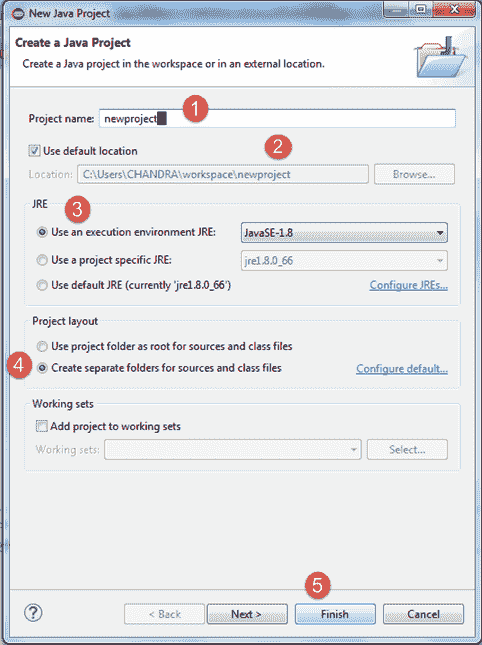

4.在这一步中

1.  右键单击新创建的项目，然后
2.  选择“新建>程序包”，然后将该程序包命名为“ newpackage”。

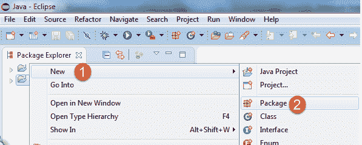

将会打开一个弹出窗口来命名包，

1.  输入包裹名称
2.  点击完成按钮

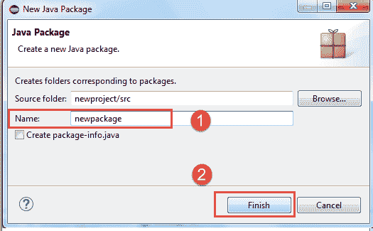

5.在 newpackage 下创建一个新的 Java 类，方法是右键单击它，然后选择-New > Class，然后将其命名为“ MyClass”。 您的 Eclipse IDE 应该如下图所示。

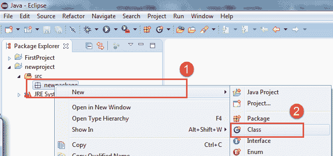

当您单击“班级”时，将打开一个弹出窗口，输入详细信息为

1.  班级名称
2.  点击完成按钮

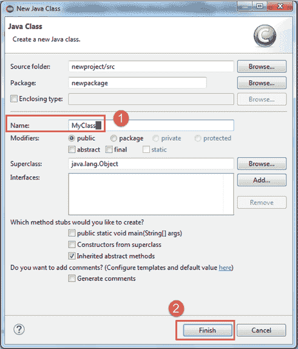

创建类后的外观就是这样。

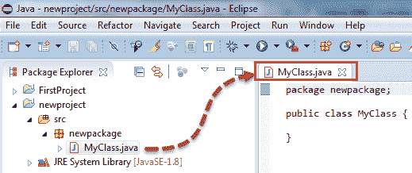

现在将 Selenium WebDriver 插入 Java 构建路径

在这一步中

1.  右键单击“ newproject”，然后选择**属性**。
2.  在“属性”对话框上，单击“ Java 构建路径”。
3.  单击**库**选项卡，然后
4.  单击“添加外部 JAR。”。

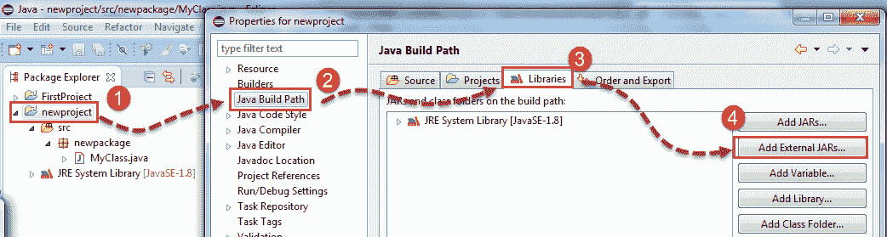

当您单击“添加外部 JAR。”时，它将打开一个弹出窗口。 选择要添加的 JAR 文件。

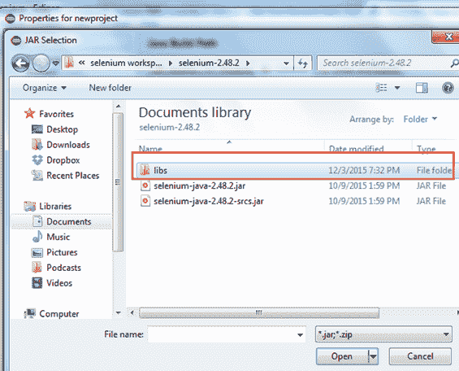

选择 jar 文件后，单击“确定”按钮。

选择 lib 文件夹中的所有文件。

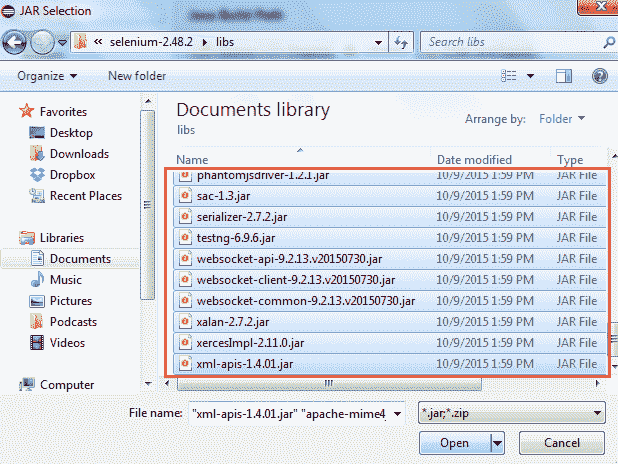

选择 lib 文件夹外的文件

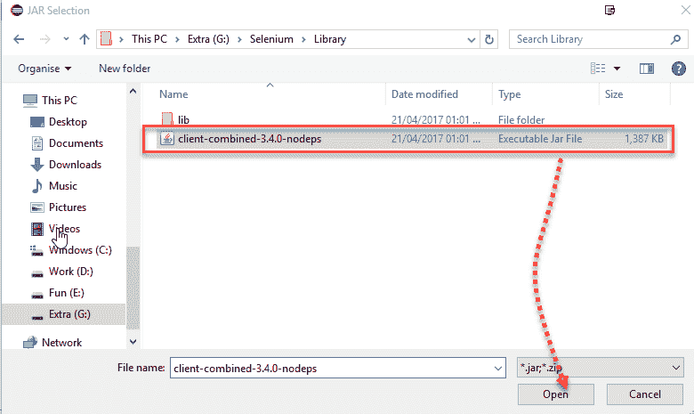

完成后，单击“应用并关闭”按钮

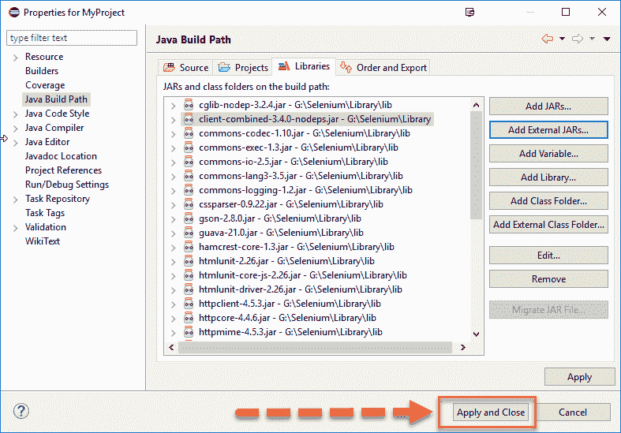

6.在“ libs”文件夹的内部和外部添加所有 JAR 文件。 现在，“属性”对话框应类似于下图。

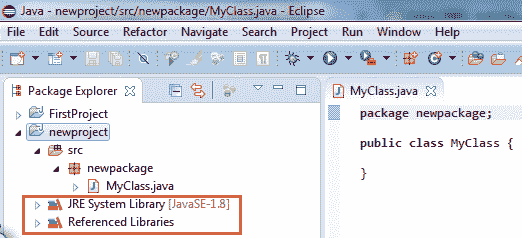

7.最后，单击 OK，我们将 Selenium 库导入到我们的项目中。

### 不同的驱动程序

**HTMLUnit 和 Firefox 是 WebDriver 可以直接自动执行**的两个浏览器-意味着在执行测试时不需要安装或运行其他单独的组件。 对于其他浏览器，需要单独的程序。 该程序称为**驱动程序服务器**。

每个浏览器的驱动程序服务器都不同。 例如，Internet Explorer 有自己的驱动程序服务器，您不能在其他浏览器上使用。 以下是驱动程序服务器和使用它们的相应浏览器的列表。

您可以在此处下载这些驱动程序

| **浏览器** | **驱动程序服务器的名称** | **备注** |
| HTMLUnit | HtmlUnitDriver | WebDriver 可以使用 HtmlUnitDriver 作为驱动程序服务器来驱动 HTMLUnit |
| 火狐浏览器 | Mozilla GeckoDriver | WebDriver 无需驱动程序服务器即可驱动 Firefox。启动上面的 Firefox 45 &需要使用 Mozilla 创建的 gecko 驱动程序进行自动化。 |
| IE 浏览器 | Internet Explorer 驱动程序服务器 | 提供 32 位和 64 位版本。 使用与您的 IE 架构相对应的版本 |
| 铬 | ChromeDriver | 尽管它的名称只是“ ChromeDriver”，但实际上它是一个驱动程序服务器，而不仅仅是一个驱动程序。 当前版本可以支持高于 Chrome v.21 的版本 |
| 歌剧 | OperaDriver | 尽管其名称仅为“ OperaDriver”，但实际上它是一个驱动程序服务器，而不仅仅是一个驱动程序。 |
| 幻影 | 幽灵车手 | PhantomJS 是另一个无头浏览器，就像 HTMLUnit。 |
| 苹果浏览器 | SafariDriver | 尽管其名称仅为“ SafariDriver”，但实际上它是驱动程序服务器，而不仅仅是驱动程序。 |

**摘要**

除了浏览器之外，您还需要以下内容才能开始使用 WebDriver

*   **Java 开发工具包（JDK）。** [http://www.oracle.com/technetwork/java/javase/downloads/index.html](http://www.oracle.com/technetwork/java/javase/downloads/index.html)
*   **Eclipse IDE** - [http://www.eclipse.org/downloads/](http://www.eclipse.org/downloads/)
*   **Java 客户端驱动程序**- [https://selenium.dev/downloads/](https://selenium.dev/downloads/)

在 Eclipse 中启动 WebDriver 项目时，请不要忘记将 Java Client Driver 文件导入到您的项目中。 这些文件将构成您的 Selenium 库。

使用新版本的 Selenium，没有不使用驱动程序服务器就无法自动化的浏览器。