# 第一个 Selenium Webdriver 脚本：JAVA 代码示例

> 原文： [https://www.guru99.com/first-webdriver-script.html](https://www.guru99.com/first-webdriver-script.html)

使用我们在上一个教程中创建的 [Java](/java-tutorial.html) 类“ myclass”，让我们尝试创建一个 WebDriver 脚本，该脚本将：

1.  获取 Mercury Tours 的主页
2.  验证其标题
3.  打印比较结果
4.  在结束整个程序之前将其关闭。

## WebDriver 代码

以下是上述方案所呈现的逻辑的实际 WebDriver 代码

注意：从 Firefox 35 开始，您需要使用 Mozilla 创建的 gecko 驱动程序才能使用 Web 驱动程序。 Selenium 3.0，gecko 和 firefox 具有兼容性问题，正确设置它们可能成为一项艰巨的任务。 如果代码不起作用，请降级到 Firefox 47 或更低版​​本。 或者，您可以在 Chrome 上运行脚本。 Selenium 可以直接用于 Chrome。 您只需要更改 3 行代码即可使脚本与 Chrome 或 Firefox 一起使用

```
package newproject;
import org.openqa.selenium.WebDriver;
import org.openqa.selenium.firefox.FirefoxDriver;
//comment the above line and uncomment below line to use Chrome
//import org.openqa.selenium.chrome.ChromeDriver;
public class PG1 {

    public static void main(String[] args) {
        // declaration and instantiation of objects/variables
    	System.setProperty("webdriver.gecko.driver","C:\\geckodriver.exe");
		WebDriver driver = new FirefoxDriver();
		//comment the above 2 lines and uncomment below 2 lines to use Chrome
		//System.setProperty("webdriver.chrome.driver","G:\\chromedriver.exe");
		//WebDriver driver = new ChromeDriver();

        String baseUrl = "http://demo.guru99.com/test/newtours/";
        String expectedTitle = "Welcome: Mercury Tours";
        String actualTitle = "";

        // launch Fire fox and direct it to the Base URL
        driver.get(baseUrl);

        // get the actual value of the title
        actualTitle = driver.getTitle();

        /*
         * compare the actual title of the page with the expected one and print
         * the result as "Passed" or "Failed"
         */
        if (actualTitle.contentEquals(expectedTitle)){
            System.out.println("Test Passed!");
        } else {
            System.out.println("Test Failed");
        }

        //close Fire fox
        driver.close();

    }

}
```

## 解释代码

## 导入包

首先，您需要导入以下两个软件包：

1.  **org.openqa.selenium。*** -包含实例化加载了特定驱动程序的新浏览器所需的 WebDriver 类
2.  **org.openqa.selenium.firefox.FirefoxDriver** -包含将 Firefox 特定的驱动程序实例化到由 WebDriver 类实例化的浏览器上所需的 FirefoxDriver 类

如果您的测试需要更复杂的操作，例如访问另一个类，获取浏览器屏幕截图或操作外部文件，则肯定需要导入更多软件包。

## 实例化对象和变量

通常，这就是实例化驱动程序对象的方式。

.png)

没有参数的 FirefoxDriver 类意味着默认的 Firefox 配置文件将由我们的 Java 程序启动。 默认的 Firefox 配置文件类似于在安全模式下启动 Firefox（不加载任何扩展程序）。

为了方便起见，我们将基本 URL 和期望的标题保存为变量。

## 启动浏览器会话

WebDriver 的 **get（）**方法用于启动新的浏览器会话，并将其定向到您指定为其参数的 URL。

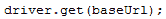.png)

## 获取实际的页面标题

WebDriver 类具有 **getTitle（）**方法，该方法始终用于获取当前加载页面的页面标题。

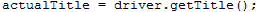.png)

## 比较预期值和实际值

该部分代码仅使用基本的 Java if-else 结构将实际标题与预期标题进行比较。

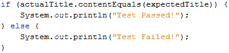.png)

## 终止浏览器会话

“ **close（）**”方法用于关闭浏览器窗口。

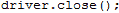.png)

## 终止整个程序

如果使用此命令而不先关闭所有浏览器窗口，则整个 Java 程序将结束，而浏览器窗口保持打开状态。

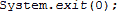.png)

## 运行测试

在 Eclipse IDE 中有两种执行代码的方法。

1.  在 Eclipse 的菜单栏上，单击 **Run > Run。**
2.  按 **Ctrl + F11** 运行整个代码。

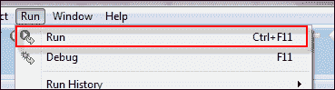.png)

如果一切正确，Eclipse 将输出“ Test Passed！”。

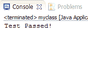.png)

## 查找 GUI 元素

通过使用“ **findElement（By。*定位器*（））**”方法来完成 WebDriver 中的元素定位。 代码的“定位器”部分与这些教程的 Selenium IDE 章节中先前讨论的任何定位器相同。 实际上，建议您使用 IDE 定位 GUI 元素，并在成功识别后将代码导出到 webdriver。

这是一个通过元素 ID 定位元素的示例代码。 Facebook 被用作基本 URL。

```
package newproject;
import org.openqa.selenium.By;
import org.openqa.selenium.WebDriver;
import org.openqa.selenium.firefox.FirefoxDriver;

public class PG2 {
    public static void main(String[] args) {
    	System.setProperty("webdriver.gecko.driver","C:\\geckodriver.exe");
    	WebDriver driver = new FirefoxDriver();
        String baseUrl = "http://www.facebook.com";
        String tagName = "";

        driver.get(baseUrl);
        tagName = driver.findElement(By.id("email")).getTagName();
        System.out.println(tagName);
        driver.close();
        System.exit(0);
}
}
```

我们使用 **getTagName（）**方法提取 ID 为“ email”的特定元素的标签名称。 运行时，此代码应能够正确识别标记名“ input”，并将其打印在 Eclipse 的 Console 窗口中。

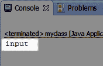.png)

元素汇总

| **变体** | **说明** | **样本** |
| 由。 **className** | 根据“ class”属性的值查找元素 | findElement（By.className（“ someClassName”）） |
| 由。 **cssSelector** | 根据驱动程序的基础 CSS 选择器引擎查找元素 | findElement（By.cssSelector（“ input＃email”）） |
| 由。 **id** | 通过元素的“ id”属性值定位元素 | findElement（By.id（“ someId”）） |
| 由。 **linkText** | 通过显示的确切文本查找链接元素 | findElement（By.linkText（“ REGISTRATION”）） |
| 由。 **名称** | 通过“名称”属性的值定位元素 | findElement（By.name（“ someName”）） |
| 由。 **partialLinkText** | 定位包含给定链接文本的元素 | findElement（By.partialLinkText（“ REG”）） |
| 由。 **tagName** | 通过标签名称定位元素 | findElement（By.tagName（“ div”）） |
| 由。 **xpath** | 通过 XPath 定位元素 | findElement（By.xpath（“ // html / body / div / table / tbody / tr / td [2] / table / tbody / tr [4] / td / table / tbody / tr / td [2] / table / tbody / tr [2] / td [3] / form / table / tbody / tr [5]“）） |

## 关于使用 findElement（By.cssSelector（））的说明

**By.cssSelector（）不支持“包含”功能**。 考虑下面的 Selenium IDE 代码-

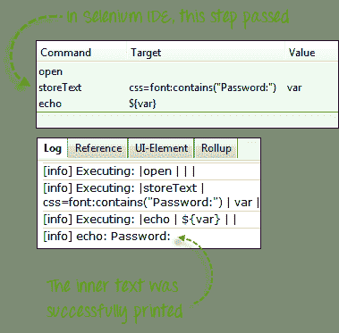.png)

在上面的 Selenium IDE 中，整个测试通过了。 但是，在下面的 WebDriver 脚本中，同一测试产生了一个错误，因为在 By.cssSelector（）方法中使用 WebDriver 时不支持“ contains”关键字。

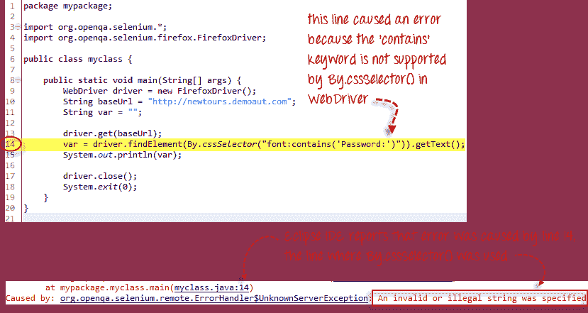.png)

## 常用命令

## 实例化 Web 元素

不必每次访问一个特定元素时都使用长的“ driver.findElement（By.locator（））”语法，我们可以为其实例化一个 WebElement 对象。 WebElement 类包含在“ org.openqa.selenium。*”包中。

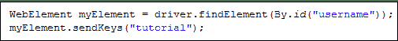.png)

## 点击一个元素

单击可能是与 Web 元素交互的最常见方法**。 click（）方法用于模拟任何元素的点击。** 以下示例显示如何使用 click（）单击 Mercury Tours 的“登录”按钮。

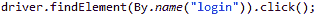.png)

使用 click（）方法时，必须注意以下几点。

*   **它不接受任何参数/参数。**
*   如果适用，方法**自动等待新页面加载**。
*   要单击的元素**必须可见**（高度和宽度不得等于零）。

## 获取命令

获取命令获取有关页面/元素的各种重要信息。 这是您必须熟悉的一些重要的“获取”命令。

| **get（）** *用法示例：* | 

*   它会自动打开一个新的浏览器窗口，并获取您在其括号内指定的页面。
*   与 Selenium IDE 的“打开”命令相对应。
*   参数必须是 **字符串** 对象。

 |
| **getTitle（）** *用法示例：* | 

*   不需要参数
*   获取当前页面的标题
*   删除前导空格和尾随空格
*   如果页面没有空白，则返回空字符串 标题

 |
| **getPageSource（）** *用法示例：* | 

*   不需要参数
*   返回页面的 **源代码作为字符串值**

 |
| **getCurrentUrl（）** *用法示例：* | 

*   不需要参数
*   获取代表浏览器正在查看的 **当前 URL** 的字符串

 |
| **getText（）** *用法示例：* | 

*   获取您指定的元素的 **内部文本**

 |

## 导航命令

这些命令使您可以刷新，进入以及在不同网页之间来回切换。

| **navigation（）。to（）** *用法示例：* | 

*   它会自动 **打开一个新的浏览器窗口，并获取您在其括号内指定的页面** 。
*   **它与 get（）方法完全相同。**

 |
| **navigation（）。refresh（）** *用法示例：* | 

*   不需要参数。
*   刷新当前页面。

 |
| **navigation（）。back（）** *用法示例：* | 

*   不需要参数
*   使 **返回浏览器历史记录上的一页** 。

 |
| **navigation（）。forward（）** *用法示例：* | 

*   不需要参数
*   使 **在浏览器历史记录上向前移一页** 。

 |

## 关闭和退出浏览器窗口

| **close（）** *用法示例：* | 

*   不需要参数
*   **它仅关闭 WebDriver 当前正在控制的浏览器窗口** 。

 |
| **quit（）** *用法示例：* | 

*   不需要参数
*   **它将关闭 WebDriver 打开的所有窗口。**

 |

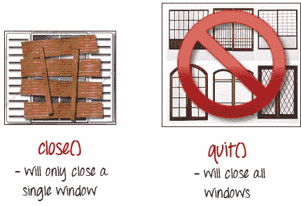

为了清楚地说明 close（）和 quit（）之间的区别，请尝试执行以下代码。 它使用的网页会在页面加载后自动弹出一个窗口，退出后又打开一个窗口。

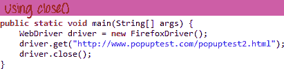.png)

请注意，仅关闭了父浏览器窗口，而没有关闭两个弹出窗口。

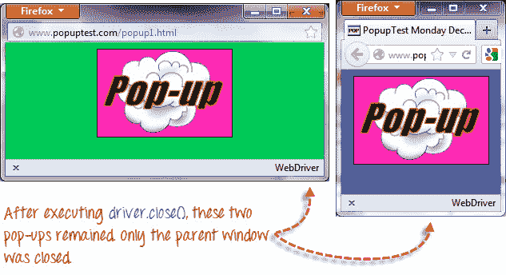

但是，如果您使用 quit（），则所有窗口都将关闭-而不仅仅是父窗口。 尝试运行下面的代码，您会发现上面的两个弹出窗口也将自动关闭。

```
package newproject;
import org.openqa.selenium.WebDriver;
import org.openqa.selenium.firefox.FirefoxDriver;

public class PG3 {
    public static void main(String[] args) {
    	System.setProperty("webdriver.gecko.driver","C:\\geckodriver.exe");
    	WebDriver driver = new FirefoxDriver();
        driver.get("http://www.popuptest.com/popuptest2.html");
        driver.quit();  // using QUIT all windows will close
    }
}
```

## 在框架之间切换

要访问框架中的 GUI 元素，我们应该首先指示 WebDriver 首先关注框架或弹出窗口，然后才能访问其中的元素。 让我们以网页 [http://demo.guru99.com/selenium/deprecated.html](http://demo.guru99.com/selenium/deprecated.html) 为例

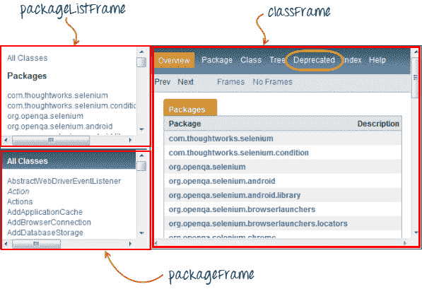

此页面有 3 个框架，其“名称”属性在上面指出。 我们希望访问上面用黄色包围的“已弃用”链接。 为此，我们必须首先指示 WebDriver 使用**“ switchTo（）。frame（）”** 方法切换到“ classFrame”帧。 我们将框架的名称属性用作“ frame（）”部分的参数。

```
package newproject;
import org.openqa.selenium.By;
import org.openqa.selenium.WebDriver;
import org.openqa.selenium.firefox.FirefoxDriver;
public class PG4 {
	  public static void main(String[] args) {
		  	System.setProperty("webdriver.gecko.driver","C:\\geckodriver.exe");  
		  	WebDriver driver = new FirefoxDriver();
	        driver.get("http://demo.guru99.com/selenium/deprecated.html");
	        driver.switchTo().frame("classFrame");
	        driver.findElement(By.linkText("Deprecated")).click();
	        driver.close(); 
	    }
}
```

执行此代码后，您将看到“ classFrame”框架进入“ Deprecated API”页面，这意味着我们的代码已成功能够访问“ Deprecated”链接。

## 在弹出窗口之间切换

与 Selenium IDE 不同，WebDriver 允许显示弹出窗口（如警报）。 要访问警报中的元素（例如它包含的消息），我们必须使用**“ switchTo（）。alert（）”** 方法。 在下面的代码中，我们将使用此方法访问警报框，然后使用**“ getText（）”** 方法检索其消息，然后使用**“ switchTo（ ）.alert（）。accept（）”** 方法。

首先，转到 [http://jsbin.com/usidix/1](http://jsbin.com/usidix/1) ，然后手动单击``开始！'' 按钮，然后自己查看消息文本。

.png)

让我们来看一下 WebDriver 代码以执行此操作-

```
package mypackage;

import org.openqa.selenium.By;
import org.openqa.selenium.WebDriver;
import org.openqa.selenium.firefox.FirefoxDriver;

public class myclass {

    public static void main(String[] args) {
    	System.setProperty("webdriver.gecko.driver","C:\\geckodriver.exe");
        WebDriver driver = new FirefoxDriver();
        String alertMessage = "";

        driver.get("http://jsbin.com/usidix/1");
        driver.findElement(By.cssSelector("input[value=\"Go!\"]")).click();
        alertMessage = driver.switchTo().alert().getText();
        driver.switchTo().alert().accept();

        System.out.println(alertMessage);
        driver.quit();

    }
}
```

在 Eclipse 控制台上，注意打印的警报消息是：

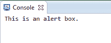.png)

## 等待

有两种等待。

1.  隐式等待-用于设置整个程序的默认等待时间
2.  显式等待-仅用于设置特定实例的等待时间

## 隐式等待

*   比“显式等待”更容易编写代码。
*   它通常在代码的实例化部分中声明。
*   您只需导入一个附加软件包。

要开始使用隐式等待，您必须将此包导入到代码中。

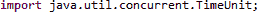.png)

然后在代码的实例化部分上添加此代码。

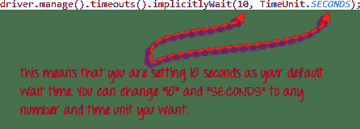.png)

## 显式等待

**显式等待使用 WebDriverWait 和 ExpectedCondition 类**完成。 对于下面的示例，在继续执行下一个命令之前，我们将等待多达 10 秒钟的时间，让其 ID 为“ username”的元素可见。 步骤如下。

**步骤 1**

导入以下两个软件包：

**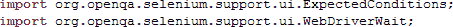.png)** 

**步骤 2**

声明一个 WebDriverWait 变量。 在此示例中，我们将使用“ myWaitVar”作为变量的名称。

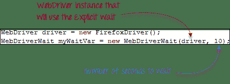.png)

**步骤 3**

在需要显式等待发生的部分上，将 myWaitVar 与 ExpectedConditions 一起使用。 在这种情况下，我们将在“用户名”（Mercury Tours 主页）输入上使用显式等待，然后在其上键入文本“ tutorial”。

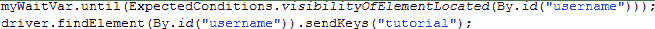.png)

## 条件

在条件和循环操作中使用以下方法-

*   **isEnabled（）**用于在执行命令之前要验证某个元素是否已启用的情况。

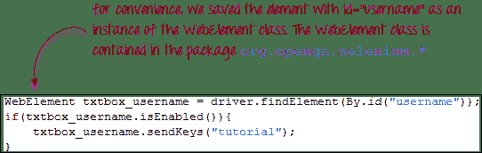.png)

*   **isDisplayed（）**用于在执行命令之前要验证是否显示了某个元素的情况。

.png)

*   **isSelected（）当您要验证是否选中了**复选框，单选按钮或下拉框**中的选项时，将使用**。 它不适用于其他元素。

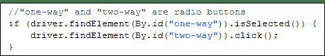

## 使用 ExpectedConditions

ExpectedConditions 类提供了一组更广泛的条件，您可以将这些条件与 WebDriverWait 的 until（）方法结合使用。

以下是一些最常见的 ExpectedConditions 方法。

*   **alertIsPresent（）**-等待直到显示警报框。

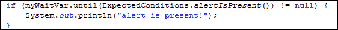.png)

*   **elementToBeClickable（）**-等待直到元素可见并同时启用。 下面的示例代码将等到 id =“ username”的元素变得可见并首先启用，然后将该元素分配为名为“ txtUserName”的 WebElement 变量。

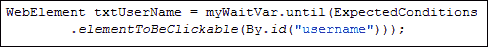.png)

*   **frameToBeAvailableAndSwitchToIt（）**-等待直到给定的帧已经可用，然后自动切换到该帧。

.png)

## 捕捉异常

当使用 isEnabled（），isDisplayed（）和 isSelected（）时，WebDriver 假定该元素已存在于页面上。 否则，它将抛出 **NoSuchElementException** 。 为了避免这种情况，我们应该使用 try-catch 块，以便程序不会被中断。

```
WebElement txtbox_username = driver.findElement(By.id("username"));
try{
        if(txtbox_username.isEnabled()){
            txtbox_username.sendKeys("tutorial");
        }
    }

catch(NoSuchElementException nsee){
            System.out.println(nsee.toString());
 }
```

如果使用显式等待，则应捕获的异常类型为“ TimeoutException”。

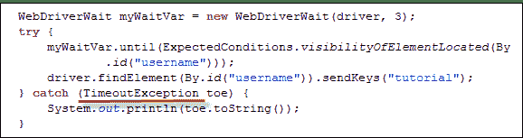.png)

## 摘要

*   要开始使用 WebDriver API，必须至少导入这两个软件包。
*   **org.openqa.selenium。***
*   **org.openqa.selenium.firefox.FirefoxDriver**
*   **get（）**方法等效于 Selenium IDE 的“打开”命令。
*   通过使用 **findElement（）**方法在 WebDriver 中定位元素。
*   以下是用于在 WebDriver 中定位元素的可用选项：
*   通过。 **className**
*   通过。 **cssSelector**
*   通过。 **ID**
*   通过。 **linkText**
*   通过。 **名称**
*   通过。 **partialLinkText**
*   通过。 **tagName**
*   通过。 **xpath**
*   By.cssSelector（）**不支持**“包含” 功能。
*   您可以使用 **WebElement** 类实例化元素。
*   通过使用 **click（）**方法来完成元素的单击。
*   WebDriver 提供了以下有用的 **get 命令**：
*   得到（）
*   getTitle（）
*   getPageSource（）
*   getCurrentUrl（）
*   getText（）
*   WebDriver 提供了这些有用的**导航命令**
*   navigation（）。forward（）
*   navigation（）。back（）
*   导航（）
*   navigation（）。refresh（）
*   close（）和 quit（）方法用于关闭浏览器窗口。 **Close（）**用于关闭单个窗口； 而 **quit（）**用于关闭与 WebDriver 对象正在控制的父窗口关联的所有窗口。
*   **switchTo（）。frame（）**和 **switchTo（）。alert（）**方法分别用于将 WebDriver 的焦点对准帧或警报。
*   **隐式等待**用于设置整个程序的等待时间，而**显式等待**仅用于特定部分。
*   验证元素状态时，可以使用 **isEnabled（），isDisplayed（），isSelected（），**以及 **WebDriverWait** 和 **ExpectedConditions** 方法的组合。 但是，它们不验证元素是否不存在。
*   在元素不存在时调用 isEnabled（），isDisplayed（）或 isSelected（）时，WebDriver 将抛出 **NoSuchElementException** 。
*   在元素不存在时调用 WebDriverWait 和 ExpectedConditions 方法时，WebDriver 会抛出 **TimeoutException** 。

**注意：**

driver.get（）：用于转到特定网站，但它不维护浏览器的历史记录和 cookie，因此，我们不能使用前进和后退按钮，如果单击该按钮，则页面将无法获得时间表

driver.navigate（）：它用于转到特定的网站，但是它保留了浏览器历史记录和 cookie，因此在测试用例的编码过程中，我们可以使用前进和后退按钮在页面之间导航