# Selenium IDE 中的定位器：CSS 选择器，DOM，XPath，链接文本，ID

> 原文： [https://www.guru99.com/locators-in-selenium-ide.html](https://www.guru99.com/locators-in-selenium-ide.html)

## 什么是定位器？

Locator is a command that tells Selenium IDE which GUI elements ( say Text Box, Buttons, Check Boxes etc) its needs to operate on.  Identification of correct GUI elements is a prerequisite to creating an automation script. But accurate identification of GUI elements is more difficult than it sounds. Sometimes, you end up working with incorrect GUI elements or no elements at all!  Hence, Selenium provides a number of Locators to precisely locate a GUI element

Selenium IDE 中不同类型的定位器

**What You Will Learn:** []

*   [ID](#1)
*   [名称](#2)
*   [链接文本](#3)
*   [CSS 选择器](#4)

*   [标签和 ID](#5)
*   [标签和类别](#6)
*   [标签和属性](#7)
*   [标签，类和属性](#8)
*   [内部文字](#9)

*   [DOM（文档对象模型）](#10)

*   [getElementById](#11)
*   [getElementsByName](#12)
*   [dom：名称](#13)
*   [dom：索引](#14)

*   [XPath](#15)

有些命令不需要定位器（例如“ open”命令）。 但是，其中大多数确实需要定位器。

**定位器的选择在很大程度上取决于您的被测应用**。 在本教程中，我们将基于这些应用程序支持的定位器在 Facebook，新的 tour.demoaut 之间切换。 同样，在[测试](/software-testing.html)项目中，您将根据应用程序支持选择上面列出的任何定位器。

## 按 ID 定位

这是最常见的元素定位方式，因为 ID 对于每个元素而言都是唯一的。

**目标格式：元素的** id = *id*

在此示例中，我们将使用 Facebook 作为测试应用程序，因为 Mercury Tours 不使用 ID 属性。

**步骤 1。**自从创建本教程以来，Facebook 更改了其登录页面设计。 使用此演示页面 [http://demo.guru99.com/test/facebook.html](http://demo.guru99.com/test/facebook.html) 进行测试。 使用 Firebug 检查“电子邮件或电话”文本框，并记下其 ID。 在这种情况下，ID 为“电子邮件”。

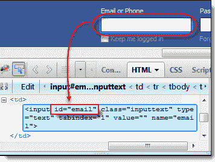

**步骤 2。**启动 Selenium IDE，然后在“目标”框中输入“ id = email”。 单击“查找”按钮，注意“电子邮件或电话”文本框以黄色突出显示，并以绿色边框，这意味着 Selenium IDE 能够正确找到该元素。

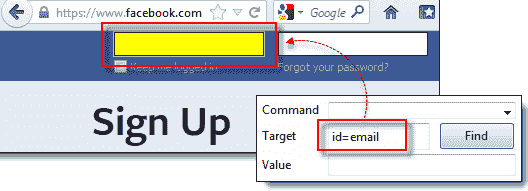

## 按名称查找

按名称查找元素与按 ID 查找非常相似，不同之处在于，我们改用**“ name =”** 前缀。

**目标格式：**名称= *元素的名称*

在下面的演示中，我们现在将使用 Mercury Tours，因为所有重要元素都有名称。

**步骤 1。**导航至 [http://demo.guru99.com/test/newtours/](http://demo.guru99.com/test/newtours/) ，然后使用 Firebug 检查“用户名”文本框。 注意其名称属性。

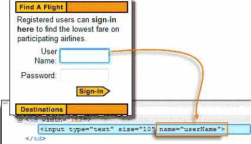

在这里，我们看到元素的名称是“ userName”。

**步骤 2。**在 Selenium IDE 中，在“目标”框中输入“名称=用户名”，然后单击“查找”按钮。 Selenium IDE 应该能够通过突出显示它来找到“用户名”文本框。

## 使用过滤器按名称查找

当多个元素具有相同的名称时，可以使用过滤器。 **过滤器是用于区分具有相同名称的元素的附加属性。**

**目标格式**：名称= *name_of_the_element* *过滤器* = *value_of_filter*

让我们看一个例子-

**步骤 1** 。 使用“教程”作为用户名和密码登录到 Mercury Tours。 它应该带您到下面显示的 Flight Finder 页面。

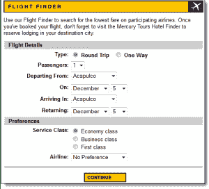

**步骤 2。**使用 Firebug，注意往返和单向单选按钮具有相同的名称“ tripType”。 但是，它们具有不同的 VALUE 属性，因此我们可以将它们中的每一个用作我们的过滤器。

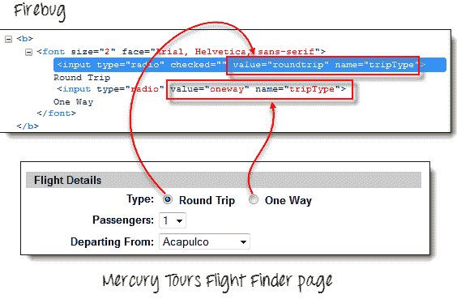

**步骤 3。**

*   我们将首先访问“单向”单选按钮。 单击编辑器上的第一行。
*   在 Selenium IDE 的“命令”框中，输入命令“单击”。
*   在“目标”框中，输入“名称= tripType 值=单向”。 “值=单向”部分是我们的过滤器。

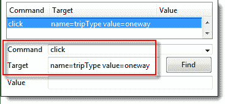

**步骤 4** 。 单击“查找”按钮，注意 Selenium IDE 能够以绿色突出显示“单向”单选按钮-这意味着我们能够使用其 VALUE 属性成功访问该元素。

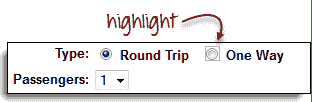

**步骤 5。**按下键盘上的“ X”键以执行此单击命令。 请注意，单向单选按钮已被选中。

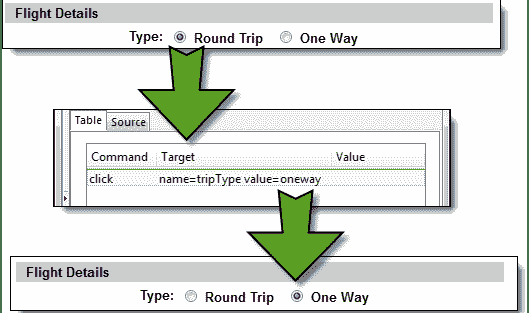

您这次可以使用“往返”单选按钮执行完全相同的操作，使用“名称= tripType 值=往返”作为目标。

## 通过链接文本定位

这种类型的定位器仅适用于超链接文本。 我们通过在目标前面添加“ link =“，然后是超链接文本来访问该链接。

**目标格式**：链接= *link_text*

在此示例中，我们将访问 Mercury Tours 主页上的“ REGISTER”链接。

**步骤 1。**

*   首先，请确保您已从 Mercury Tours 注销。
*   转到 Mercury Tours 主页。

**步骤 2** 。

*   使用 Firebug，检查“ REGISTER”链接。 链接文本位于和标签之间。
*   在这种情况下，我们的链接文本为“ REGISTER”。 复制链接文本。

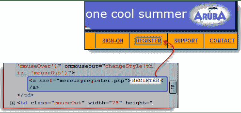

**步骤 3** 。 在 Firebug 中复制链接文本，然后将其粘贴到 Selenium IDE 的“目标”框中。 前缀“ link =“。

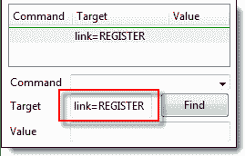

**步骤 4。**单击“查找”按钮，注意 Selenium IDE 能够正确突出显示 REGISTER 链接。

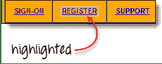

**步骤 5。**要进一步验证，请在“命令”框中输入“ clickAndWait”并执行它。 Selenium IDE 应该能够成功单击该 REGISTER 链接，并将您带到下面显示的“注册”页面。

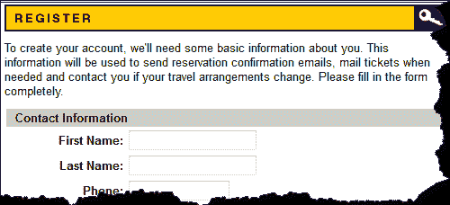

## 通过 CSS 选择器定位

CSS 选择器是字符串模式，用于基于 HTML 标签，id，类和属性的组合来标识元素。 通过 CSS Selector 进行定位比以前的方法更为复杂，但这是高级 Selenium 用户最常用的定位策略，因为它甚至可以访问没有 ID 或名称的元素。

CSS 选择器有多种格式，但我们仅关注最常见的格式。

*   标签和 ID
*   标签和类别
*   标签和属性
*   标签，类和属性
*   内部文字

使用此策略时，我们始终在“目标”框中添加“ css =“前缀，如以下示例所示。

## 通过 CSS 选择器定位-标签和 ID

同样，在此示例中，我们将使用 Facebook 的“电子邮件”文本框。 您可能还记得，它的 ID 为“电子邮件”，我们已经在“按 ID 定位”部分中对其进行了访问。 这次，我们将使用具有 ID 的 CSS 选择器来访问相同的元素。

| 

**语法**

 | 

**说明**

 |
| css = *标签*＃ *id* | 

*   标签=所访问元素的 HTML 标签
*   ＃=哈希符号。 当使用 ID 为
*   的 CSS 选择器时，应始终存在该标识符。

 |

**请记住，ID 始终以井号（＃）开头。**

**步骤 1\.** 导航至 [www.facebook.com](http://www.facebook.com/) 。 使用 Firebug，检查“电子邮件或电话”文本框。

此时，请注意 HTML 标记为“输入”，其 ID 为“电子邮件”。 因此，我们的语法将为“ css = input＃email”。

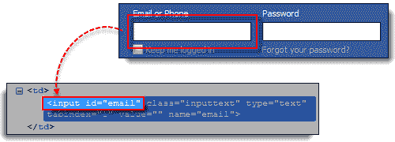

**步骤 2。**在 Selenium IDE 的“目标”框中输入“ css = input＃email”，然后单击“查找”按钮。 Selenium IDE 应该能够突出显示该元素。

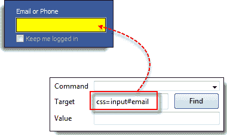

## 通过 CSS 选择器定位-标签和类

使用 HTML 标记和类名称通过 CSS Selector 进行定位与使用标记和 ID 相似，但是在这种情况下，使用点（。）代替了井号。

| 

**Syntax**

 | 

**Description**

 |
| css = *标签*。 *类* | 

*   标签=要访问的元素的 HTML 标签
*   。 =点号。 当将 CSS 选择器与类
*   一起使用时，应该始终存在该类。=所访问元素的类

 |

**步骤 1。**转到演示页面 [http://demo.guru99.com/test/facebook.html](http://demo.guru99.com/test/facebook.html) 并使用 Firebug 检查“电子邮件或电话”文本框。 请注意，其 HTML 标记为“ input”，其类为“ inputtext”。

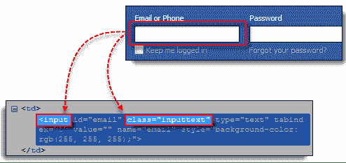

**步骤 2。**在 Selenium IDE 中，在“目标”框中输入“ css = input.inputtext”，然后单击“查找”。 Selenium IDE 应该能够识别“电子邮件”或“电话”文本框。

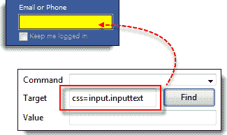

**请注意，当多个元素具有相同的 HTML 标签和名称时，将仅识别源代码中的第一个元素**。 使用 Firebug，检查 Facebook 中的“密码”文本框，并注意它与“电子邮件”或“电话”文本框的名称相同。

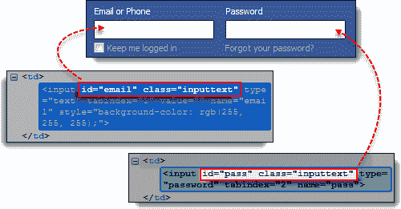

上图中仅突出显示“电子邮件”或“电话”文本框的原因是，它首先出现在 Facebook 的页面源中。

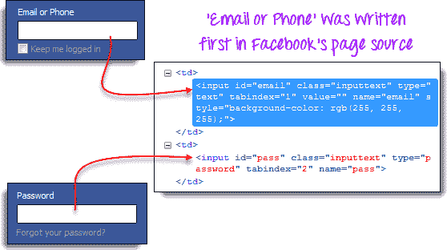

## 通过 CSS 选择器定位-标签和属性

此策略使用 HTML 标记和要访问的元素的特定属性。

| 

句法

 | 

描述

 |
| css = *标签* [*属性* = *值*] | 

*   标签=所访问元素的 HTML 标签
*   [和] =将在其中放置特定属性及其对应值的方括号
*   属性=属性 要使用的。 建议使用元素唯一的属性，例如名称或 ID。
*   值=所选属性的相应值。

 |

**步骤 1。**导航至 Mercury Tours 的注册页面（ [http://demo.guru99.com/test/newtours/register.php](http://demo.guru99.com/test/newtours/register.php) ）并检查“姓氏”文本框 。 注意其 HTML 标记（在这种情况下为“ input”）和名称（“ lastName”）。

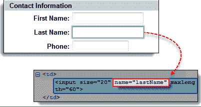

**步骤 2。**在 Selenium IDE 中，在“目标”框中输入“ css = input [name = lastName]”，然后单击“查找”。 Selenium IDE 应该能够成功访问“姓氏”框。

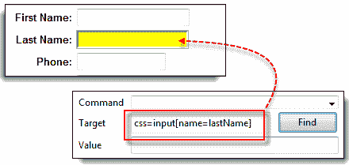

**当多个元素具有相同的 HTML 标签和属性时，将仅识别第一个元素**。 此行为类似于使用具有相同标签和类的 CSS 选择器定位元素。

## 通过 CSS 选择器定位-标签，类和属性

| 语法 | 说明 |
| css = *tag.class* [*属性* = *值*] | 

*   标签=要访问的元素的 HTML 标签
*   。 =点号。 当 CSS 选择器与类
*   类=所访问元素的类一起使用时，应始终存在
*   [和] =方括号，其中将包含特定属性及其对应值 放置的
*   属性=要使用的属性。 建议使用元素唯一的属性，例如名称或 ID。
*   值=所选属性的相应值。

 |

**步骤 1。**转到演示页面 [http://demo.guru99.com/test/facebook.html](http://demo.guru99.com/test/facebook.html) 并使用 Firebug 检查“电子邮件或电话”和“密码” 输入框。 注意它们的 HTML 标记，类和属性。 在此示例中，我们将选择其“ tabindex”属性。

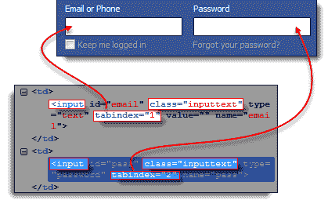

**步骤 2。**。我们将首先访问“电子邮件或电话”文本框。 因此，我们将使用 tabindex 值为 1。在 Selenium IDE 的“目标”框中输入“ css = input.inputtext [tabindex = 1]”，然后单击“查找”。 “电子邮件或电话”输入框应突出显示。

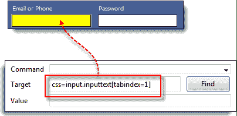

**步骤 3。**要访问密码输入框，只需替换 tabindex 属性的值即可。 在“目标”框中输入“ css = input.inputtext [tabindex = 2]”，然后单击“查找”按钮。 Selenium IDE 必须能够成功识别“密码”文本框。

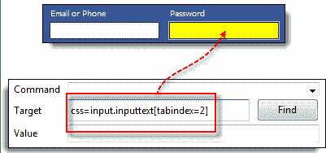

## 通过 CSS 选择器定位-内部文本

您可能已经注意到，很少给 HTML 标签提供 id，name 或 class 属性。 那么，我们如何访问它们？ 答案是通过使用其内部文本。 **内部文本是 HTML 标签在页面上显示的实际字符串模式。**

| 

**Syntax**

 | 

**Description**

 |
| css = *标签*：contains（“ *内部文本*”） | 

*   标签=所访问元素的 HTML 标签
*   内部文本=元素的内部文本

 |

**步骤 1。**导航至 Mercury Tours 的主页（ [http://demo.guru99.com/test/newtours/](http://demo.guru99.com/test/newtours/) ），然后使用 Firebug 来研究“密码”标签。 记下它的 HTML 标记（在这种情况下为“ font”），并注意它没有类，id 或名称属性。

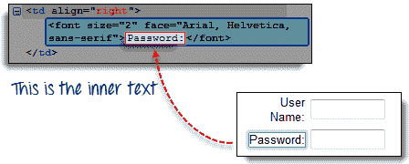

**步骤 2。**在 Selenium IDE 的“目标”框中键入 **css = font：contains（“ Password：”）**，然后单击“查找”。 Selenium IDE 应该能够访问密码标签，如下图所示。

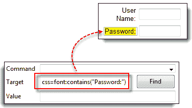

**步骤 3。**这次，将内部文本替换为“波士顿”，这样您的目标现在将变为“ css = font：contains（“波士顿”）“。 单击查找。 您应注意，“波士顿到旧金山”标签将突出显示。 这表明即使您仅指示了其内部文本的第一个单词，Selenium IDE 仍可以访问长标签。

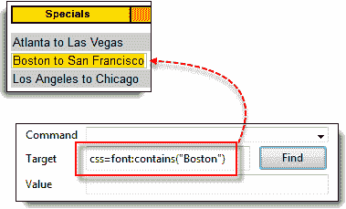

## 按 DOM（文档对象模型）定位

简而言之，文档对象模型（DOM）是 HTML 元素的构建方式。 Selenium IDE 能够在访问页面元素时使用 DOM。 如果使用此方法，则“目标”框将始终以“ dom = document ...”开头； 但是，通常会删除“ dom =“前缀，因为 Selenium IDE 能够自动将以关键字“ document”开头的任何内容解释为 DOM 中的路径。

通过 DOM 定位元素有四种基本方法：

*   getElementById
*   getElementsByName
*   dom：name（仅适用于命名形式中的元素）
*   dom：索引

## 按 DOM 定位-getElementById

让我们专注于第一种方法-使用 getElementById 方法。 语法为：

| 

**Syntax**

 | 

**Description**

 |
| document.getElementById（“ *元素的 ID* ”） | 元素的 ID =这是要访问的元素的 ID 属性的值。 此值应始终放在一对括号（“”）中。 |

**步骤 1。**使用此演示页 [http://demo.guru99.com/test/facebook.html](http://demo.guru99.com/test/facebook.html) 导航至该页面并使用 Firebug 检查“保持登录状态”检查 框。 记录其 ID。

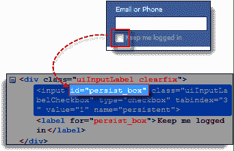

我们可以看到我们应该使用的 ID 是“ persist_box”。

**步骤 2。**打开 Selenium IDE，然后在“目标”框中输入“ document.getElementById（“ persist_box”）”，然后单击“查找”。 Selenium IDE 应该能够找到“保持登录状态”复选框。 尽管它无法突出显示复选框的内部，但 Selenium IDE 仍然可以用明亮的绿色边框围绕元素，如下所示。

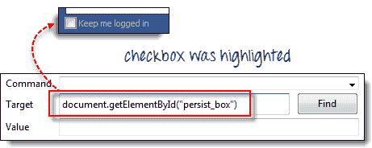

## 按 DOM 定位-getElementsByName

getElementById 方法一次只能访问一个元素，该元素就是您指定的 ID。 getElementsByName 方法是不同的。 它收集具有指定名称的元素数组。 您可以使用从 0 开始的索引访问各个元素。

| 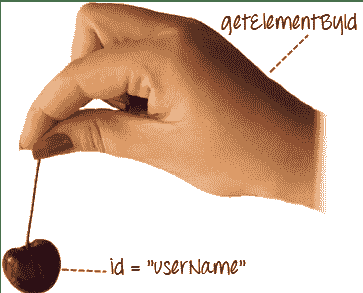 | **getElementById**

*   它只会为您提供一个要素。
*   该元素带有您在 getElementById（）括号内指定的 ID。

 |
| 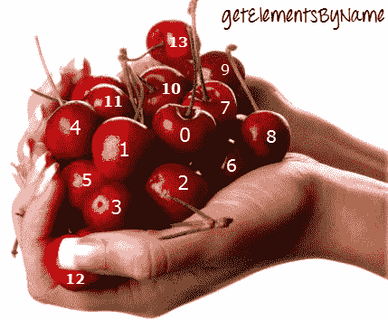 | **的 getElementsByName**

*   它将获得名称相同的元素的集合。
*   每个元素都以从 0 开始的数字索引，就像数组一样
*   通过在下面的 getElementsByName 语法中将其索引号放在方括号中，可以指定要访问的元素。

 |

| 

**Syntax**

 | 

**Description**

 |
| document.getElementsByName（“ *名称*”）[*索引*] | 

*   名称=由其“名称”属性定义的元素名称
*   索引=整数，指示将使用 getElementsByName 数组中的哪个元素。

 |

**步骤 1\.** 导航至 Mercury Tours 的主页，并使用“ tutorial”作为用户名和密码登录。 Firefox 应该带您到 Flight Finder 屏幕。

**步骤 2。**使用 Firebug，检查页面底部的三个单选按钮（经济舱，商务舱和头等舱单选按钮）。 请注意，它们都具有相同的名称，即“ servClass”。

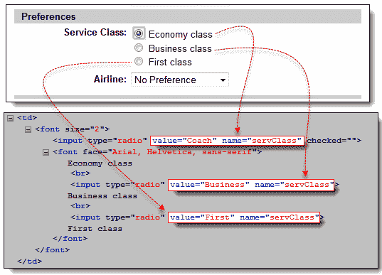

**步骤 3。**首先让我们访问“经济舱”单选按钮。 在所有这三个单选按钮中，此元素排在最前面，因此索引为 0。在 Selenium IDE 中，键入“ document.getElementsByName（“ servClass”）[0]“，然后单击“查找”按钮。 Selenium IDE 应该能够正确识别经济舱单选按钮。

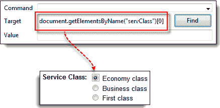

**步骤 4。**将索引号更改为 1，以便您的目标现在将成为 document.getElementsByName（“ servClass”）[1]。 单击“查找”按钮，Selenium IDE 应该能够突出显示“业务类别”单选按钮，如下所示。

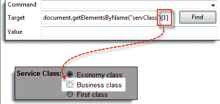

## 按 DOM 定位-dom：name

如前所述，仅当您正在访问的元素包含在命名表单中时，此方法才适用。

| 

**语法**

 | 

**说明**

 |
| document.forms [“ *格式为*的名称”] .elements [“ *元素名称*”] | 

*   表单的名称=包含要访问的元素的表单标签的 name 属性的值
*   元素的名称=您所使用元素的 name 属性的值 希望访问

 |

**步骤 1。**导航至 Mercury Tours 主页（ [http://demo.guru99.com/test/newtours/](http://demo.guru99.com/test/newtours/) ），然后使用 Firebug 检查“用户名”文本框。 请注意，它包含在名为“ home”的表单中。

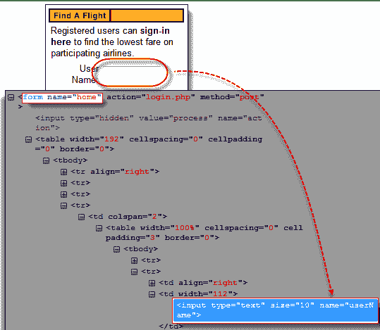

**步骤 2。**在 Selenium IDE 中，键入“ document.forms [“ home”]。elements [“ userName”]“，然后单击“查找”按钮。 Selenium IDE 必须能够成功访问元素。

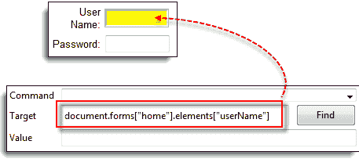

## 按 DOM 定位-dom：index

即使该元素不在命名表单中，该方法也适用，因为它使用表单的索引而不是其名称。

| 

**Syntax**

 | 

**Description**

 |
| document.forms [格式为的*索引] .elements [元素*的*索引]* | 表格的

*   索引=表单相对于整个页面的索引号（从 0 开始）

 |

我们将访问 Mercury Tours 注册页面中的“电话”文本框。 该页面中的表单没有名称和 ID 属性，因此这将是一个很好的例子。

**步骤 1\.** 导航到 Mercury Tours Registration 页面，然后检查 Phone 文本框。 请注意，包含它的表单没有 ID 和 name 属性。

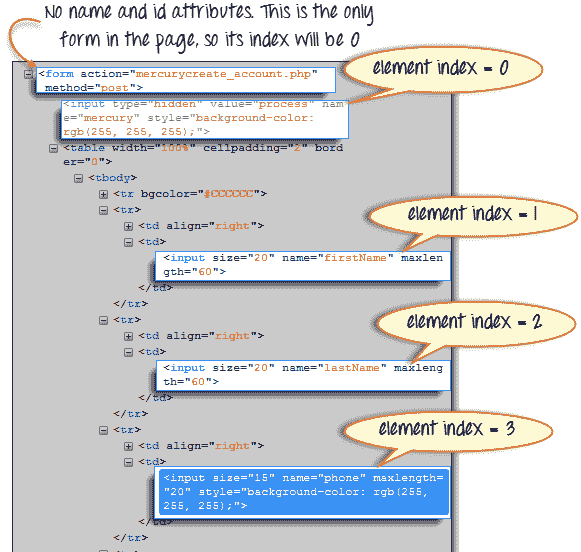

**步骤 2。**在 Selenium IDE 的“目标”框中输入“ document.forms [0] .elements [3]”，然后单击“查找”按钮。 Selenium IDE 应该能够正确访问“电话”文本框。

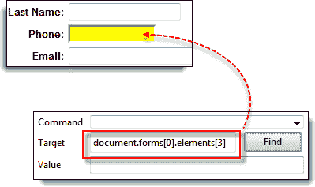

**步骤 3。**或者，您可以使用元素的名称而不是其索引来获得相同的结果。 在 Selenium IDE 的“目标”框中输入“ document.forms [0] .elements [“电话”]”。 电话文本框仍应突出显示。

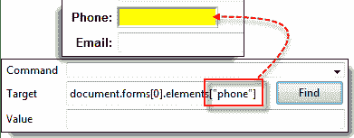

## 通过 XPath 定位

XPath 是查找 XML（可扩展标记语言）节点时使用的语言。 由于可以将 HTML 视为 XML 的实现，因此我们也可以使用 [XPath](/xpath-selenium.html) 来定位 HTML 元素。

**优点：**它几乎可以访问任何元素，即使没有类，名称或 id 属性的元素也是如此。

**缺点：**由于太多不同的规则和考虑因素，它是识别元素的最复杂的方法。

幸运的是，Firebug 可以自动生成 XPath 定位器。 在下面的示例中，我们将访问无法通过我们前面讨论的方法访问的图像。

**步骤 1。**导航至 Mercury Tours 主页，然后使用 Firebug 检查黄色“链接”框右侧的橙色矩形。 请参考下图。

**步骤 2** 。 右键单击元素的 HTML 代码，然后选择“复制 XPath”选项。

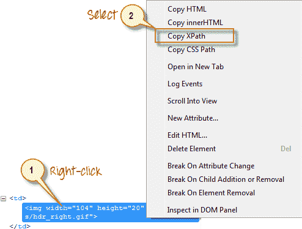

**步骤 3。**在 Selenium IDE 中，在“目标”框中键入一个正斜杠“ /”，然后粘贴在上一步中复制的 XPath。 **现在，“目标”框中的条目应以两个正斜杠“ //”开头。**

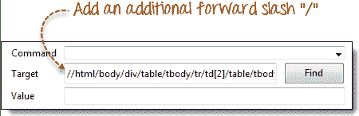

**步骤 4** 。 单击查找按钮。 Selenium IDE 应该能够突出显示橙色框，如下所示。

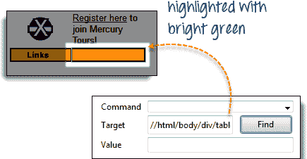

## 摘要

Syntax for Locator Usage

| 

**方法**

 | 

**目标语法**

 | 

**范例**

 |
| 按编号 | id = *id_of_the_element* | id =电子邮件 |
| 按名字 | name = *name_of_the_lement* | 名称=用户名 |
| 按名称使用过滤器 | name = *name_of_the_element* *过滤器* = *value_of_filter* | 名称=行程类型值=单向 |
| 通过链接文字 | link = *link_text* | 链接=注册 |
| 标签和 ID | css = *标签*＃ *id* | css = input＃email |
| 标签和类别 | css = *标签*。 *类* | css = input.inputtext |
| 标签和属性 | css = *标签* [*属性* = *值*] | css = input [name = lastName] |
| 标签，类和属性 | css = *标签*。 *类* [*属性* = *值*] | css = input.inputtext [tabindex = 1] |