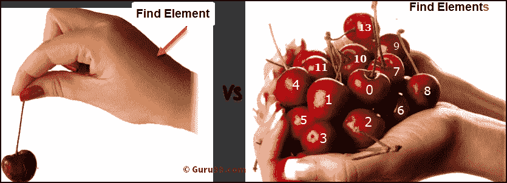

# 在 Selenium WebDriver 中查找元素和 FindElements

> 原文： [https://www.guru99.com/find-element-selenium.html](https://www.guru99.com/find-element-selenium.html)

## 为什么需要“查找元素”命令？

与网页的交互需要用户定位网络元素。 “查找元素”命令用于唯一标识网页中的（一个）网络元素。 而“查找元素”命令用于唯一标识网页中的 Web 元素列表。 有多种方法可以唯一地标识网页中的 Web 元素，例如 ID，名称，类名，链接文本，部分链接文本，标记名和 XPATH。

## FindElement 命令语法：

“查找元素”命令将“按对象”作为参数，并返回 WebElement 类型的对象。 按对象依次可以与各种定位器策略一起使用，例如 ID，名称，类名称，XPATH 等。下面是 Selenium Web 驱动程序中 FindElement 命令的语法。

```
WebElement elementName = driver.findElement(By.LocatorStrategy("LocatorValue"));
```

定位器策略可以是以下任意值。

*   ID
*   Name
*   班级名称
*   标签名
*   连结文字
*   部分链接文字
*   XPATH

定位器值是可以用来识别 Web 元素的唯一值。 开发人员和测试人员有责任使用某些属性（例如 ID 或名称）来唯一标识 Web 元素。

**示例：**

```
WebElement loginLink = driver.findElement(By.linkText("Login"));
```

## FindElements 命令语法：

“查找元素”命令将“按对象”作为参数，并返回 Web 元素列表。 如果使用给定的定位器策略和定位器值找不到任何元素，它将返回一个空列表。 下面是 find elements 命令的语法。

```
List<WebElement> elementName = driver.findElements(By.LocatorStrategy("LocatorValue"));
```

**Example:**

```
List<WebElement> listOfElements = driver.findElements(By.xpath("//div"));
```

## 查找元素与查找元素

以下是 find element 和 find elements 命令之间的主要区别。



| 查找元素 | 查找元素 |
| 如果找到多个具有相同定位符的 Web 元素，则返回第一个 Web 元素 | 返回网络元素列表 |
| 如果没有与定位器策略匹配的元素，则引发异常 NoSuchElementException | 如果没有与定位器策略匹配的 Web 元素，则返回一个空列表 |
| 只会找到一个网络元素 | 它将找到与定位器策略匹配的元素的集合。 |
| 不适用 | 每个 Web 元素都以从 0 开始的数字索引，就像数组一样 |

### 示例：如何使用“查找元素”命令

以下应用程序用于演示目的

[http://demo.guru99.com/test/ajax.html](http://demo.guru99.com/test/ajax.html)

**场景：**

1.打开 AUT

2.查找并单击单选按钮

```
package com.sample.stepdefinitions;

import org.openqa.selenium.By;
import org.openqa.selenium.WebDriver;
import org.openqa.selenium.chrome.ChromeDriver;

public class NameDemo {

public static void main(String[] args) {
// TODO Auto-generated method stub

System.setProperty("webdriver.chrome.driver", "D:\\3rdparty\\chrome\\chromedriver.exe");
WebDriver driver = new ChromeDriver();
driver.manage().window().maximize();

driver.get("http://demo.guru99.com/test/ajax.html");

// Find the radio button for “No” using its ID and click on it
driver.findElement(By.id("no")).click();

//Click on Check Button
driver.findElement(By.id("buttoncheck")).click();

}

}
```

### 示例：如何使用“查找元素”命令

**场景：**

1.打开被测应用程序的 URL

2.查找单选按钮的文本并将其打印到输出控制台上

```
package com.sample.stepdefinitions;

import java.util.List;

import org.openqa.selenium.By;
import org.openqa.selenium.WebDriver;
import org.openqa.selenium.WebElement;
import org.openqa.selenium.chrome.ChromeDriver;

public class NameDemo {

public static void main(String[] args) {

    System.setProperty("webdriver.chrome.driver", "X://chromedriver.exe");
    WebDriver driver = new ChromeDriver();
    driver.get("http://demo.guru99.com/test/ajax.html");
    List<WebElement> elements = driver.findElements(By.name("name"));
    System.out.println("Number of elements:" +elements.size());

    for (int i=0; i<elements.size();i++){
      System.out.println("Radio button text:" + elements.get(i).getAttribute("value"));
    }
  }
}

```

**摘要：**

*   “查找元素”命令返回与网页中最前面的元素匹配的 Web 元素。
*   “查找元素”命令返回符合条件的 Web 元素列表。
*   如果找不到元素与条件匹配的元素，则“查找元素”命令将引发 NoSuchElementException。
*   如果没有符合条件的元素，“查找元素”命令将返回一个空列表