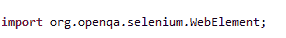
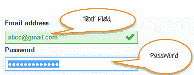
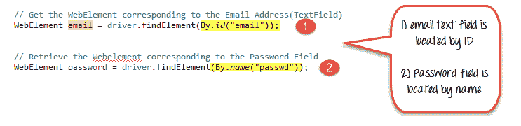
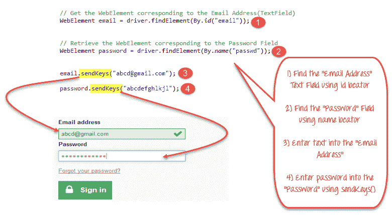
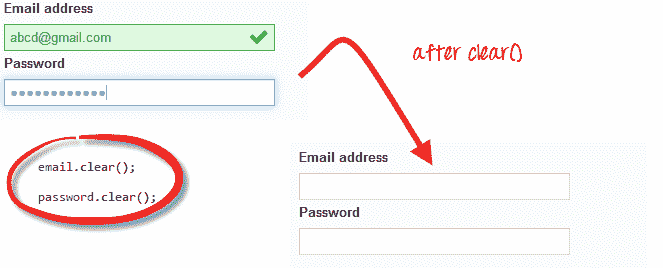
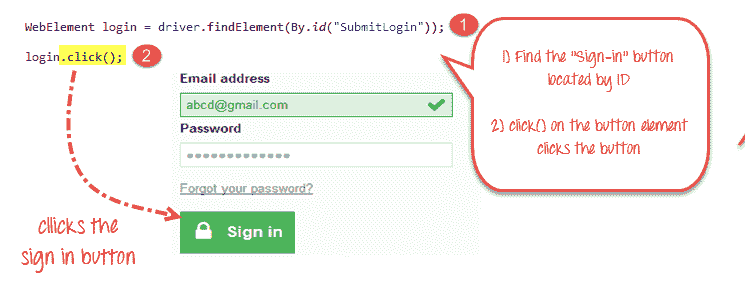
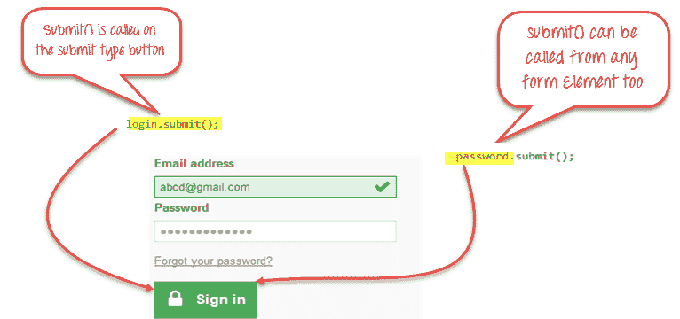

# Selenium Form WebElement：文本框，提交按钮，sendkeys（），click（）

> 原文： [https://www.guru99.com/accessing-forms-in-webdriver.html](https://www.guru99.com/accessing-forms-in-webdriver.html)

表单是从网站访问者那里接收信息的基本网络元素。 Web 表单具有不同的 GUI 元素，例如文本框，密码字段，复选框，单选按钮，下拉列表，文件输入等。

我们将看到如何使用带有 Java 的 Selenium Web Driver 访问这些不同的表单元素。 **Selenium 将每个表单元素封装为 WebElement 的对象。** 它提供​​API，以查找元素并对其进行操作，例如在文本框中输入文本，单击按钮等。我们将看到可用于访问每个表单元素的方法。

在本教程中，我们将看到如何识别以下表单元素

*   [WebElement 简介，findElement（），findElements（）](#1)
*   [输入框](#2)
*   [在输入框中输入值](#3)
*   [删除输入框中的值](#4)
*   [按钮](#5)
*   [提交按钮](#6)
*   [完整代码](#9)
*   [故障排除](#10)

## WebElement 简介，findElement（），findElements（）

Selenium Web 驱动程序将一个简单的表单元素封装为 **WebElement 的对象。**

WebDriver 通过多种技术基于 Web 元素的不同属性来识别表单元素，例如 ID，Name，Class，XPath，Tagname，CSS 选择器，链接文本等。

Web 驱动程序提供以下两种方法来查找元素。

*   **findElement（）** –查找单个 Web 元素并作为 WebElement 对象返回。
*   **findElements（）** –返回与定位器条件匹配的 WebElement 对象的列表。

让我们看一下获取单个元素的代码片段-使用 findElement（）方法将网页中的文本字段作为 WebElement 的对象。 在后续教程中，我们将介绍用于查找多个元素的 findElements（）方法。

**步骤 1：**我们需要导入此包才能创建 Web Elements 的对象



**步骤 2：**我们需要调用 WebDriver 类上可用的 findElement（）方法并获取 WebElement 对象。

请参阅下面的内容以了解其操作方法。

## 输入框

输入框引用以下两种类型之一：

1.  **文本字段**-接受输入值并按原样显示它们的文本框。
2.  **Password Fields**- text boxes that accept typed values but mask them as a series of special characters (commonly dots and asterisks) to avoid sensitive values to be displayed.

    

### **定位器**

findElement（）方法采用一个参数，该参数是元素的定位符。 不同的定位器（例如 By.id（），By.name（），By.xpath（），By.CSSSelector（）等）使用其属性（例如 ID，名称或路径， 等等

您可以使用诸如 Fire path 之类的插件来获取有关获取元素 ID，xpath 等的帮助。

使用下面给出的示例站点 [http://demo.guru99.com/test/login.html](http://demo.guru99.com/test/login.html) ，该代码用于使用 ID 定位符和“密码”字段来使用 ID 定位符来定位“电子邮件地址”文本字段 名称定位器。



1.  电子邮件文本字段按 ID 定位
2.  密码字段按名称定位

## 在输入框中输入值

要将文本输入到“文本字段”和“密码字段”，sendKeys（）是 WebElement 上可用的方法。

使用 [http://demo.guru99.com/test/login.html](http://demo.guru99.com/test/login.html) 网站的相同示例，这是我们查找“文本”字段和“密码”字段并在其中输入值的方法。



1.  使用 id 定位器找到“电子邮件地址”文本字段。
2.  使用名称定位器找到“密码”字段
3.  使用 sendKeys（）方法将文本输入“电子邮件地址”。
4.  使用 sendKeys（）方法在“密码”字段中输入密码。

## 删除输入框中的值

**clear（）**方法用于删除输入框中的文本。 **此方法不需要参数**。 下面的代码段将清除“电子邮件”或“密码”字段中的文本



## 按钮

可以使用 click（）方法访问按钮。

在上面的例子中

1.  查找登录按钮
2.  单击站点登录页面中的“登录”按钮以登录到站点。



## 提交按钮

提交按钮用于将整个表单提交到服务器。 如上所述，我们可以像常规按钮一样在 Web 元素上使用 click（）方法，也可以在表单中的任何 Web 元素上或在 Submit 按钮本身上使用 Submit（）方法。



**使用 Submit（）时，WebDriver 将查找 DOM 以了解该元素属于哪个表单，然后触发其 Submit 函数。**

## 完整代码

这是完整的工作代码

```
import org.openqa.selenium.By;		
import org.openqa.selenium.WebDriver;		
import org.openqa.selenium.chrome.ChromeDriver;		
import org.openqa.selenium.*;		

public class Form {				
    public static void main(String[] args) {									

    	// declaration and instantiation of objects/variables		
        System.setProperty("webdriver.chrome.driver","G:\\chromedriver.exe");					
        WebDriver driver = new ChromeDriver();					

        String baseUrl = "http://demo.guru99.com/test/login.html";					
        driver.get(baseUrl);					

        // Get the WebElement corresponding to the Email Address(TextField)		
        WebElement email = driver.findElement(By.id("email"));							

        // Get the WebElement corresponding to the Password Field		
        WebElement password = driver.findElement(By.name("passwd"));							

        email.sendKeys("This email address is being protected from spambots. You need JavaScript enabled to view it.
	");					
        password.sendKeys("abcdefghlkjl");					
        System.out.println("Text Field Set");					

        // Deleting values in the text box		
        email.clear();			
        password.clear();			
        System.out.println("Text Field Cleared");					

        // Find the submit button		
        WebElement login = driver.findElement(By.id("SubmitLogin"));							

        // Using click method to submit form		
        email.sendKeys("This email address is being protected from spambots. You need JavaScript enabled to view it.");					
        password.sendKeys("abcdefghlkjl");					
        login.click();			
        System.out.println("Login Done with Click");					

        //using submit method to submit the form. Submit used on password field		
        driver.get(baseUrl);					
        driver.findElement(By.id("email")).sendKeys("This email address is being protected from spambots. You need JavaScript enabled to view it.");							
        driver.findElement(By.name("passwd")).sendKeys("abcdefghlkjl");							
        driver.findElement(By.id("SubmitLogin")).submit();					
        System.out.println("Login Done with Submit");					

		//driver.close();		

    }		
}

```

## 故障排除

如果在查找元素时遇到 NoSuchElementException（），则意味着在 Web 驱动程序访问页面时在页面中找不到该元素。

1.  在 Chrome 中使用 Firepath 或 Inspect Element 再次检查定位器。
2.  现在检查您在代码中使用的值是否与 Firepath 中的元素的值不同。
3.  有些属性对于少数元素是动态的。 如果发现该值不同且正在动态变化，请考虑使用 By.xpath（）或 By.cssSelector（），它们更可靠，但方式更复杂。
4.  有时，这也可能是一个等待问题，即 Web 驱动程序甚至在页面完全加载之前就执行了代码等。
5.  使用隐式或显式等待在 findElement（）之前添加一个等待。

### 摘要

*   下表总结了访问上述每种元素的命令

| **元素** | **命令** | **说明** |
| --- | --- | --- |
| **输入框** | sendKeys（） | 用于在文本框中输入值 |
| 明确（） | 用于清除文本框的当前值 |
| **链接** | click（） | 用于单击链接并等待页面加载完成，然后再继续执行下一个命令。 |
| **提交按钮** | 提交（） | 
 |

*   WebDriver 允许在多个 SELECT 元素中选择多个选项。
*   您可以在表单中的任何元素上使用 commit（）方法。 WebDriver 将自动触发该元素所属表单的提交功能。