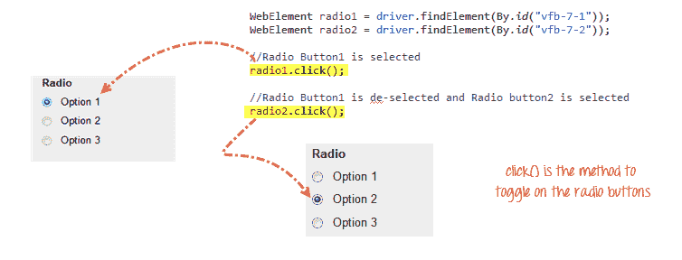
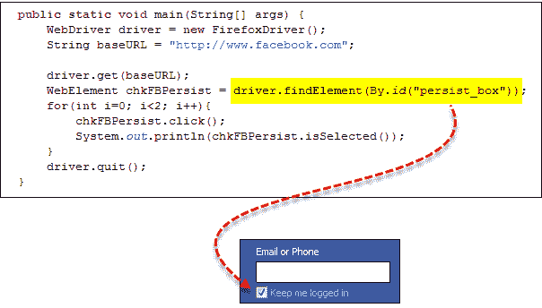
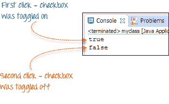
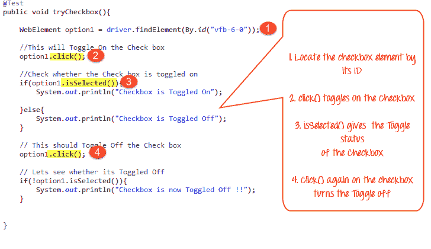

# 如何在 Selenium WebDriver 中选择复选框和单选按钮

> 原文： [https://www.guru99.com/checkbox-and-radio-button-webdriver.html](https://www.guru99.com/checkbox-and-radio-button-webdriver.html)

在本教程中，我们将看到如何识别以下表单元素

*   [单选按钮](#7)
*   [复选框](#8)

## 单选按钮

也可以使用 click（）方法打开单选按钮。

使用 [http://demo.guru99.com/test/radio.html](http://demo.guru99.com/test/radio.html) 进行练习，可以看到 radio1.click（）切换了“ Option1”单选按钮。 radio2.click（）切换“ Option2”单选按钮，而未选中“ Option1”。



## 复选框

也可以使用 **click（）**方法来打开/关闭复选框。

下面的代码将两次单击 Facebook 的“保持登录状态”复选框，然后在打开时将结果输出为 TRUE，在关闭时将结果显示为 FALSE。





isSelected（）方法用于知道复选框是打开还是关闭。

这是另一个示例： [http://demo.guru99.com/test/radio.html](http://demo.guru99.com/test/radio.html)



## 完整的代码

这是完整的工作代码

```
import org.openqa.selenium.By;		
import org.openqa.selenium.WebDriver;		
import org.openqa.selenium.chrome.ChromeDriver;		
import org.openqa.selenium.*;		

public class Form {				
    public static void main(String[] args) {									

    	// declaration and instantiation of objects/variables		
        System.setProperty("webdriver.chrome.driver","G:\\chromedriver.exe");					
        WebDriver driver = new ChromeDriver();					

        driver.get("http://demo.guru99.com/test/radio.html");					
        WebElement radio1 = driver.findElement(By.id("vfb-7-1"));							
        WebElement radio2 = driver.findElement(By.id("vfb-7-2"));							

        //Radio Button1 is selected		
        radio1.click();			
        System.out.println("Radio Button Option 1 Selected");					

        //Radio Button1 is de-selected and Radio Button2 is selected		
        radio2.click();			
        System.out.println("Radio Button Option 2 Selected");					

        // Selecting CheckBox		
        WebElement option1 = driver.findElement(By.id("vfb-6-0"));							

        // This will Toggle the Check box 		
        option1.click();			

        // Check whether the Check box is toggled on 		
        if (option1.isSelected()) {					
            System.out.println("Checkbox is Toggled On");					

        } else {			
            System.out.println("Checkbox is Toggled Off");					
        }		

        //Selecting Checkbox and using isSelected Method		
        driver.get("http://demo.guru99.com/test/facebook.html");					
        WebElement chkFBPersist = driver.findElement(By.id("persist_box"));							
        for (int i=0; i<2; i++) {											
            chkFBPersist.click (); 			
            System.out.println("Facebook Persists Checkbox Status is -  "+chkFBPersist.isSelected());							
        }		
		//driver.close();		

    }		
}

```

## 故障排除

如果在查找元素时遇到 NoSuchElementException（），则意味着在 Web 驱动程序访问页面时在页面中找不到该元素。

1.  在 Chrome 中使用 Firepath 或 Inspect Element 再次检查定位器。
2.  现在检查您在代码中使用的值是否与 Firepath 中的元素的值不同。
3.  有些属性对于少数元素是动态的。 如果发现该值不同且正在动态变化，请考虑使用 By.xpath（）或 By.cssSelector（），它们更可靠，但方式更复杂。
4.  有时，这也可能是一个等待问题，即 Web 驱动程序甚至在页面完全加载之前就执行了代码等。
5.  使用隐式或显式等待在 findElement（）之前添加一个等待。

### 摘要

*   下表总结了访问上述每种元素的命令

| **元素** | **命令** | **说明** |
| --- | --- | --- |
| **复选框，** **单选按钮** | click（） | 用于打开/关闭元素 |