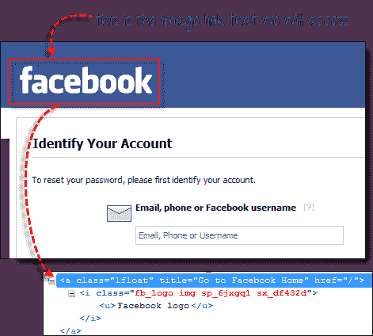
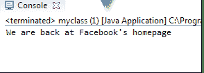

# 如何在 Selenium Webdriver 中单击图像

> 原文： [https://www.guru99.com/click-on-image-in-selenium.html](https://www.guru99.com/click-on-image-in-selenium.html)

## 访问图像链接

图像链接是网页中由图像表示的链接，单击该链接可导航到其他窗口或页面。

由于它们是图像，因此我们不能使用 By.linkText（）和 By.partialLinkText（）方法，因为图像链接基本上根本没有链接文本。

在这种情况下，我们应该使用 By.cssSelector 或 By.xpath。 第一种方法由于其简单性而更为可取。

在下面的示例中，我们将访问 Facebook 密码恢复页面左上角的“ Facebook”徽标。

.png)

我们将使用 By.cssSelector 和元素的“ title”属性来访问图像链接。 然后，我们将验证是否将我们带到 Facebook 的主页。

```
package newproject;
import org.openqa.selenium.By;		
import org.openqa.selenium.WebDriver;		
import org.openqa.selenium.chrome.ChromeDriver;		

public class MyClass {				

    public static void main(String[] args) {									
        String baseUrl = "https://www.facebook.com/login/identify?ctx=recover";					
        System.setProperty("webdriver.chrome.driver","G:\\chromedriver.exe");					
        WebDriver driver = new ChromeDriver();					

        driver.get(baseUrl);					
        //click on the "Facebook" logo on the upper left portion		
			driver.findElement(By.cssSelector("a[title=\"Go to Facebook home\"]")).click();					

			//verify that we are now back on Facebook's homepage		
			if (driver.getTitle().equals("Facebook - log in or sign up")) {							
            System.out.println("We are back at Facebook's homepage");					
        } else {			
            System.out.println("We are NOT in Facebook's homepage");					
        }		
				driver.close();		

    }		
}

```

结果

.png)

**结论：**

这就是所有单击图像。 使用 By.cssSelector（）访问图像链接