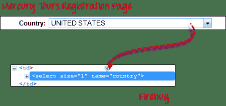
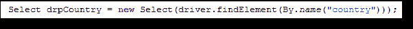
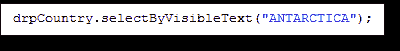
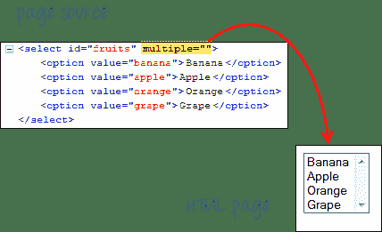
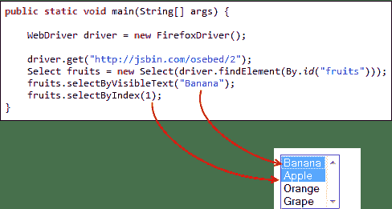
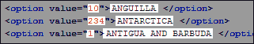
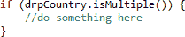
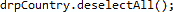

# 如何使用 Selenium Webdriver 从 DropDown 中选择值

> 原文： [https://www.guru99.com/select-option-dropdown-selenium-webdriver.html](https://www.guru99.com/select-option-dropdown-selenium-webdriver.html)

在本教程中，我们将学习如何处理下拉和多选操作。

## 从下拉框中选择选项

在控制下拉框之前，我们必须执行以下两项操作：

1.  导入软件包 **org.openqa.selenium.support.ui。选择**
2.  在 WebDriver 中将下拉框实例化为“选择”对象

例如，转到 Mercury Tours 的“注册”页面（ [http://demo.guru99.com/test/newtours/register.php](http://demo.guru99.com/test/newtours/register.php) ），然后注意到那里的“国家”下拉框。

.png)

**步骤 1**

导入“选择”包。

.png)

**步骤 2**

将下拉元素声明为 Select 类的实例。 在下面的示例中，我们将该实例命名为“ drpCountry”。

.png)

**步骤 3**

现在，我们可以使用任何可用的 Select 方法开始控制“ drpCountry”。 下面的示例代码将选择选项“ ANTARCTICA”。

.png)

## 在多个 SELECT 元素中选择项目

我们还可以使用 **selectByVisibleText（）**方法在多 SELECT 元素中选择多个选项。 例如，我们将 [http://jsbin.com/osebed/2](http://jsbin.com/osebed/2) 作为基本 URL。 它包含一个下拉框，一次允许多个选择。

.png)

下面的代码将使用 selectByVisibleText（）方法选择前两个选项。

.png)

## 选择方法

以下是下拉列表中最常用的方法。

| **方法** | **说明** |
| **selectByVisibleText（）**和 **deselectByVisibleText（）** *示例：* .png)  | 

*   选择/取消选择显示与参数匹配的文本的选项。
*   **参数** ：特定选项的确切显示的文本

 |
| **selectByValue（）**和 **deselectByValue（）** *示例：* .png)  | 

*   选择/取消选择其“值”属性与指定参数匹配的选项。
*   **参数** ：“值”属性的值
*   请记住，并非所有下拉选项都具有相同的文本和“值”，如下例所示。

[ ](/images/image019(2).png)   |
| **selectByIndex（）**和 **deselectByIndex（）** *示例：* *[ ](/images/image020(2).png) *   | 

*   选择/取消选择给定索引处的选项。
*   **参数** ：要选择的选项的索引。

 |
| **isMultiple（）** *示例：* *[ ](/images/image021(2).png) *   | 

*   如果下拉元素一次允许多个选择，则返回 TRUE；否则，返回 TRUE。 否则为 FALSE。
*   **不需要参数**

 |
| **deselectAll（）** *示例：* *[ ](/images/image022(2).png) *   | 

*   清除所有选中的条目。 仅当下拉元素支持多个选择时才有效。
*   **不需要参数**

 |

## 这是完整的代码

```
package newpackage;
import org.openqa.selenium.WebDriver;
import org.openqa.selenium.firefox.FirefoxDriver;
import org.openqa.selenium.support.ui.Select;
import org.openqa.selenium.By;

public class accessDropDown {
 public static void main(String[] args) { 
		System.setProperty("webdriver.gecko.driver","C:\\geckodriver.exe");
	    String baseURL = "http://demo.guru99.com/test/newtours/register.php";
	    WebDriver driver = new FirefoxDriver();
		driver.get(baseURL);

		Select drpCountry = new Select(driver.findElement(By.name("country")));
		drpCountry.selectByVisibleText("ANTARCTICA");

		//Selecting Items in a Multiple SELECT elements
		driver.get("http://jsbin.com/osebed/2");
		Select fruits = new Select(driver.findElement(By.id("fruits")));
		fruits.selectByVisibleText("Banana");
		fruits.selectByIndex(1);
 }
}

```

## 摘要

| 元件 | 命令 | 描述 |
| **下拉框** | *selectByVisibleText（）/* *deselectByVisibleText（）* | 通过其显示的文本选择/取消选择一个选项 |
| *selectByValue（）/* *deselectByValue（）* | 通过其“值”属性的值选择/取消选择一个选项 |
| *selectByIndex（）/* *deselectByIndex（）* | 通过索引选择/取消选择一个选项 |
| *isMultiple（）* | 如果下拉元素一次允许多个选择，则返回 TRUE；否则，返回 TRUE。 否则为 FALSE |
| *deselectAll（）* | 取消选择所有先前选择的选项 |

要控制下拉框，必须首先导入 org.openqa.selenium.support.ui.Select 包，然后创建一个 Select 实例。