# 在 Selenium Webdriver 中按链接文本&部分链接文本定位元素

> 原文： [https://www.guru99.com/locate-by-link-text-partial-link-text.html](https://www.guru99.com/locate-by-link-text-partial-link-text.html)

**符合条件的链接**

可以使用链接文本的完全匹配或部分匹配来访问链接。 下面的示例提供了多个匹配项存在的场景，并说明了 WebDriver 如何处理它们。

在本教程中，我们将学习使用 Webdriver 查找和访问链接的可用方法。 另外，我们将讨论访问链接时遇到的一些常见问题，并将进一步讨论如何解决它们。

这是您将学到的-

*   [使用精确文本匹配访问链接：By.linkText（）](#2)
*   [使用部分文本匹配访问链接：By.partialLinkText（）](#3)
*   [如何获取具有相同链接文本的多个链接](#5)
*   [链接文本](#4)区分大小写
*   [链接到块的内部和外部](#6)

## 使用精确文本匹配访问链接：By.linkText（）

**通过 By.linkText（）方法**使用链接的确切链接文本访问链接。 但是，如果有两个链接具有完全相同的链接文本，则此方法将仅访问第一个。 考虑下面的 HTML 代码

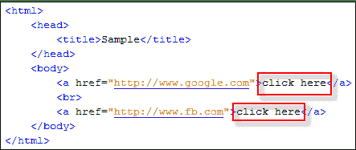

.png)

当您尝试运行下面的 WebDriver 代码时，您将访问第一个“单击此处”链接

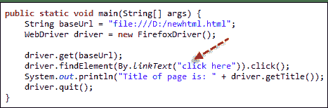.png)

**代码：**

```
import org.openqa.selenium.By;		
import org.openqa.selenium.WebDriver;		
import org.openqa.selenium.chrome.ChromeDriver;		

public class MyClass {				

    public static void main(String[] args) {									
        String baseUrl = "http://demo.guru99.com/test/link.html";					
        System.setProperty("webdriver.chrome.driver","G:\\chromedriver.exe");					
        WebDriver driver = new ChromeDriver();					

        driver.get(baseUrl);					
        driver.findElement(By.linkText("click here")).click();					
        System.out.println("title of page is: " + driver.getTitle());							
        driver.quit();			
    }		

}			

```

下面是它的工作原理-

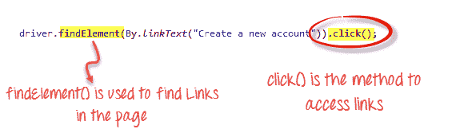

因此，您将被自动带到 Google。

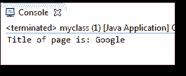.png)

## 使用部分文本匹配访问链接：By.partialLinkText（）

使用 **By.partialLinkText（）**方法来完成使用一部分链接文本访问链接的操作。 如果您指定具有多个匹配项的部分链接文本，则仅第一个匹配项将被访问。 考虑下面的 HTML 代码。

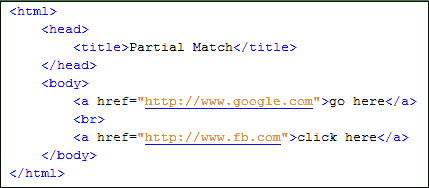.png)

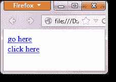.png)

当您执行以下 WebDriver 代码时，您仍将被带到 Google。

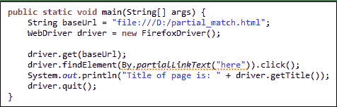.png)

**Code:**

```
import org.openqa.selenium.By;		
import org.openqa.selenium.WebDriver;		
import org.openqa.selenium.chrome.ChromeDriver;		

public class P1 {				

    public static void main(String[] args) {									
        String baseUrl = "http://demo.guru99.com/test/accessing-link.html";					
        System.setProperty("webdriver.chrome.driver","G:\\chromedriver.exe");					
        WebDriver driver = new ChromeDriver();					

        driver.get(baseUrl);					
        driver.findElement(By.partialLinkText("here")).click();					
        System.out.println("Title of page is: " + driver.getTitle());							
        driver.quit();			
    }		
}

```

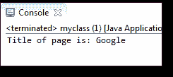.png)

## 如何使用相同的链接文本获取多个链接

那么，如何解决以上问题呢？ 如果存在多个具有相同链接文本的链接，并且我们要访问第一个链接以外的链接，我们该如何处理？

在这种情况下，通常使用不同的定位符，即... By.xpath（），By.cssSelector（）或 By.tagName（）。

最常用的是 By.xpath（）。 它是最可靠的一种，但看起来也很复杂且不可读。

## 链接文本区分大小写

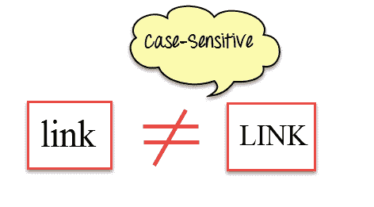

**By.linkText（）**和 **By.partialLinkText（）**的参数均区分大小写，这意味着大写很重要。 例如，在 Mercury Tours 的主页中，有两个链接包含文本“ egis”-一个是在顶部菜单中找到的“ REGISTER”链接，另一个是在右下部分中找到的“ Register here”链接 页面。

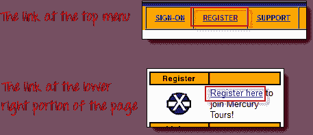.png)

尽管两个链接都包含字符序列“ egis”，但其中一个是“ By.partialLinkText（）”方法将根据字符的大写字母分别访问这两个链接。 请参见下面的示例代码。

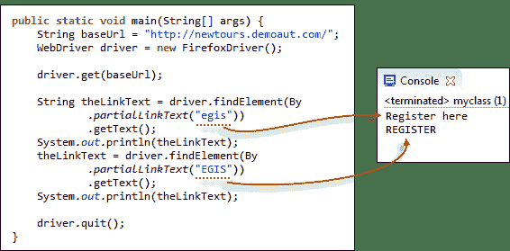.png)

**代码**

```
public static void main(String[] args) {								
        String baseUrl = "http://demo.guru99.com/test/newtours/";					
        System.setProperty("webdriver.chrome.driver","G:\\chromedriver.exe");					
        WebDriver driver = new ChromeDriver();					

        driver.get(baseUrl);					
        String theLinkText = driver.findElement(By					
                .partialLinkText("egis"))			
                .getText();		
        System.out.println(theLinkText);					
        theLinkText = driver.findElement(By					
                .partialLinkText("EGIS"))			
                .getText();		
        System.out.println(theLinkText);					

        driver.quit();			

    }

```

## 链接到块的内部和外部

最新的 HTML5 标准允许<和>标签放置在块级标签的内部和外部，例如< div >，< p >或< h3 > 。 “ By.linkText（）”和“ By.partialLinkText（）”方法可以访问位于这些块级元素外部和内部的链接。 考虑下面的 HTML 代码。

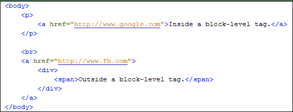.png)

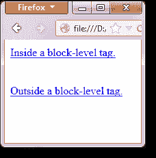.png)

下面的 WebDriver 代码使用 By.partialLinkText（）方法访问这两个链接。

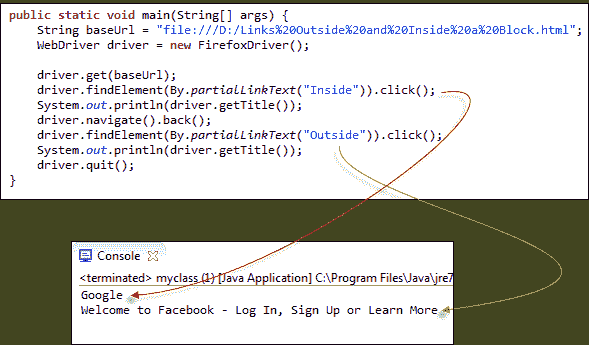.png)

**Code:**

```
import org.openqa.selenium.By;		
import org.openqa.selenium.WebDriver;		
import org.openqa.selenium.chrome.ChromeDriver;		

public class MyClass {				

    public static void main(String[] args) {									
        String baseUrl = "http://demo.guru99.com/test/block.html";					
        System.setProperty("webdriver.chrome.driver","G:\\chromedriver.exe");					
        WebDriver driver = new ChromeDriver();					

        driver.get(baseUrl);					
        driver.findElement(By.partialLinkText("Inside")).click();					
        System.out.println(driver.getTitle());					
        driver.navigate().back();			
        driver.findElement(By.partialLinkText("Outside")).click();					
        System.out.println(driver.getTitle());					
        driver.quit();			
    }		
}		

```

上面的输出确认两个链接均已成功访问，因为正确检索了它们各自的页面标题。

### 摘要

*   使用 click（）方法访问链接。
*   除了适用于任何 WebElement 的定位器之外，链接还具有基于链接文本的定位器：
    *   By.linkText（）–根据作为参数提供的链接文本的精确匹配来定位链接。
    *   By.partialLinkText（）–根据链接文本的部分文本匹配找到链接。
*   以上两个定位符均区分大小写。
*   如果存在多个匹配项，By.linkText（）和 By.partialLinkText（）将仅选择第一个匹配项。 在存在具有相同链接文本的多个链接的情况下，将使用基于 xpath，CSS 的其他定位符。
*   findElements（）& By.tagName（“ a”）方法查找页面中与定位器条件匹配的所有元素
*   链接可以通过 By.linkText（）和 By.partialLinkText（）进行访问，无论它们位于块级元素之内还是之外。