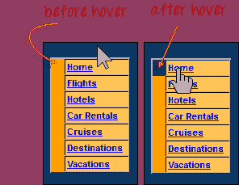
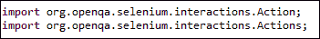
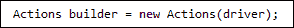
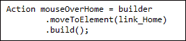
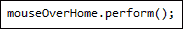
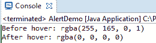
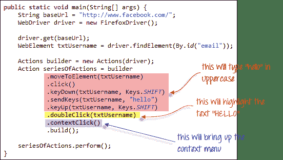
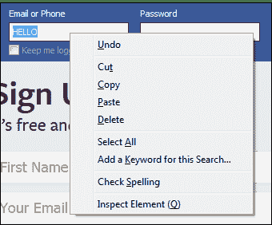

# 鼠标单击&键盘事件：Selenium Webdriver 中的操作类

> 原文： [https://www.guru99.com/keyboard-mouse-events-files-webdriver.html](https://www.guru99.com/keyboard-mouse-events-files-webdriver.html)

在本教程中，我们将学习在 Selenium Webdriver 中处理键盘和鼠标事件

## 处理键盘&鼠标事件

使用**高级用户交互 API** 处理特殊的键盘和鼠标事件。 它包含执行这些事件时所需的**操作**和**操作**类。 以下是 Actions 类提供的最常用的键盘和鼠标事件。

| **方法** | **说明** |
| **clickAndHold（）** | 在当前鼠标位置单击（不释放）。 |
| **contextClick（）** | 在当前鼠标位置执行上下文单击。 （右键单击鼠标动作） |
| **doubleClick（）** | 在当前鼠标位置上双击。 |
| **dragAndDrop（源，目标）** | 在源元素的位置单击并按住，移至目标元素的位置，然后释放鼠标。

**参数：**

源元素，用于模拟按下按钮的位置。

目标元素，可移动至并释放鼠标。 |
| **dragAndDropBy（source，x-offset，y-offset）** | 在源元素的位置单击并按住，移动给定的偏移量，然后释放鼠标。

**参数**：

源元素，用于模拟按下按钮的位置。

xOffset-水平移动偏移。

yOffset-垂直移动偏移。 |
| **keyDown（modifier_key）** | 执行修改键。 不释放修饰键-后续的交互可能会假定它一直处于按下状态。

**参数**：

修饰符键-任何修饰键（Keys.ALT，Keys.SHIFT 或 Keys.CONTROL） |
| **keyUp（修饰符 _key）** | 执行密钥释放。

**参数**：

修饰符键-任何修饰键（Keys.ALT，Keys.SHIFT 或 Keys.CONTROL） |
| **moveByOffset（x-offset，y-offset）** | 将鼠标从其当前位置（或 0,0）移动给定的偏移量。

**参数**：

x-offset-水平偏移。 负值表示将鼠标左移。

y-offset-垂直偏移。 负值表示向下移动鼠标。 |
| **moveToElement（toElement）** | 将鼠标移到元素的中间。

**参数**：

要移动到的 Element 元素。 |
| **release（）** | 在当前鼠标位置释放按下的鼠标左键 |
| **sendKeys（onElement，charsequence）** | 向元素发送一系列击键。

**参数**：

onElement-将接收击键的元素，通常是文本字段

charsequence-表示击键序列的任何字符串值 被发送 |

在下面的示例中，我们将使用 moveToElement（）方法将鼠标悬停在一个 Mercury Tours 的表行上。 请参见下面的示例。



上面显示的单元格是< TR >元素的一部分。 如果未悬停，则其颜色为＃FFC455（橙色）。 悬停后，单元格的颜色变为透明。 它变成与整个橙色表的蓝色背景相同的颜色。

**步骤 1：**导入**动作**和**动作**类。



**步骤 2：**实例化一个新的 Actions 对象。



**步骤 3：**在步骤 2 中使用 Actions 对象实例化一个 Action。



在这种情况下，我们将使用 moveToElement（）方法，因为我们只是将鼠标悬停在“ Home”链接上。 build（）方法始终是最终使用的方法，因此所有列出的动作将被编译为一个步骤。

**步骤 4：**在执行我们在步骤 3 中设计的 Action 对象时，请使用 perform（）方法。



以下是整个 WebDriver 代码，用于在鼠标悬停之前和之后检查< TR >元素的背景颜色。

```
package newproject;

import org.openqa.selenium.*;
import org.openqa.selenium.firefox.FirefoxDriver;
import org.openqa.selenium.interactions.Action;
import org.openqa.selenium.interactions.Actions;

public class PG7 {

    public static void main(String[] args) {
        String baseUrl = "http://demo.guru99.com/test/newtours/";
        System.setProperty("webdriver.gecko.driver","C:\\geckodriver.exe");
                WebDriver driver = new FirefoxDriver();

                driver.get(baseUrl);           
                WebElement link_Home = driver.findElement(By.linkText("Home"));
                WebElement td_Home = driver
                        .findElement(By
                        .xpath("//html/body/div"
                        + "/table/tbody/tr/td"
                        + "/table/tbody/tr/td"
                        + "/table/tbody/tr/td"
                        + "/table/tbody/tr"));    

                Actions builder = new Actions(driver);
                Action mouseOverHome = builder
                        .moveToElement(link_Home)
                        .build();

                String bgColor = td_Home.getCssValue("background-color");
                System.out.println("Before hover: " + bgColor);        
                mouseOverHome.perform();        
                bgColor = td_Home.getCssValue("background-color");
                System.out.println("After hover: " + bgColor);
                driver.close();
        }
}

```

下面的输出清楚地表明，将鼠标悬停后背景颜色变为透明。



## 建立一系列多重动作

**您可以使用 Action 和 Actions 类**来构建一系列操作。 只需记住使用 build（）方法关闭该系列。 考虑下面的示例代码。



```
public static void main(String[] args) {
String baseUrl = "http://www.facebook.com/"; 
WebDriver driver = new FirefoxDriver();

driver.get(baseUrl);
WebElement txtUsername = driver.findElement(By.id("email"));

Actions builder = new Actions(driver);
Action seriesOfActions = builder
	.moveToElement(txtUsername)
	.click()
	.keyDown(txtUsername, Keys.SHIFT)
	.sendKeys(txtUsername, "hello")
	.keyUp(txtUsername, Keys.SHIFT)
	.doubleClick(txtUsername)
	.contextClick()
	.build();

seriesOfActions.perform() ;

}
```



**摘要**

*   使用 AdvancedUserInteractions API 处理特殊的键盘和鼠标事件。
*   常用的关键字和鼠标事件是 doubleClick（），keyUp，dragAndDropBy，contextClick & sendKeys。